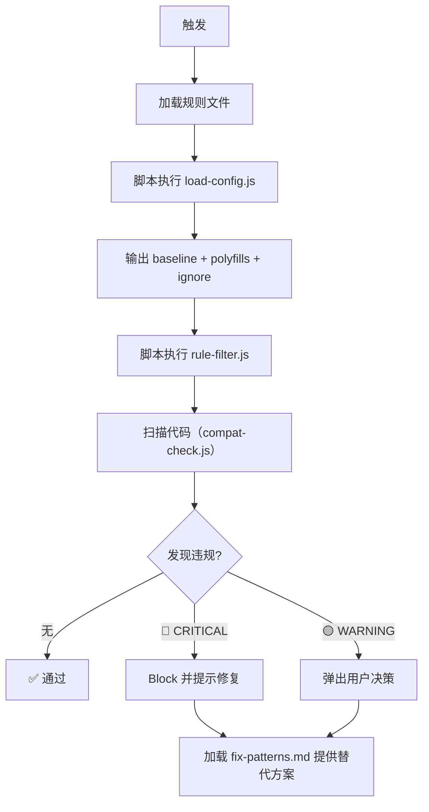

# 浏览器兼容性检查 Skill

> 统一的浏览器兼容性检查入口。规则文件 `~/.codebuddy/rules/浏览器兼容性规范.mdc` 为**单一真相源**，本 skill 只做加载 + 路由 + 执行。

---

## 使用方式

### 独立使用（用户主动触发）

用户说"检查一下兼容性"/"这段代码能用吗"/"扫描一下 diff 兼容性"时触发。

- 默认对当前 `git diff` 执行扫描
- 可指定文件：`use_skill('browser-compat')` + 「帮我看 `src/xxx.tsx`」
- 可指定目录/全仓：「扫全项目」「升级 browserslist 前看看」

→ 加载 `modules/quick-scan.md`

### 被 dev-flow / code-review 调用（被动触发）

- `code-review` L1 审查第 5 条：有 JS/CSS 改动时代理调用本 skill
- dev-flow 步骤 5 / 5.5 / 6：按 `shared-rules.md §5` 的 Skill 匹配表自动发现

→ 加载 `modules/dev-flow-hook.md`

---

## 核心规则来源（单一真相）

**请勿在本 skill 任何文件中重复列禁用清单**。规则只有一份：

📄 `~/.codebuddy/rules/浏览器兼容性规范.mdc`

该规则是 `alwaysApply: false`，按需加载。本 skill 被调用时必须先 `read_rules` 或 `read_file` 加载该规则作为检查依据。

**双向同步由元门控守护**：`scripts/meta/validate-rules-sync.sh` 校验规则文件 ↔ `scripts/compat-check.js` 的 JS_RULES/CSS_RULES 集合双向一致（包含 18 条规则的关键字落地检查）。任何一边变动必须同步另一边，否则元门控失败 exit 1。临时绕过：`SKIP_COMPAT_RULES_SYNC=1 bash validate-rules-sync.sh`。

---

## 按需加载索引

| 场景 | 加载文件 |
|------|---------|
| 用户主动扫描（独立使用）| `modules/quick-scan.md` |
| 被 dev-flow / code-review 调用 | `modules/dev-flow-hook.md` |
| 违规后查修复方案 | `references/fix-patterns.md` |
| 多项目基线对照 / 判定当前项目基线 | `references/browser-baseline.md` |
| 排查误报 / 豁免方法 / 性能边界 | `references/known-false-positives.md` |
| 初始化项目级配置 | `templates/project-config.json` |
| 输出格式契约（JSON Schema）| `schemas/finding.schema.json` |
| 批量扫描（脚本执行）| `scripts/compat-check.js` |
| 规则同步元门控 | `scripts/meta/validate-rules-sync.sh` |
| 配置文件 IDE 校验 schema | `schema.json` |
---

## 执行流程（通用）



> 基线判定 / 规则过滤 / 路径过滤均由脚本执行，不依赖 AI 判断。LLM 仅负责：
> 1）判断违规是否为实隟误报（2）选择修复方案（3）与用户交互决策。

---

## 配置文件 Schema 兼容

`load-config.js` 同时识别两套 `.browser-compat.json` schema 风格，用户既有项目零改动即可使用。新项目推荐使用「我们 schema」（命名更清晰），存量项目沿用「用户 schema」（已在 my-project / record-project / my-website 验证）。

### 字段对照表

| 用途 | 用户 schema（主路径） | 我们 schema（语法糖） | 优先级 |
|------|---------------------|---------------------|-------|
| 基线版本 | `targets: { chrome: "70" }` 复数 + 字符串 | `target: "conservative"` + `baseline: { chrome: 70 }` 数字 | `target` > `targets` > `baseline` |
| 规则开关 | `rules: { "X": "error\|warn\|info\|off" }` ESLint 风格 | `ignore: [{ rule_id, reason }]` 显式对象 | `ignore` 对象数组优先；`rules.off` 合并补充 |
| 路径排除 | `ignore: ["node_modules/**"]` 字符串数组 | `excludePaths: [...]` 显式 | `excludePaths` 优先；缺省时嗅探 `ignore` 第一个元素类型 |
| 多项目 | `projects: { "<name>": {...} }` | — | 通过 `package.json>name` 反查；找不到再降级到目录名 |

### `ignore` 字段的多态嗅探（关键）

`ignore` 字段在两套 schema 里**字段名相同但语义不同**，脚本通过第一个元素的类型自动判定：

- 第一个元素是 `string` → 用户 schema：路径 glob 数组 → 合并到 `excludePaths`
- 第一个元素是 `object`（含 `rule_id`）→ 我们 schema：规则豁免数组 → 写入 `ignore`
- 空数组 → 不动作
- 类型异常 → 写 stderr 警告并跳过（不静默失败）

### 加载优先级链

```
.browser-compat.json
  ├─ 含 projects 字段 → 反查 package.json>name → 用对应子配置
  ├─ 含 target/targets/baseline → 直接使用
  └─ 都没有 → fallback 到 ↓
package.json>browserslist
  └─ 缺失 → fallback 到 ↓
.browserslistrc
  └─ 缺失 → 默认保守型（chrome:70 / safari:12 / firefox:68 / edge:79）
```

> 关键修复（2026-05-15）：当 `.browser-compat.json` 存在但所有 baseline 字段都缺失时，旧版本会提前 `return` 不再 fallback，导致 source 错标为 `fallback`。新版本会继续走 browserslist 优先级链，并在 source 字段标记 `package.json>browserslist (compat-json fallback)` 便于追溯。

### IDE 校验配置（推荐）

在项目的 `.browser-compat.json` 第一行添加 `$schema` 引用，IDE 会提供自动补全和字段校验：

```jsonc
{
  "$schema": ".codebuddy/skills/browser-compat/schema.json",
  // ...
}
```

### 脚本暴露的内部工具（测试与自检用）

`load-config.js` 的 `_internal` 命名空间暴露给测试：`normalizeMajorVersion / targetsToMinVersions / rulesToIgnoreAndCustom / classifyIgnoreField / resolveCentralProject`。生产代码请只用 `loadConfig()`。

---

## 与其他 Skill 的协作关系

| 关联 Skill | 协作关系 |
|-----------|---------|
| `code-review` | L1 第 5 条代理调用本 skill，本 skill 输出回填到 code-review 报告 |
| `browser-toolkit` | 跨浏览器实测（V4 Browser 阶段）时本 skill 提供"该测什么版本"的信息，`browser-toolkit` 负责实际测试 |
| `dev-flow` | 按 `shared-rules.md §5` 匹配表在步骤 5/5.5/6 自动被发现 |

---

## 输出规范

所有报告的文件路径引用必须遵循 `~/.codebuddy/rules/AI行为规范.mdc` 的「文件/代码位置引用」规范（反引号包裹相对路径 + `L行号`）。

单项违规输出格式：

```
[🔴 CRITICAL] 使用了 :has() 选择器
文件: `src/components/Foo.tsx` L42
问题: 项目基线 Safari 12+ 不支持 :has()，将导致样式失效
修复: 改用 JS 逻辑 + className 切换
参考: references/fix-patterns.md §CSS:has()替代方案
```

Summary 表格：

```
| 严重度 | 数量 | 状态 |
|--------|------|------|
| 🔴 CRITICAL | 0 | ✅ 通过 |
| 🟡 WARNING | 2 | ⚠️ 需确认 |

结论: ⚠️ 2 个 WARNING 需决策；0 个 CRITICAL。
```
