# dev-flow 完整流程图

> 静态 Mermaid 版本，可在 GitHub / IDE 中直接渲染预览。
> 交互式版本（支持点击跳转到源文件）：[flowchart.html](./flowchart.html)

---

## 1. 入口触发与模式路由

```mermaid
flowchart TD
A["🗣️ 用户消息"] --> B{"关键词匹配?"}
B -->|"dev:full / 任务平台 / Figma / 新需求"| C["📋 完整模式"]
B -->|"dev:quick / 修复 / 优化 / 调整"| D["⚡ 快速模式"]
B -->|"dev:ultra / 直接改就行"| UQ["🚀 极速模式"]
B -->|"dev:wrap / 收尾 / 生成commit"| E["📦 收尾模式"]
B -->|"dev:specs"| F["📐 规范管理"]
B -->|"dev:status"| G["📊 状态查看"]
B -->|"未匹配"| H{"检查 .active-flows/"}
H -->|"0个活跃"| I["💬 普通对话"]
H -->|"1个活跃"| J["🔄 自动恢复"]
H -->|"≥2个活跃"| K["📋 展示清单让用户选"]
C --> N{"迭代修复信号?"}
D --> N
N -->|"是"| O["匹配已有工作上下文"] --> Q{"匹配到?"}
N -->|"否"| P["创建/读取工作上下文"]
Q -->|"是"| R{"复杂度评估"}
Q -->|"否"| P
R -->|"简单/中等"| D2["⚡ 快速模式（增量）"]
R -->|"重大"| C2["📋 完整模式（增量）"]
UQ --> UQ1["U1定位→U2修改→U3收尾"]
UQ1 -.->|"降级"| D

```

> 优先级：用户显式指定 > 收尾关键词 > 完整模式信号 > 快速模式信号 > 极速模式信号 > 默认快速模式

---

## 2. 完整模式总览（阶段0 + 步骤1~10）

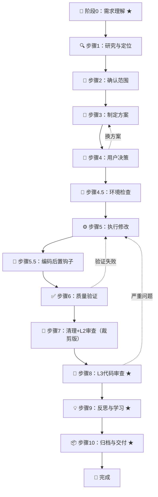

> ★ = 完整模式独有步骤。步骤1~7为快速模式共享。步骤7裁剪了commit/devlog/反思，推迟到步骤10。

---

## 3. 快速模式总览（步骤1~7）

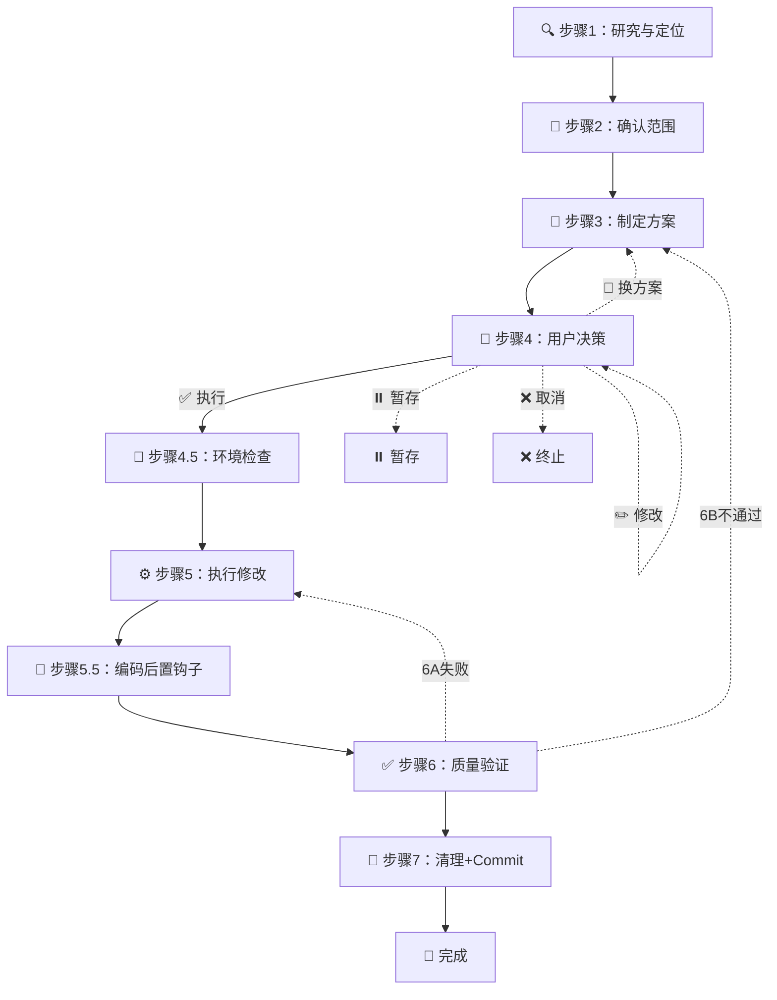

---

## 4. 极速模式总览（3步）

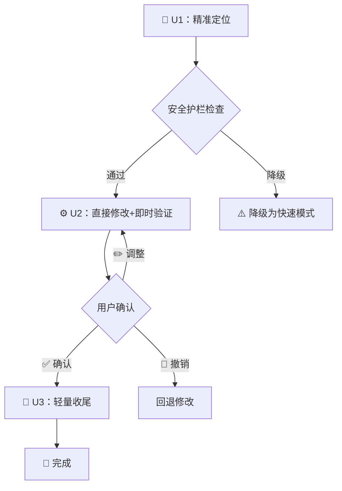

> 触发条件：≤1文件 + ≤20行 + 定位明确 + 无需方案设计（需同时满足≥2个）
> 降级条件：涉及>1文件、>20行、上下游依赖、状态管理/异步/竞态、公共组件、需求歧义

---

## 5. 收尾模式（环节制 A→B→F→G→H）

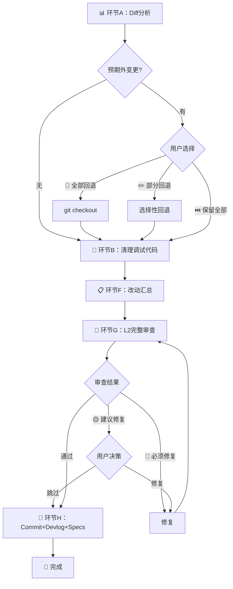

> 灵活用法：「收尾」=完整流程 | 「不用检查」=跳过环节B | 「汇总改动」=A+F | 「只要commit」=环节H | 「帮我提交」=H+git commit

---

## 6. 统一收尾流程（wrapup-flow.md）— 调用方×环节矩阵

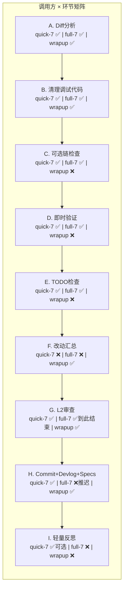

---

## 7. 阶段0：需求理解（完整模式独有）

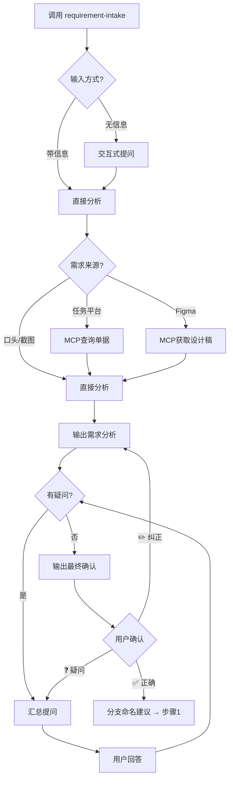

---

## 8. 步骤1~4.5 子流程

### 步骤1：研究与定位

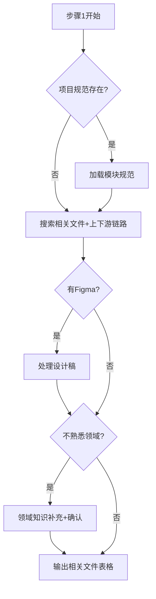

### 步骤2：确认范围

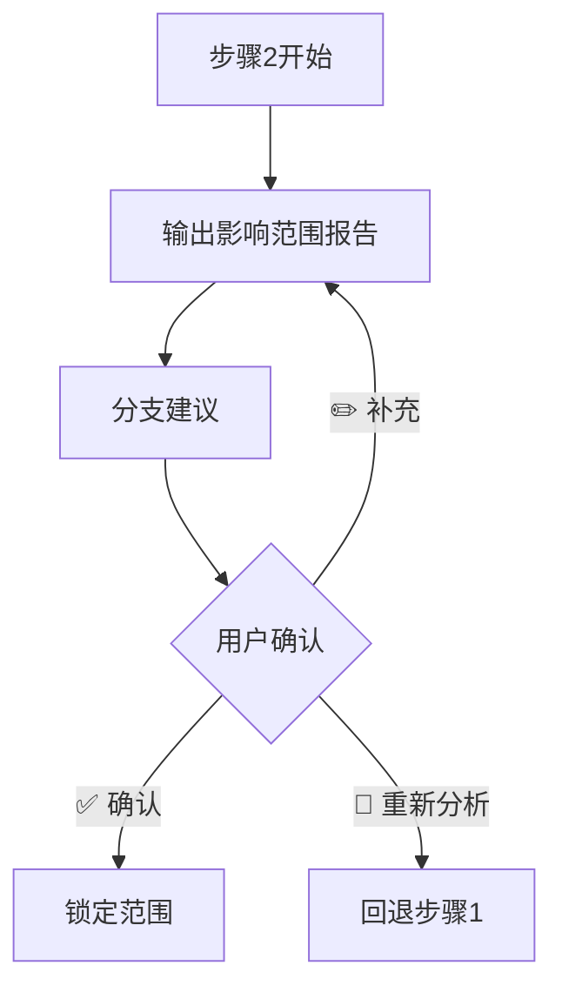

### 步骤3：制定方案

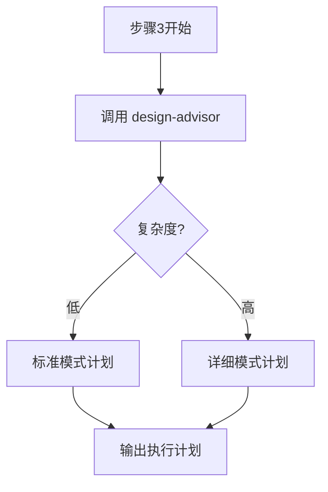

### 步骤4：用户决策（门控）

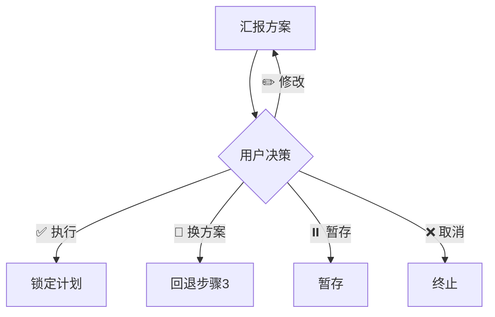

### 步骤4.5：环境检查

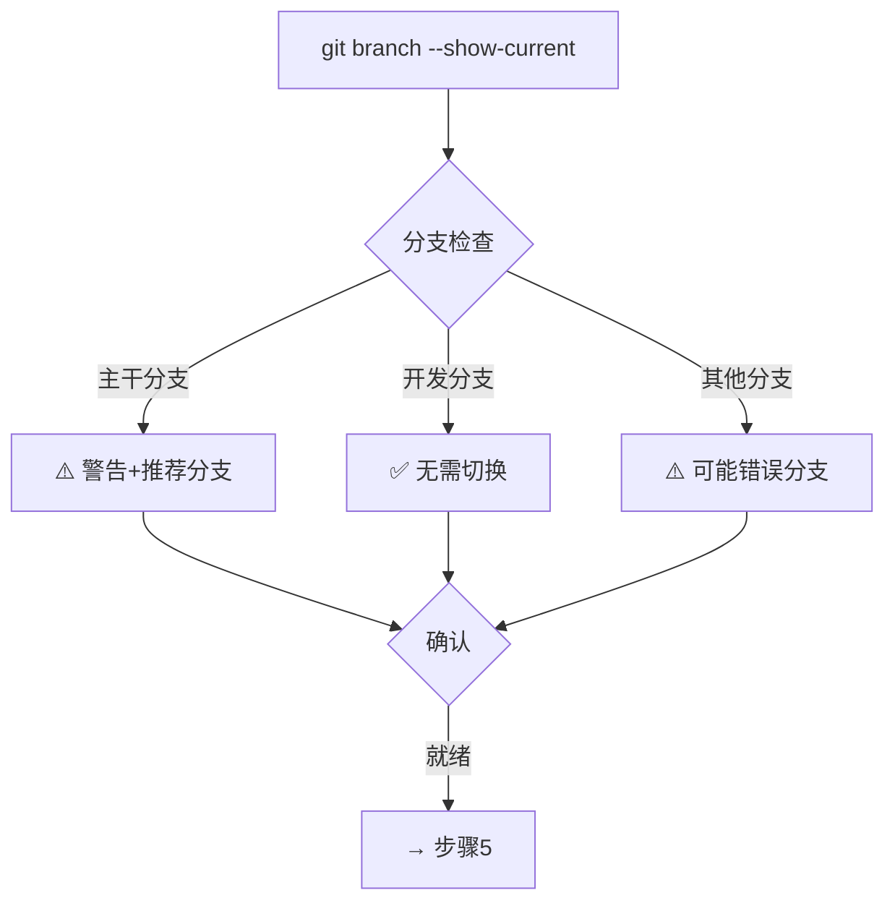

---

## 9. 步骤5~7 子流程

### 步骤5：执行修改

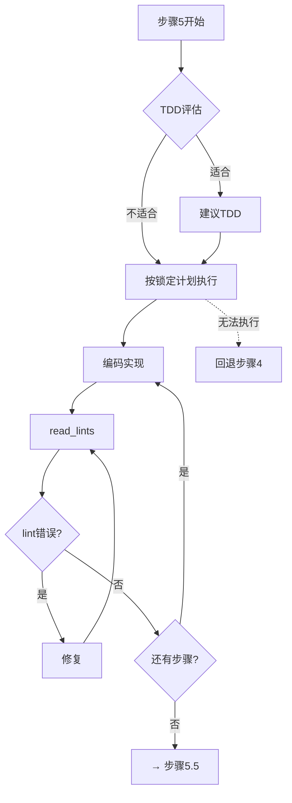

### 步骤5.5：编码后置钩子

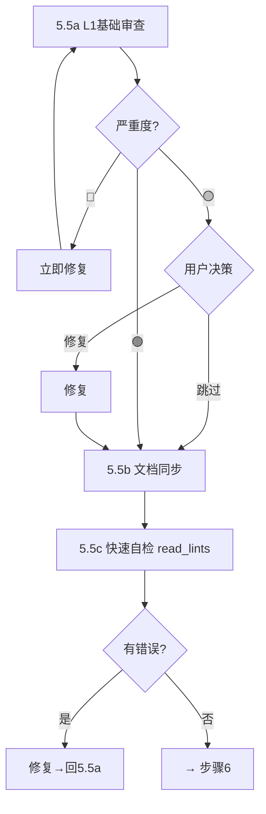

### 步骤6：质量验证（6A+6B+6C）

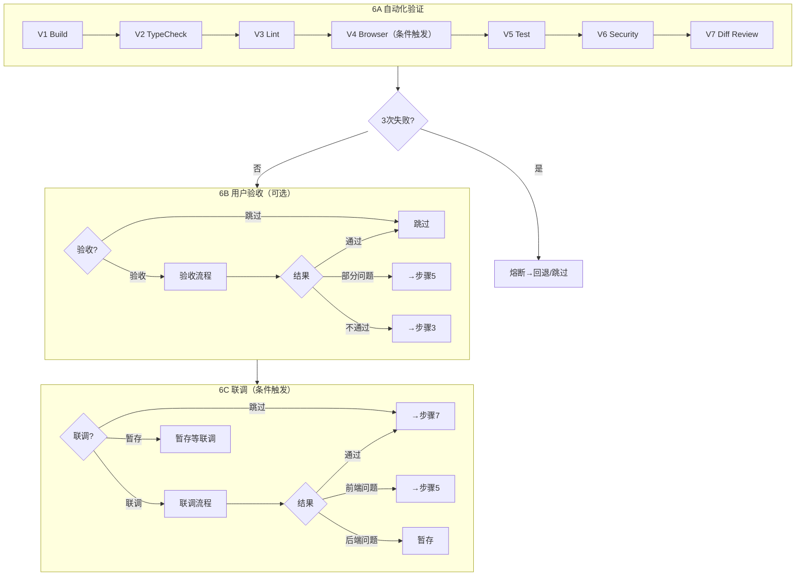

### 步骤7：清理+Commit（统一收尾流程）

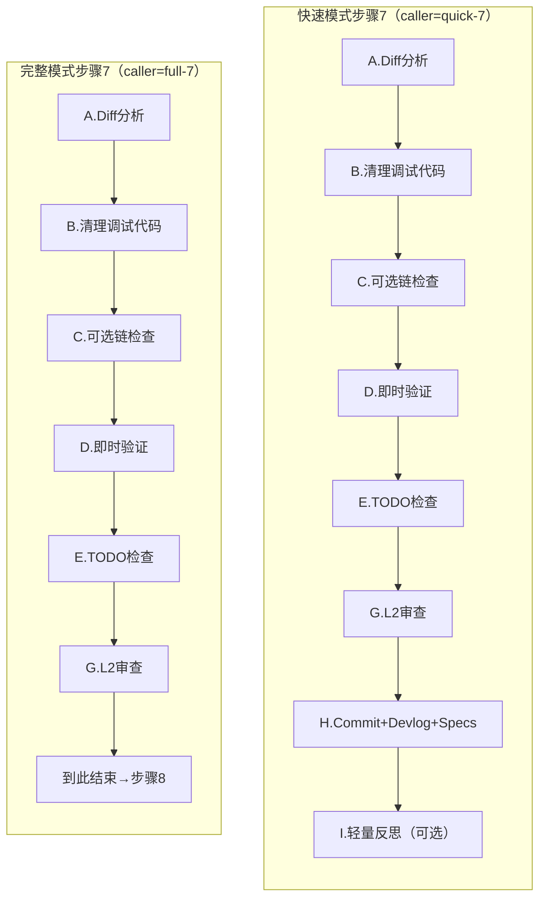

> 快速模式步骤7执行全部环节（A→B→C→D→E→G→H→I），完整模式步骤7仅到G结束，H/I推迟到步骤10。

---

## 10. 完整模式独有步骤（8~10）

### 步骤8：L3代码审查

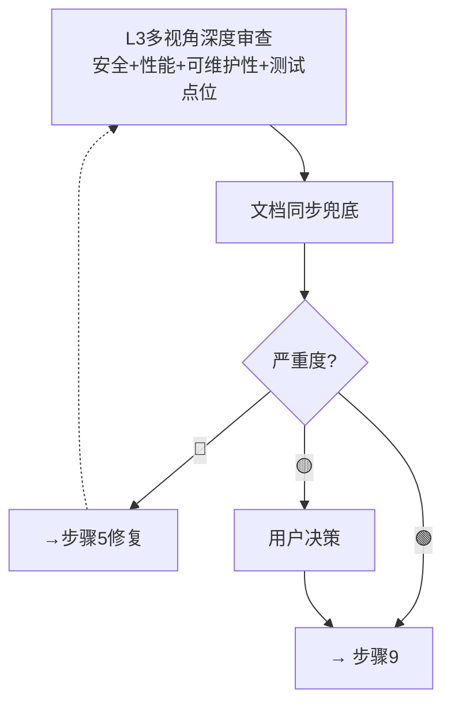

### 步骤9：反思与学习（数据驱动，4个子步骤）

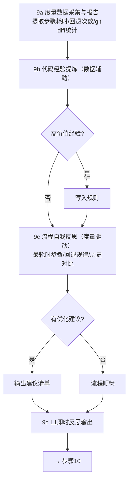

> 跳过条件：全程无回退、无卡顿、无用户纠正，且指标在历史平均±30%范围内时精简输出。

### 步骤10：归档与交付（6个子步骤）

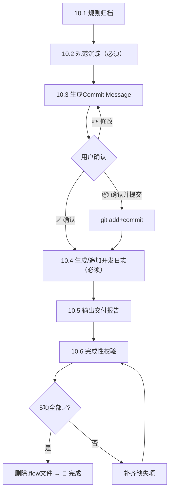

> 10.6 校验项：①Commit已确认 ②devlog已生成 ③specs已沉淀 ④交付报告已输出 ⑤规则归档已处理

---

## 11. 特殊流程

### 迭代修复机制

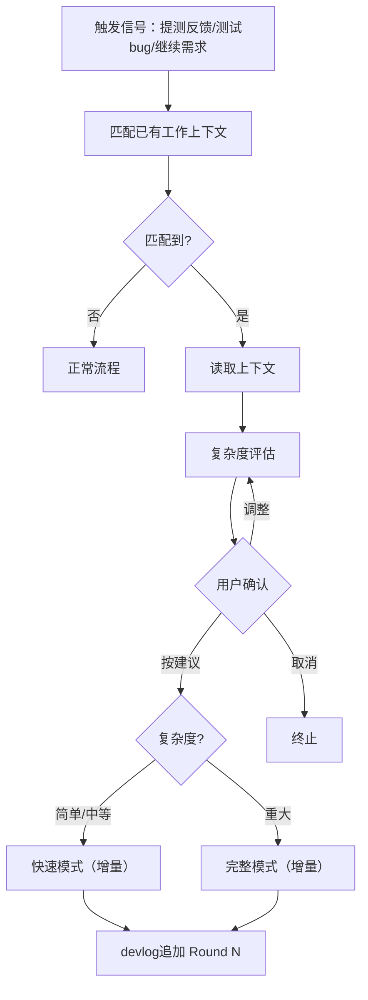

> 步骤简化：步骤1增量研究、步骤2增量范围、步骤3增量调整，步骤4~7/10无变化

### 回退机制

| 当前步骤 | 问题 | 回退到 |
| --- | --- | --- |
| 步骤4 | 修改 | 步骤4（更新后重新选择） |
| 步骤4 | 换方案 | 步骤3 |
| 步骤5 | 计划无法执行 | 步骤4 |
| 步骤5.5a | 🔴修复 | 步骤5.5a（重新审查） |
| 步骤5.5c | lint错误 | 步骤5.5a |
| 步骤6A V1-V3 | 编译/类型/lint | 步骤5.5a |
| 步骤6A V4 | Browser失败 | 步骤5 |
| 步骤6A V5 | 测试失败 | 步骤3 |
| 步骤6B | 部分问题 | 步骤5 |
| 步骤6B | 不通过 | 步骤3 |
| 步骤6C | 前端问题 | 步骤5 |
| 步骤6C | 协议不一致 | 步骤3 |
| 步骤7 L2 | 🔴修复后 | 步骤5.5a |
| 步骤8（完整） | CRITICAL | 步骤5 |

### 门控与钩子（分级钩子 Tiered Hooks）

```mermaid
flowchart TD
STEP["步骤N完毕"] --> TIER{"钩子级别?"}
TIER -->|"🔴 重量级<br/>步骤4/5/6/7"| H1R["动作1：完整outputs+gate_checks"]
TIER -->|"🟡 中量级<br/>步骤3/5.5/8"| H1Y["动作1：精简outputs（仅关键字段）"]
TIER -->|"🟢 轻量级<br/>步骤1/2/4.5/9/10"| H1G["动作1：最小outputs（3-4字段）"]
H1R --> H2["动作2：原子状态同步<br/>（工作上下文+.flow一次写入）"]
H1Y --> H2
H1G --> H2
H2 --> SNAP{"关键步骤?<br/>步骤3/5/6"}
SNAP -->|"是"| H2S["创建状态快照"] --> H3
SNAP -->|"否"| H3["动作3：门控验证"]
H3 --> GATE{"校验通过?"}
GATE -->|"是"| NEXT["加载步骤N+1"]
GATE -->|"否"| FIX["立即补齐"] --> GATE

```

> **分级钩子**：🔴重量级（完整校验）| 🟡中量级（关键字段校验）| 🟢轻量级（仅status+next_step）
> **原子操作**：动作2将工作上下文更新和.flow文件更新合并为一次操作，减少IO开销
> **状态快照**：仅步骤3/5/6创建快照，每需求最多5个，超出删除最早的

---

## 12. 交互模式（精简交互优化）

### 步骤 2+3+4 合并展示

```mermaid
flowchart TD
subgraph BEFORE["优化前（3次交互）"]
direction TB
B1["步骤2：展示范围"] --> B2{"用户确认范围"}
B2 --> B3["步骤3：展示方案"] --> B4{"用户确认方案"}
B4 --> B5["步骤4：用户决策"]
end
subgraph AFTER["优化后（1次交互）"]
direction TB
A1["步骤2+3：完整执行<br/>（范围分析+方案制定）"]
A1 --> A2["步骤4：一次性展示<br/>范围+方案"]
A2 --> A3{"用户决策"}
A3 -->|"✅ 执行"| A4["→ 步骤4.5"]
A3 -->|"范围有误"| A5["调整范围"] --> A1
A3 -->|"方案需改"| A6["修改方案"] --> A1
end

```

> 步骤2和3仍完整执行，只是合并展示和确认点。用户在步骤4一次性确认"范围+方案"。

### 步骤 7 合并审查报告

```mermaid
flowchart TD
subgraph BEFORE7["优化前（最多3次交互）"]
direction TB
C1["环节A：预期外变更"] --> C2{"交互"}
C2 --> C3["环节B：调试代码"] --> C4{"交互"}
C4 --> C5["环节G：L2审查🟡项"] --> C6{"交互"}
end
subgraph AFTER7["优化后（1次交互）"]
direction TB
D1["环节A+B+C+D+E<br/>静默执行"]
D1 --> D2["环节G：L2审查"]
D2 --> D3["📋 合并输出<br/>清理与审查报告"]
D3 --> D4{"用户选择"}
D4 -->|"🔧 修复🟡项"| D5["修复"]
D4 -->|"⏭️ 跳过"| D6["→ 环节H"]
D4 -->|"✏️ 部分修复"| D7["选择性修复"]
end

```

> 精简模式下，若清理全部✅且L2无🟡项，合并为一行摘要直接继续。

### 交互模式风险分级

```mermaid
flowchart TD
MODE{"交互模式?"}
MODE -->|"标准模式"| STD["所有交互点正常暂停<br/>4~7次交互"]
MODE -->|"精简模式"| SIM["按风险分级处理<br/>2~3次交互"]
SIM --> RED["🔴 关键决策点<br/>步骤4决策 / 步骤7 Commit<br/>→ 必须暂停"]
SIM --> YELLOW["🟡 质量决策点<br/>L1/L2审查🟡项 / 验证结果<br/>→ 智能默认，异常才打断"]
SIM --> GREEN["🟢 流程决策点<br/>研究结果 / 环境检查<br/>→ 一行摘要继续"]

```

> 精简模式仍输出步骤完成反馈（`✅ 步骤N完成：...`），不完全静默。

---

## 13. 源文件索引

| 文件 | 说明 |
| --- | --- |
| `SKILL.md` | 主入口，四模式设计+全局规则 |
| `full-mode.md` | 完整模式指引（阶段0+步骤8/9/10） |
| `quick-mode.md` | 快速模式指引（L0路由层） |
| `ultra-quick-mode.md` | 极速模式指引（3步：定位→修改→收尾） |
| `wrapup-mode.md` | 收尾模式指引（引用统一收尾流程） |
| `steps/step-router.md` | 步骤路由器（Prompt Chaining核心） |
| `steps/step-1-research.md` | 步骤1：研究与定位 |
| `steps/step-2-scope.md` | 步骤2：确认范围 |
| `steps/step-3-plan.md` | 步骤3：制定方案 |
| `steps/step-4-decision.md` | 步骤4：用户决策 |
| `steps/step-4.5-env-check.md` | 步骤4.5：环境检查 |
| `steps/step-5-execute.md` | 步骤5：执行修改 |
| `steps/step-5.5-post-coding.md` | 步骤5.5：编码后置钩子 |
| `steps/step-6-verify.md` | 步骤6：质量验证 |
| `steps/step-7-commit.md` | 步骤7：清理+Commit（引用统一收尾流程） |
| `references/wrapup-flow.md` | 统一收尾流程规范（9环节制） |
| `references/iteration-fix.md` | 迭代修复机制 |
| `references/quick-mode-rollback.md` | 回退对照表 |
| `references/working-context.md` | 工作上下文模板 |
| `references/code-safety-rules.md` | 代码安全规则 |
| `references/integration-flow.md` | 联调流程 |
| `references/user-acceptance.md` | 用户验收流程 |
| `references/project-specs.md` | 项目规范层 |
| `references/flow-retrospective.md` | 流程反思模板 |
| `references/metrics-rules.md` | 度量数据规则 |
| `references/interaction-mode.md` | 交互模式（标准/精简） |
| `references/tech-proposal-flow.md` | 技术方案文档 |
| `references/token-management.md` | Token管理 |
| `references/core-principles.md` | 核心原则（§1~§18） |
| `references/devlog-rules.md` | 开发日志规范 |
| `references/doc-sync-rules.md` | 文档同步规则 |
| `references/figma-flow.md` | Figma设计稿处理流程 |
| `references/topic-specs.md` | 专题规范查找表 |
| `references/tdd-mode.md` | TDD模式规范 |
| `references/output-schemas.md` | 输出Schema定义 |
| `references/shared-rules.md` | 共享规则 |
| `references/gate-validator.md` | 门控验证器 |
| `references/env-tools.md` | 环境工具（含 Git Worktrees） |
| `references/react.md` | React专题规范 |
| `references/component-library.md` | 组件库规范 |
| `references/flow-graph.md` | 流程图定义 |
