# dev-flow 完整流程图 v4

> 静态 Mermaid 版本，可在 GitHub / IDE 中直接渲染预览。
> 交互式版本（支持点击跳转到源文件）：[flowchart.html](./flowchart.html)

### v3 → v4 核心变更（2026-07-14）

> **执行层与交互层持续硬化**：v4 在 v3 程序化执行层基础上，继续将规则从提示词下沉为物理校验，并用「可信默认值」减少低价值交互。

> **核心变更点**：
>
> - **命令扩展**：新增 `dev:fix --drift`（显式需求漂移）、`dev:fix --iteration`（显式迭代修复）、`dev:status --trace`（实时观测）、`dev:flowchart`（流程图生成）四条命令
> - **口语意图消歧规则**：用户口语化指令（"精简一下"/"简单点"/"重头来"等）先查直接命中映射表，未命中则弹 `ask_followup_question` 多维度选项，禁止凭推测修改维度字段
> - **热启动增强**：健康检查脚本（`health-check.sh`）+ L1 极速恢复「3 句话回忆杀」+ 24h+ 跨天轻量 git 对账
> - **交互式选项一致性硬化**：JSON 完成标记新增 `interactive_progression_shown` 字段，由 `post-step.sh` 机械校验，缺失则拒绝推进
> - **产出物真实性原则**：证伪式标注（"无"须附 grep 理由）+ 极简模式机器可校验准入清单
> - **micro-fix 升级**：从 ≤1 文件放宽到 ≤3 文件 + `symmetric_change_required`（多文件须对称修改）；5 项 safe defaults 自动代劳
> - **文档平台 × 模式矩阵**：跨模式文档处理策略矩阵（首轮决定继承、skip 吸附性、published 提醒性、用户逃生通道）
> - **6→7 回归修复规则**：步骤 6 通过后用户追加修复 → 强制重走 5.5→6→7 完整链路，精简模式不豁免
> - **5.5b 新鲜度物理兜底**：`freshness-lint.sh` 物理事实校验工作上下文新鲜度，过时 → 阻断推进

---

## 1. 入口触发与模式路由

> **v4 更新**：新增 `dev:fix --drift` / `dev:fix --iteration` / `dev:status --trace` / `dev:flowchart` 四条命令。

**命令速查**（v4 当前有效命令）：

| 命令 | 快捷 | 说明 |
| --- | --- | --- |
| `dev-flow` / `dev:` / `/dev-flow` | — | 进入统一流程 |
| `dev:sync` | `dev:s2` | 流程内全量文档同步（不生成 commit，完成后回原步骤） |
| `dev:fix --drift` | — | 显式触发需求漂移（三步固定动作 + dev:sync 同步下游文档 + 门控校验） |
| `dev:fix --iteration` | — | 显式触发迭代修复（调 iteration-fix-classify.sh） |
| `dev:status` | `dev:st` | 工作上下文进度概览 |
| `dev:status --trace` | — | 实时观测（Token/红牌/步骤耗时） |
| `dev:kb` | `dev:k` | 知识库管理 |
| `dev:metrics` | `dev:m` | 度量查看（支持 --all/--trend/--dashboard） |
| `dev:onboard` | `dev:ob` | 知识库平台 profile 生成/刷新 |
| `dev:flowchart` | `dev:chart` | 生成/更新 dev-flow 流程图 |
| `--fast` | — | 精简交互修饰层（可与任意命令组合） |
| `--micro` | — | 显式启动 micro-fix 模式（≤3 文件 + ≤10 行/文件 + 对称修改） |

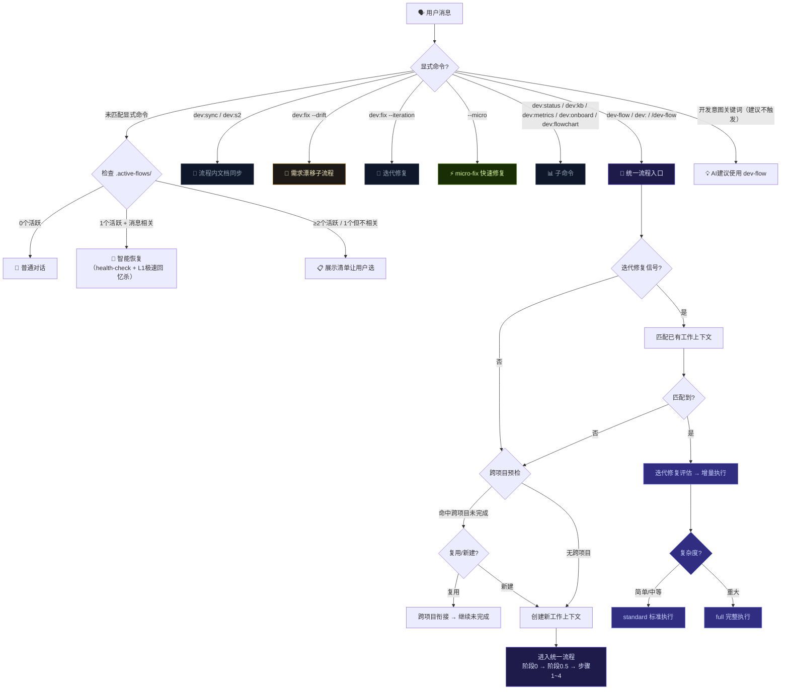
```mermaid
flowchart TD
A["🗣️ 用户消息"] --> B{"显式命令?"}
B -->|"dev-flow / dev: / /dev-flow"| C["🔄 统一流程入口"]
B -->|"dev:sync / dev:s2"| SYNC["📄 流程内文档同步"]
B -->|"dev:fix --drift"| DRIFT["🔄 需求漂移子流程"]
B -->|"dev:fix --iteration"| ITER_CMD["🔄 迭代修复"]
B -->|"--micro"| MICRO["⚡ micro-fix 快速修复"]
B -->|"dev:status / dev:kb / dev:metrics / dev:onboard / dev:flowchart"| SUB["📊 子命令"]
B -->|"未匹配显式命令"| H{"检查 .active-flows/"}
H -->|"0个活跃"| I["💬 普通对话"]
H -->|"1个活跃 + 消息相关"| J["🔄 智能恢复<br/>（health-check + L1极速回忆杀）"]
H -->|"≥2个活跃 / 1个但不相关"| K["📋 展示清单让用户选"]
B -->|"开发意图关键词（建议不触发）"| SUG["💡 AI建议使用 dev-flow"]
C --> N{"迭代修复信号?"}
N -->|"是"| O["匹配已有工作上下文"]
O --> Q{"匹配到?"}
N -->|"否"| CP{"跨项目预检"}
Q -->|"是"| R["迭代修复评估 → 增量执行"]
Q -->|"否"| CP
CP -->|"命中跨项目未完成"| CROSS{"复用/新建?"}
CROSS -->|"复用"| CR["跨项目衔接 → 继续未完成"]
CROSS -->|"新建"| P["创建新工作上下文"]
CP -->|"无跨项目"| P
R --> RM{"复杂度?"}
RM -->|"简单/中等"| STD["standard 标准执行"]
RM -->|"重大"| FULL["full 完整执行"]
P --> FLOW["进入统一流程<br/>阶段0 → 阶段0.5 → 步骤1~4"]

classDef unified fill:#1e1b4b,stroke:#4338ca,color:#e0e7ff
classDef cmd fill:#0f172a,stroke:#334155,color:#94a3b8
classDef micro fill:#1a2e05,stroke:#4d7c0f,color:#d9f99d
classDef drift fill:#1c1917,stroke:#a16207,color:#fef3c7
classDef iter fill:#312e81,stroke:#6366f1,color:#c7d2fe
class C,FLOW unified
class MICRO micro
class DRIFT drift
class SYNC,SUB,ITER_CMD cmd
class R,RD,RM,STD,FULL iter
```

> **v4 触发原则**：dev-flow 仅由显式命令触发或活跃流程相关恢复触发。AI 不得基于关键词主观判断自动触发。
> **新增命令**：`dev:fix --drift` 直接进入需求漂移子流程，`dev:fix --iteration` 直接进入迭代修复，`dev:status --trace` 实时观测流程状态，`dev:flowchart` 生成流程图。
> **热启动增强**：恢复时先跑 `health-check.sh`（≤3 秒），检测到状态不一致时追加警告。

---

## 2. 统一流程总览（阶段 0 + 0.5 + 步骤 1~10）

> **v4 新增**：产出物真实性原则（证伪式标注 + 极简模式准入）+ 交互式选项一致性 `interactive_progression_shown` 字段。

**流程总览表**（步骤名称以 step-router.md 为准）：

| 步骤 | 名称 | 加载文件 | 核心产出 | 执行深度 |
| --- | --- | --- | --- | --- |
| 0 | 需求理解 | `use_skill("requirement-intake")` | 需求确认 + 分支告知收集（仅 user_specified） | 全部 |
| 0.5 | 项目画像轻量注入 | 本地 `_profile.md`（0 MCP） | project_profile 或 skipped | 本地 profile 存在时 |
| 1 | 研究与定位 | `steps/step-1-research.md` | 相关文件表格 | 全部 |
| 2 | 确认范围 | `steps/step-2-scope.md` | 影响范围报告 + 用户确认 | 全部 |
| 3 | 制定方案 | `steps/step-3-plan.md` | 执行计划表格（极简/完整） | 全部 |
| 4 | 方案汇报与用户决策 | `steps/step-4-decision.md` | 评估卡片+执行深度选择+分支定稿+文档决策 | 全部 |
| 4.5 | 环境检查 | `steps/step-4.5-env-check.md` | 分支确认（主干拦截） | 全部 |
| 5 | 执行修改 | `steps/step-5-execute.md` | 代码改动 | 全部 |
| 5.5 | 编码后置钩子 | `steps/step-5.5-post-coding.md` | L1审查+文档同步+ESLint自检+新鲜度校验 | 全部 |
| 6 | 质量验证 | `steps/step-6-verify.md` | 验证报告（6A/6B/6C） | 全部 |
| 7 | 清理+Commit | `steps/step-7-commit.md` | L2审查+commit+devlog+knowledge（标准）或 L2审查（完整裁剪） | 全部 |
| 8 | L3 代码审查 | `steps/step-8-10-full.md` | L3多视角深度审查 | 仅完整执行 |
| 9 | 反思与学习 | `steps/step-8-10-full.md` | 度量报告+经验提炼 | 仅完整执行 |
| 10 | 归档与交付 | `steps/step-8-10-full.md` | commit+devlog+knowledge+交付报告 | 仅完整执行 |

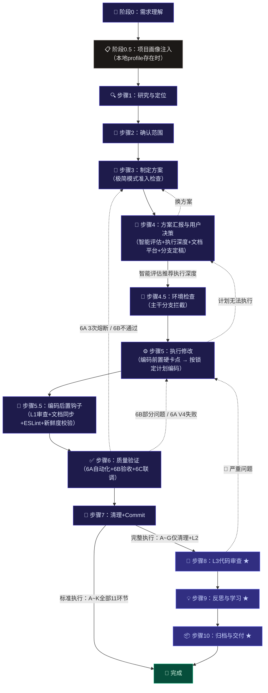
```mermaid
flowchart TD
S0["🎯 阶段0：需求理解"]
S05["📋 阶段0.5：项目画像注入<br/>（本地profile存在时）"]
S1["🔍 步骤1：研究与定位"]
S2["📐 步骤2：确认范围"]
S3["📝 步骤3：制定方案<br/>（极简模式准入检查）"]
S4["🤝 步骤4：方案汇报与用户决策<br/>（智能评估+执行深度+文档平台+分支定稿）"]
S45["🔧 步骤4.5：环境检查<br/>（主干分支拦截）"]
S5["⚙️ 步骤5：执行修改<br/>（编码前置硬卡点 → 按锁定计划编码）"]
S55["🔬 步骤5.5：编码后置钩子<br/>（L1审查+文档同步+ESLint+新鲜度校验）"]
S6["✅ 步骤6：质量验证<br/>（6A自动化+6B验收+6C联调）"]
S7["🧹 步骤7：清理+Commit"]
S8["🔎 步骤8：L3代码审查 ★"]
S9["💡 步骤9：反思与学习 ★"]
S10["📦 步骤10：归档与交付 ★"]
DONE["🏁 完成"]

S0 --> S05 --> S1 --> S2 --> S3 --> S4
S4 -->|"智能评估推荐执行深度"| S45
S45 --> S5
S5 --> S55 --> S6
S6 --> S7
S7 -->|"标准执行：A~K全部11环节"| DONE
S7 -->|"完整执行：A~G仅清理+L2"| S8 --> S9 --> S10 --> DONE

S4 -.->|"换方案"| S3
S6 -.->|"6A 3次熔断 / 6B不通过"| S3
S6 -.->|"6B部分问题 / 6A V4失败"| S5
S8 -.->|"🔴 严重问题"| S5
S5 -.->|"计划无法执行"| S4

classDef shared fill:#1e1b4b,stroke:#4338ca,color:#e0e7ff
classDef fullOnly fill:#312e81,stroke:#6366f1,color:#c7d2fe
classDef done fill:#064e3b,stroke:#10b981,color:#d1fae5
classDef phase fill:#1c1917,stroke:#78716c,color:#e7e5e4
class S0,S05,S1,S2,S3,S4,S45,S5,S55,S6,S7 shared
class S8,S9,S10 fullOnly
class DONE done
class S05 phase
```

> ★ = 仅完整执行时执行的步骤。步骤 0~7 为所有需求共享。
> **v4 产出物真实性原则**：产出长度由事实决定，不由模板决定。简单任务允许极简产出，但必须基于充分研究。空项须证伪式标注（"无 + 理由"），禁止静默省略。
> **交互式选项一致性**：每个完成标记 JSON 必须含 `interactive_progression_shown: true`（精简模式豁免流转除外），由 `post-step.sh` 机械校验。
> **步骤 6→7 回归修复**：步骤 6 通过后用户追加修复 → 强制重走 5.5→6→7 完整链路，精简模式不豁免。

---

## 3. 模式矩阵（5 种基础模式 + 1 种专项模式 + 1 种修饰层）

> **v4 更新**：micro-fix 升级为 ≤3 文件 + 对称修改 + 5 项 safe defaults。新增 文档平台 × 模式处理策略矩阵。

### 基础模式全景矩阵

| 模式 | 触发条件 | 阶段0 | 0.5 | 1 | 2 | 3 | 4 | 4.5 | 5 | 5.5 | 6 | 7 | 8-10 |
| --- | --- | :---: | :---: | :---: | :---: | :---: | :---: | :---: | :---: | :---: | :---: | :---: | :---: |
| **standard** | 默认 + 步骤4选 `execute_standard` | ✅ | 🔹 | ✅ | ✅ | ✅ | ✅ | ✅ | ✅ | ✅ | ✅ | ✅**结束** | — |
| **full** | 步骤4选 `execute_full` | ✅ | 🔹 | ✅ | ✅ | ✅ | ✅ | ✅ | ✅ | ✅ | ✅ | ✅裁剪 | ✅ |
| **micro-fix** | `--micro` + ≤3文件 + ≤10行/文件 + 对称修改 | ✅精简 | ❌ | ❌ | ❌ | ❌ | ❌ | 🔹主干检测 | ✅ | 🔹L1极简 | ✅lint | ⚡极简收尾 | — |
| **iteration-fix** | 活跃.flow + 迭代意图 | 🔹简化 | ❌ | 🔹增量 | 🔹增量 | 🔹增量 | — | ✅ | ✅ | ✅ | ✅ | ✅ | — |
| **batch** | 步骤4选 `execute_batched` | ✅ | 🔹 | ✅ | ✅ | ✅ | ✅ | ✅循环 | ✅循环 | ✅循环 | ✅循环 | ✅循环 | 最后批 |
| **cross-project** | 步骤2检测到 workspace 外修改 | ✅ | 🔹 | ✅ | ✅跨 | ✅跨 | ✅ | ✅ | ✅ | ✅ | ✅跨 | ✅跨 | — |

> ✅ 执行 / ❌ 跳过 / 🔹 按需触发 / 循环 = 批次循环 / 裁剪 = 步骤7仅A~G

> **v4 micro-fix 升级**：触发条件从 ≤1 文件放宽到 ≤3 文件，新增 `symmetric_change_required`（多文件须对称修改——每个文件做相同结构的修改，仅文件名/变量名等局部差异）。5 项 safe defaults 自动代劳：`read_lints` 必走、commit 必须确认、L1 极简审查必走、knowledge 漂移检测必走、自动降级机制。

### 模式切换决策树

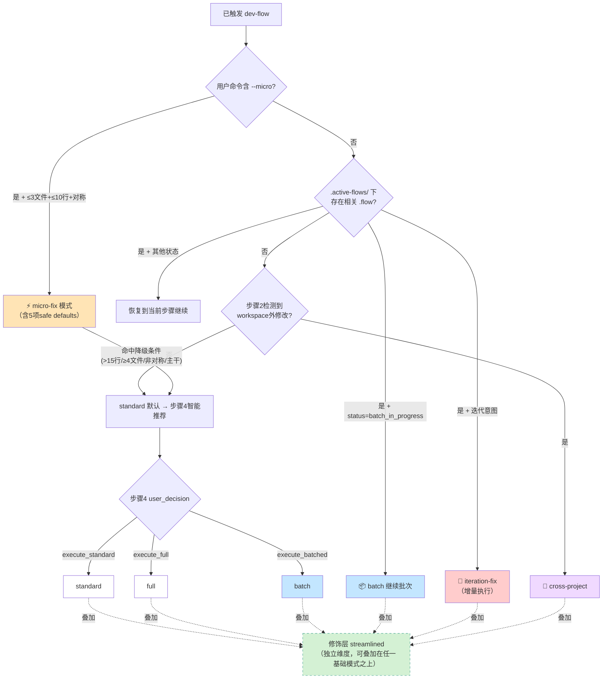
```mermaid
flowchart TD
A[已触发 dev-flow] --> B2{"用户命令含 --micro?"}
B2 -->|"是 + ≤3文件+≤10行+对称"| B3["⚡ micro-fix 模式<br/>（含5项safe defaults）"]
B2 -->|"否"| D{".active-flows/ 下<br/>存在相关 .flow?"}
D -->|"是 + status=batch_in_progress"| F["📦 batch 继续批次"]
D -->|"是 + 迭代意图"| H["🔄 iteration-fix<br/>（增量执行）"]
D -->|"是 + 其他状态"| I["恢复到当前步骤继续"]
D -->|"否"| L{"步骤2检测到<br/>workspace外修改?"}
L -->|"是"| M["🔗 cross-project"]
L -->|"否"| N["standard 默认 → 步骤4智能推荐"]
N --> O{"步骤4 user_decision"}
O -->|"execute_standard"| P["standard"]
O -->|"execute_full"| Q["full"]
O -->|"execute_batched"| R["batch"]

B3 -->|"命中降级条件<br/>(>15行/≥4文件/非对称/主干)"| N

K["修饰层 streamlined<br/>（独立维度，可叠加在任一基础模式之上）"]
P -.叠加.-> K
Q -.叠加.-> K
R -.叠加.-> K
F -.叠加.-> K
H -.叠加.-> K
M -.叠加.-> K

style B3 fill:#ffe4b5
style F fill:#c3e6ff
style H fill:#ffcccc
style M fill:#f0d9ff
style P fill:#fff
style Q fill:#fff
style R fill:#c3e6ff
style K fill:#d4f1d4,stroke:#5a9,stroke-dasharray:5 5
```

### 文档平台 × 模式处理策略矩阵（v4 新增）

| 模式 | 步骤 4 · 文档决策 | 步骤 7 H.3+ | 步骤 10.3.5 |
| --- | --- | --- | --- |
| `standard` | ✅ 硬性必走 | docid 非空即触发 | — |
| `full` | ✅ 硬性必走 | ↩️ 推迟至 §10.3.5 | ✅ docid 非空即触发 |
| `iteration-fix` | 仅首轮走；后续按 `action_history` 继承 | 命中阈值时触发 | 按首轮决策派生 |
| `batch` | 仅 Batch 1 走；后续自动继承 | 仅最后一批 | 仅最后一批（若 full） |
| `cross-project` | A 项目侧按其 mode 走 | 同左 | 同左 |

> **跨模式继承规则**：`action_history` 是权威历史证据链；首轮 skip 具有"吸附性"（后续自动继承）；首轮已发布具有"提醒性"；用户逃生通道永远有效（显式说"生成 文档平台"可覆盖任何继承规则）。

---

## 4. 步骤 4：方案汇报与用户决策（4 个环节）

> **v4 增强**：产出物真实性原则影响步骤 3 产出的形态（简单任务允许 1 句话方案，但须通过机校验准入清单）。

**环节速查**：

| 环节 | 执行时机 | 是否必走 | 交互方式 |
| --- | --- | --- | --- |
| 环节 1 · 评估输出 | 方案汇报末尾自动 | ✅ 必走 | 输出展示，无弹窗 |
| 环节 2 · 执行深度决策 | 第 1 次弹窗 | ✅ 必走 | `ask_followup_question` |
| 环节 3 · 文档决策 | 第 2 次弹窗（仅执行类选项进入） | ✅ 硬性必走 | `ask_followup_question` |
| 环节 4 · 决策落地 | 串行三步：§4.1 分支定稿 → §4.2 plan.md 写盘 → §4.3 文档平台 执行 | ✅ 必走 | 仅 §4.1 特定场景弹窗 |

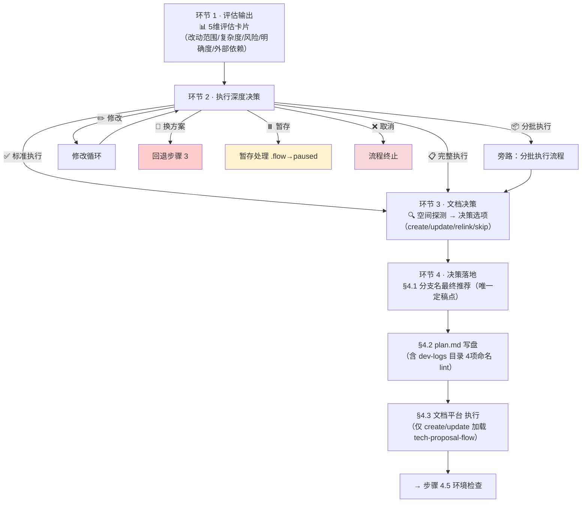
```mermaid
flowchart TB
S1["环节 1 · 评估输出<br/>📊 5维评估卡片<br/>（改动范围/复杂度/风险/明确度/外部依赖）"]
S1 --> S2["环节 2 · 执行深度决策"]

S2 -->|"✅ 标准执行"| S3_1
S2 -->|"📋 完整执行"| S3_1
S2 -->|"📦 分批执行"| BYPASS_BATCH["旁路：分批执行流程"]
S2 -->|"✏️ 修改"| S2_2["修改循环"] --> S2
S2 -->|"🔄 换方案"| BACK3["回退步骤 3"]
S2 -->|"⏸️ 暂存"| PAUSE["暂存处理 .flow→paused"]
S2 -->|"❌ 取消"| CANCEL["流程终止"]
BYPASS_BATCH --> S3_1

S3_1["环节 3 · 文档决策<br/>🔍 空间探测 → 决策选项<br/>（create/update/relink/skip）"]
S3_1 --> S4_1["环节 4 · 决策落地<br/>§4.1 分支名最终推荐（唯一定稿点）"]
S4_1 --> S4_2["§4.2 plan.md 写盘<br/>（含 dev-logs 目录 4项命名 lint）"]
S4_2 --> S4_3["§4.3 文档平台 执行<br/>（仅 create/update 加载 tech-proposal-flow）"]
S4_3 --> NEXT["→ 步骤 4.5 环境检查"]

style BACK3 fill:#ffcccc
style PAUSE fill:#fff3cd
style CANCEL fill:#f8d7da
```

> **步骤 4 决策后顺序锚点**：环节 4 严格按 §4.1 → §4.2 → §4.3 串行执行。§4.1 分支名定稿发生在 plan.md 写盘前。
> **文档决策必走**：除 `user_decision` 为 modify/change_plan/pause/cancel 外，必须执行 文档平台 空间探测并输出决策。
> **文档平台 × 模式策略**：首轮决策写入 `action_history`，后续迭代/批次自动继承，用户显式覆盖始终有效。

---

## 5. 步骤 7：收尾流程（closeout-flow.md）— 调用方 × 环节矩阵

> **v4 变化**：环节 K（dev-logs 完整性自检）已在 v3 引入。v4 新增 5.5b 新鲜度物理兜底（`freshness-lint.sh` 在步骤 5.5 执行而非步骤 7）。

**环节清单**（A~K，标准执行全部 11 环）：

| 环节 | 内容 | standard-7 | full-7 | micro-fix-7 | batch-7（非末批） |
| :---: | --- | :---: | :---: | :---: | :---: |
| A | Diff 分析 + 预期外变更处理 | ✅ | ✅ | ✅极简 | ✅ |
| B | 清理调试代码 | ✅ | ✅ | ✅限改动行 | ✅ |
| C | 可选链检查 | ✅ | ✅ | ❌ | ✅ |
| D | 即时验证 | ✅ | ✅ | ❌ | ✅ |
| E | TODO 检查 | ✅ | ✅ | ❌ | ✅ |
| F | 改动汇总 | ❌ | ❌ | ❌ | ❌ |
| G | L2 审查 | ✅ | ✅ 到此结束 | ❌ | ✅ |
| H | Commit+Devlog+Knowledge | ✅ | ❌ 推迟到步骤10 | ✅极简 | ✅精简 |
| I | 数据驱动反思 | ✅ | ❌ | ❌ | ❌ |
| J | 经验快检（3问） | ✅ | ❌ | ✅静默 | ❌ |
| K | dev-logs 完整性自检 | ✅ | ❌ 推迟到步骤10 | ❌ | ❌ |

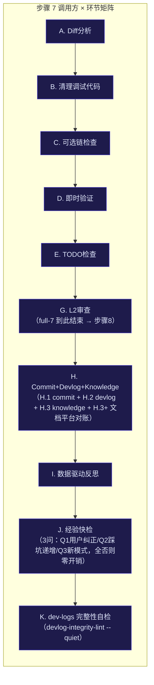
```mermaid
flowchart TD
subgraph MATRIX["步骤 7 调用方 × 环节矩阵"]
direction TB
MA["A. Diff分析"]
MB["B. 清理调试代码"]
MC["C. 可选链检查"]
MD["D. 即时验证"]
ME["E. TODO检查"]
MG["G. L2审查<br/>（full-7 到此结束 → 步骤8）"]
MH["H. Commit+Devlog+Knowledge<br/>（H.1 commit + H.2 devlog + H.3 knowledge + H.3+ 文档平台对账）"]
MI["I. 数据驱动反思"]
MJ["J. 经验快检<br/>（3问：Q1用户纠正/Q2踩坑递增/Q3新模式，全否则零开销）"]
MK["K. dev-logs 完整性自检<br/>（devlog-integrity-lint --quiet）"]
MA --> MB --> MC --> MD --> ME --> MG --> MH --> MI --> MJ --> MK
end

classDef standard fill:#1e1b4b,stroke:#4338ca,color:#e0e7ff
class MA,MB,MC,MD,ME,MG,MH,MI,MJ,MK standard
```

> **四种调用方**：
> - `caller=standard-7`：标准执行步骤 7，执行 A~K 全部 11 环，流程结束
> - `caller=full-7`：完整执行步骤 7，仅执行 A~G（到 G 结束），H~K 推迟到步骤 10
> - `caller=micro-fix-7`：极简收尾，A 仅 diff stat + B 限改动行 + H 极简 + J 静默 + 跳过 C/D/E/G/I/K
> - `caller=batch-7`（非末批）：A~G 正常 + H 精简（仅 H.1+H.2 增量），跳过 I/J/K
> **环节 H 子步骤**：H.1 生成 Commit Message（smart-commit）→ H.2 生成/追加开发日志（tech-doc）→ H.3 知识沉淀（knowledge-loop）→ H.3+ 文档平台 兜底对账（docid 非空时强制执行）

---

## 6. 阶段 0：需求理解

> **v4 变化**：分支推荐仍唯一定稿在步骤 4 §4.1。产出物以需求确认为核心，极简任务允许精简输出。

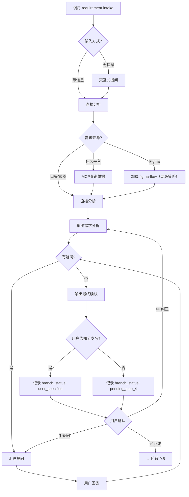
```mermaid
flowchart TD
RI["调用 requirement-intake"] --> RIA{"输入方式?"}
RIA -->|"无信息"| RIQ["交互式提问"]
RIA -->|"带信息"| RID["直接分析"]
RIQ --> RID
RID --> SRC{"需求来源?"}
SRC -->|"任务平台"| 任务平台["MCP查询单据"]
SRC -->|"Figma"| FIG["加载 figma-flow（两级策略）"]
SRC -->|"口头/截图"| ANA["直接分析"]
任务平台 --> ANA
FIG --> ANA
ANA --> OUT["输出需求分析"]
OUT --> QA{"有疑问?"} -->|"是"| ASK["汇总提问"] --> ANS["用户回答"] --> QA
QA -->|"否"| CONF["输出最终确认"]
CONF --> BR{"用户告知分支名?"}
BR -->|"是"| BREC["记录 branch_status: user_specified"]
BR -->|"否"| BRP["记录 branch_status: pending_step_4"]
BREC --> UC
BRP --> UC{"用户确认"}
UC -->|"✅ 正确"| NEXT["→ 阶段 0.5"]
UC -->|"✏️ 纠正"| OUT
UC -->|"❓ 疑问"| ASK
```

> 所有需求（无论大小）都必须经过阶段 0。迭代修复场景下，阶段 0 执行增量理解而非全量理解。
> 分支推荐唯一定稿在步骤 4 §4.1，阶段 0 只做记录。

---

## 7. 阶段 0.5：项目画像轻量注入 + 步骤 1~4.5 子流程

### 阶段 0.5：项目画像轻量注入

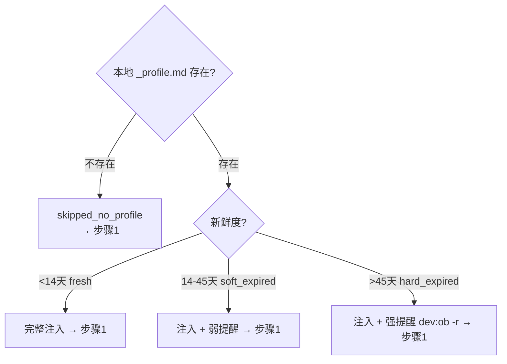
```mermaid
flowchart TD
CHECK{"本地 _profile.md 存在?"}
CHECK -->|"不存在"| SKIP["skipped_no_profile<br/>→ 步骤1"]
CHECK -->|"存在"| FRESH{"新鲜度?"}
FRESH -->|"<14天 fresh"| LOAD["完整注入 → 步骤1"]
FRESH -->|"14-45天 soft_expired"| WARN["注入 + 弱提醒 → 步骤1"]
FRESH -->|">45天 hard_expired"| STRONG["注入 + 强提醒 dev:ob -r → 步骤1"]
```

### 步骤 1：研究与定位

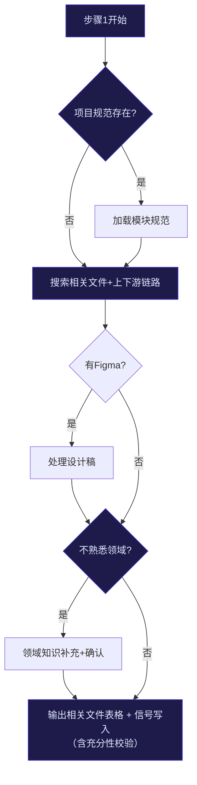
```mermaid
flowchart TD
S1["步骤1开始"] --> SPEC{"项目规范存在?"}
SPEC -->|"是"| SPECL["加载模块规范"]
SPEC -->|"否"| SEARCH["搜索相关文件+上下游链路"]
SPECL --> SEARCH
SEARCH --> FIGMA{"有Figma?"} -->|"是"| FIGP["处理设计稿"] --> DOMAIN
FIGMA -->|"否"| DOMAIN{"不熟悉领域?"}
DOMAIN -->|"是"| DK["领域知识补充+确认"] --> OUTPUT
DOMAIN -->|"否"| OUTPUT["输出相关文件表格 + 信号写入<br/>（含充分性校验）"]

classDef shared fill:#1e1b4b,stroke:#4338ca,color:#e0e7ff
class S1,SPEC,SEARCH,DOMAIN,OUTPUT shared
```

> **v4 充分性校验**：步骤 1 末尾执行 `sufficiency_check`，不通过 → 禁止进入步骤 2，必须补充搜索。防止"伪装简化"（描述简短但实际中等复杂）。

### 步骤 2：确认范围

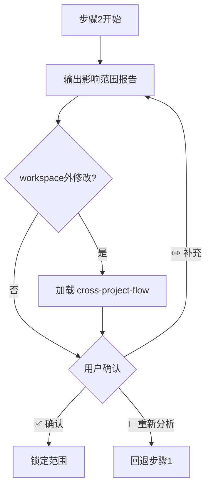
```mermaid
flowchart TD
S2["步骤2开始"] --> RPT["输出影响范围报告"]
RPT --> CROSS{"workspace外修改?"}
CROSS -->|"是"| CFLOW["加载 cross-project-flow"]
CROSS -->|"否"| UC{"用户确认"}
CFLOW --> UC
UC -->|"✅ 确认"| LOCK["锁定范围"]
UC -->|"✏️ 补充"| RPT
UC -->|"🔄 重新分析"| BACK["回退步骤1"]
```

### 步骤 3：制定方案

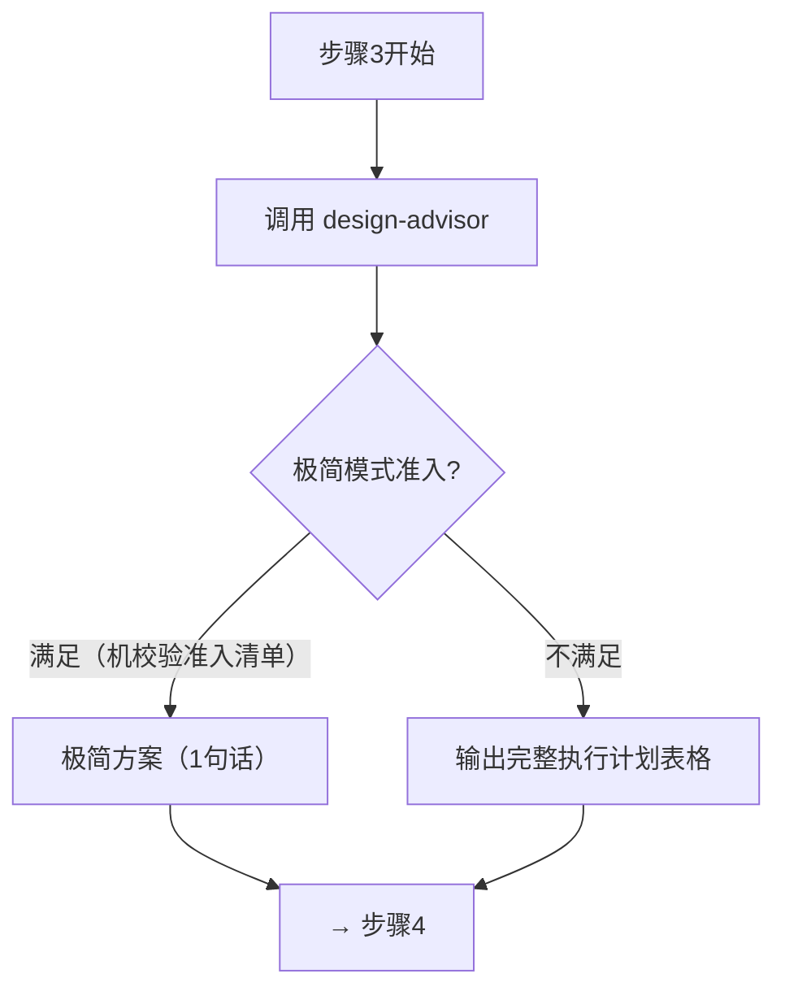
```mermaid
flowchart TD
S3["步骤3开始"] --> DA["调用 design-advisor"]
DA --> ADMIT{"极简模式准入?"}
ADMIT -->|"满足（机校验准入清单）"| MINI["极简方案（1句话）"]
ADMIT -->|"不满足"| PLAN["输出完整执行计划表格"]
MINI --> DONE3["→ 步骤4"]
PLAN --> DONE3
```

> **v4 极简模式准入**：不再是 AI 自由选择。须满足机器可校验准入清单（基于步骤 1/2 JSON 产出），任一条件不满足 → 自动禁用极简模式。

### 步骤 4.5：环境检查

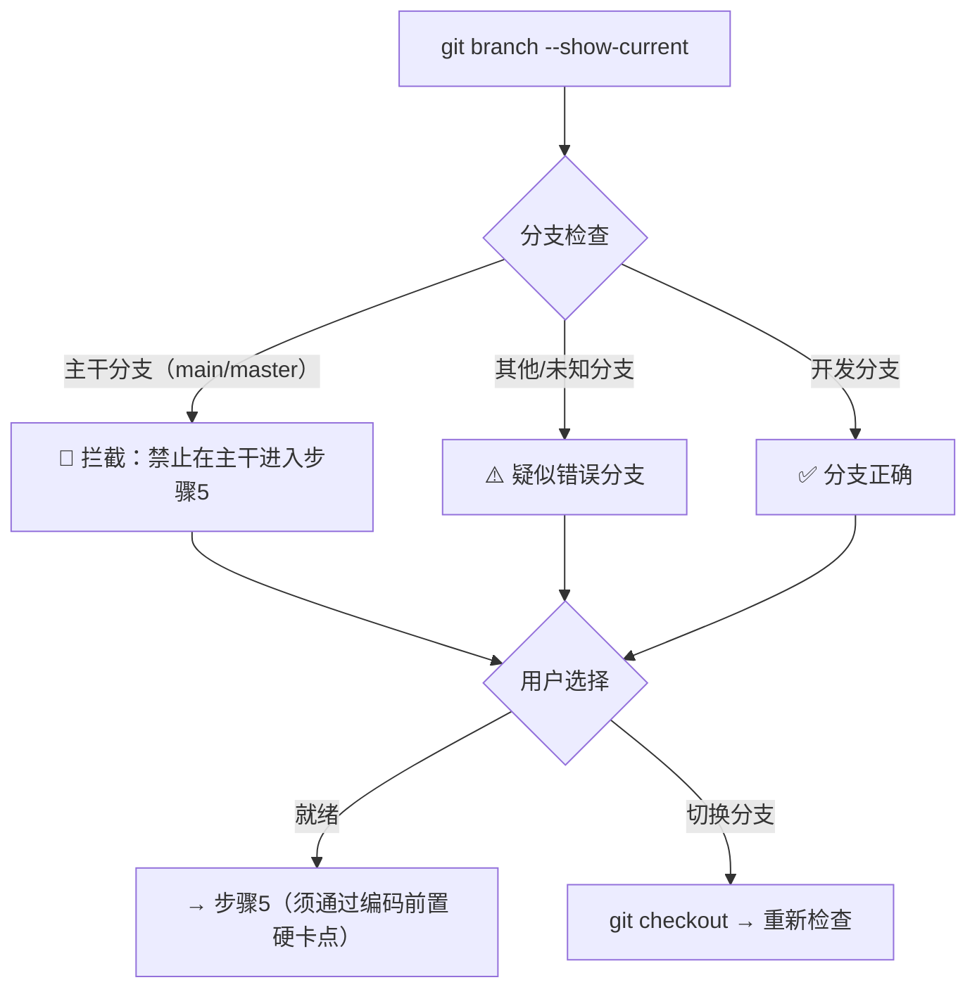
```mermaid
flowchart TD
GIT["git branch --show-current"] --> CHK{"分支检查"}
CHK -->|"主干分支（main/master）"| BLOCK["🔴 拦截：禁止在主干进入步骤5"]
CHK -->|"开发分支"| OK["✅ 分支正确"]
CHK -->|"其他/未知分支"| WARN["⚠️ 疑似错误分支"]
BLOCK --> UC{"用户选择"}
WARN --> UC
OK --> UC
UC -->|"就绪"| NEXT["→ 步骤5（须通过编码前置硬卡点）"]
UC -->|"切换分支"| SWITCH["git checkout → 重新检查"]
```

> **硬性规则**：主干分支下不可进入步骤 5，交互选项中不允许"跳过检查"。
> **步骤 4.5 推进选项**：正常场景（分支一致且非主干）标准模式下仅弹一次推进选项，精简模式一行摘要静默推进。

---

## 8. 步骤 5~6 子流程

### 步骤 5：执行修改

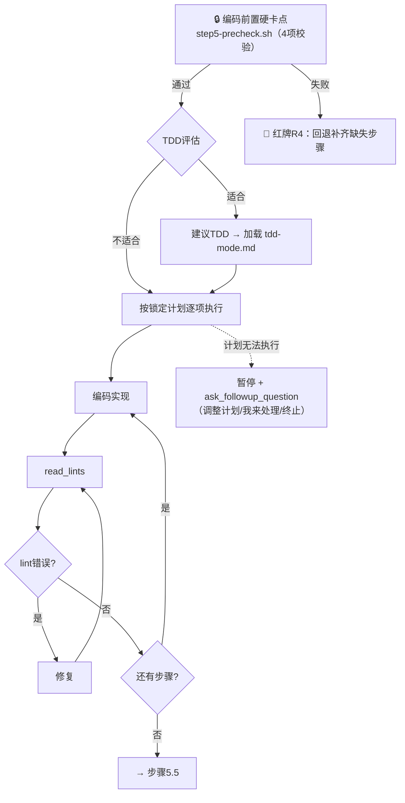
```mermaid
flowchart TD
PRECHECK["🔒 编码前置硬卡点<br/>step5-precheck.sh（4项校验）"]
PRECHECK -->|"通过"| TDD{"TDD评估"}
PRECHECK -->|"失败"| BACK4["🔴 红牌R4：回退补齐缺失步骤"]
TDD -->|"适合"| TDDS["建议TDD → 加载 tdd-mode.md"]
TDD -->|"不适合"| EXEC["按锁定计划逐项执行"]
TDDS --> EXEC
EXEC --> CODE["编码实现"] --> LINT["read_lints"]
LINT --> ERR{"lint错误?"}
ERR -->|"是"| FIX["修复"] --> LINT
ERR -->|"否"| NEXT{"还有步骤?"}
NEXT -->|"是"| CODE
NEXT -->|"否"| DONE5["→ 步骤5.5"]
EXEC -.->|"计划无法执行"| BLOCK5["暂停 + ask_followup_question<br/>（调整计划/我来处理/终止）"]
```

> **编码前置硬卡点 4 项校验**：① 工作上下文文件存在 ② `.flow` 锁文件 current_step ≥ 4.5 ③ 步骤 4 user_decision 非空 ④ 步骤 2/4 交互记录存在。micro-fix 模式有独立分流规则。

### 步骤 5.5：编码后置钩子

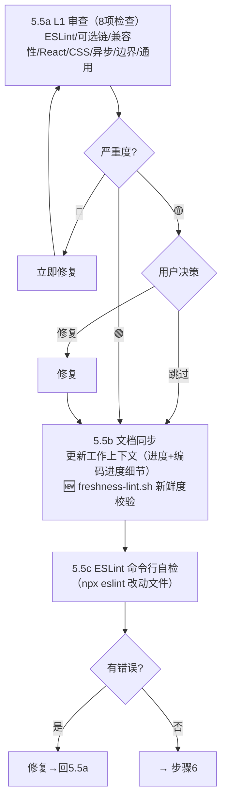
```mermaid
flowchart TD
A["5.5a L1 审查（8项检查）<br/>ESLint/可选链/兼容性/React/CSS/异步/边界/通用"]
A --> SEV{"严重度?"}
SEV -->|"🔴"| RFIX["立即修复"] --> A
SEV -->|"🟡"| YD{"用户决策"} -->|"修复"| YFIX["修复"]
YD -->|"跳过"| B
SEV -->|"🟢"| B["5.5b 文档同步<br/>更新工作上下文（进度+编码进度细节）<br/>🆕 freshness-lint.sh 新鲜度校验"]
YFIX --> B
B --> C["5.5c ESLint 命令行自检<br/>（npx eslint 改动文件）"]
C --> CERR{"有错误?"} -->|"是"| CFIX["修复→回5.5a"]
CERR -->|"否"| PASS["→ 步骤6"]
```

> **v4 5.5b 新鲜度物理兜底**：`freshness-lint.sh` 校验工作上下文新鲜度（步骤清单状态与实际产出时间戳一致性），过时 → 阻断推进，必须先执行 `dev:sync`。
> **5.5 不可跳过**：每轮编码（含迭代修复）完成后必须执行 5.5a L1 审查 + 5.5b 文档同步 + 5.5c ESLint 自检。
> 静默累计 ≥3 次未执行 dev:sync → 物理层必弹提醒（由 post-step.sh 维护 `silent_55_count`）。

### 步骤 6：质量验证（6A + 6B + 6C）

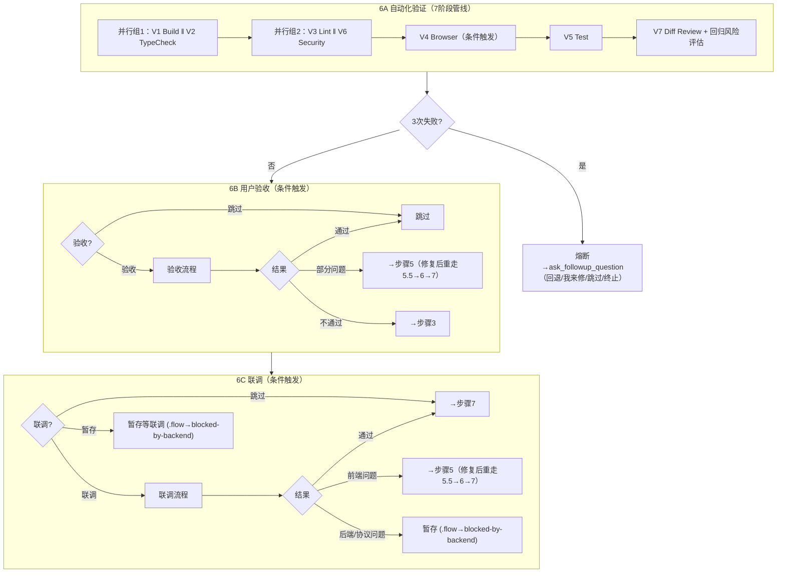
```mermaid
flowchart TD
subgraph A6["6A 自动化验证（7阶段管线）"]
PAR1["并行组1：V1 Build ‖ V2 TypeCheck"]
PAR2["并行组2：V3 Lint ‖ V6 Security"]
PAR1 --> PAR2
PAR2 --> V4["V4 Browser（条件触发）"]
V4 --> V5["V5 Test"] --> V7["V7 Diff Review + 回归风险评估"]
end
subgraph B6["6B 用户验收（条件触发）"]
VB{"验收?"} -->|"验收"| VBA["验收流程"]
VB -->|"跳过"| VBP["跳过"]
VBA --> VBR{"结果"} -->|"通过"| VBP
VBR -->|"部分问题"| VBF1["→步骤5（修复后重走5.5→6→7）"]
VBR -->|"不通过"| VBF2["→步骤3"]
end
subgraph C6["6C 联调（条件触发）"]
VC{"联调?"} -->|"联调"| VCA["联调流程"]
VC -->|"跳过"| VCP["→步骤7"]
VC -->|"暂存"| VCS["暂存等联调 (.flow→blocked-by-backend)"]
VCA --> VCR{"结果"} -->|"通过"| VCP
VCR -->|"前端问题"| VCF["→步骤5（修复后重走5.5→6→7）"]
VCR -->|"后端/协议问题"| VCW["暂存 (.flow→blocked-by-backend)"]
end
A6 --> FUSE{"3次失败?"} -->|"是"| FUSED["熔断→ask_followup_question<br/>（回退/我来修/跳过/终止）"]
FUSE -->|"否"| B6 --> C6
```

> **v4 6→7 回归修复规则**：步骤 6 通过后、步骤 7 加载前用户追加修复 → 修复完成后必须重走 5.5→6→7 完整链路（每个步骤独立 loading + JSON + validate-output.sh）。精简模式不豁免本规则。步骤 7 的 `.step-7.validated` 是流程结束的唯一合法标志。

---

## 9. 完整执行独有步骤（8~10）

> 以下步骤仅在用户选择「完整执行」时执行。标准执行在步骤 7 结束。

### 步骤 8：L3 代码审查

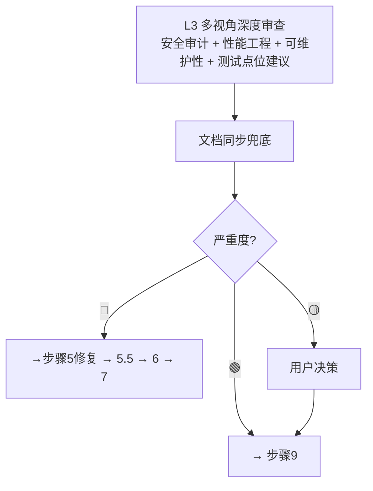
```mermaid
flowchart TD
L3["L3 多视角深度审查<br/>安全审计 + 性能工程 + 可维护性 + 测试点位建议"]
L3 --> DOC["文档同步兜底"]
DOC --> SEV{"严重度?"}
SEV -->|"🔴"| BACK5["→步骤5修复 → 5.5 → 6 → 7"]
SEV -->|"🟡"| UD["用户决策"]
SEV -->|"🟢"| NEXT9["→ 步骤9"]
UD --> NEXT9
```

### 步骤 9：反思与学习（数据驱动，4 个子步骤）

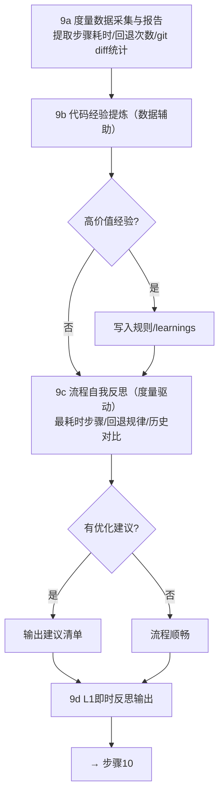
```mermaid
flowchart TD
S9A["9a 度量数据采集与报告<br/>提取步骤耗时/回退次数/git diff统计"]
S9A --> S9B["9b 代码经验提炼（数据辅助）"]
S9B --> EXP{"高价值经验?"}
EXP -->|"是"| RULE["写入规则/learnings"]
EXP -->|"否"| S9C
RULE --> S9C["9c 流程自我反思（度量驱动）<br/>最耗时步骤/回退规律/历史对比"]
S9C --> OPT{"有优化建议?"}
OPT -->|"是"| SUGGEST["输出建议清单"]
OPT -->|"否"| SMOOTH["流程顺畅"]
SUGGEST --> S9D["9d L1即时反思输出"]
SMOOTH --> S9D
S9D --> NEXT10["→ 步骤10"]
```

### 步骤 10：归档与交付

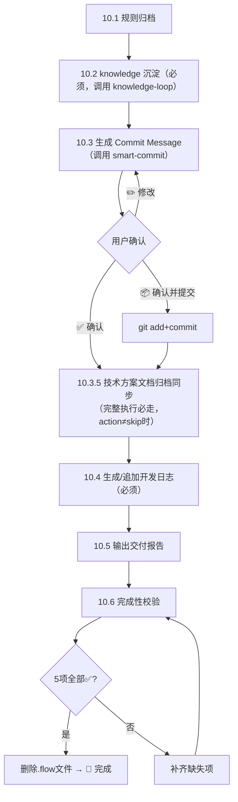
```mermaid
flowchart TD
T1["10.1 规则归档"]
T2["10.2 knowledge 沉淀（必须，调用 knowledge-loop）"]
T3["10.3 生成 Commit Message（调用 smart-commit）"]
T35["10.3.5 技术方案文档归档同步<br/>（完整执行必走，action≠skip时）"]
T4["10.4 生成/追加开发日志（必须）"]
T5["10.5 输出交付报告"]
T6["10.6 完成性校验"]
T1 --> T2 --> T3
T3 --> UC{"用户确认"}
UC -->|"✅ 确认"| T35
UC -->|"📦 确认并提交"| GITCMT["git add+commit"] --> T35
UC -->|"✏️ 修改"| T3
T35 --> T4 --> T5 --> T6
T6 --> CHK{"5项全部✅?"}
CHK -->|"是"| DEL["删除.flow文件 → 🏁 完成"]
CHK -->|"否"| FIX["补齐缺失项"] --> T6
```

> 10.6 校验项：① Commit已确认 ② devlog已生成 ③ knowledge已沉淀 ④ 交付报告已输出 ⑤ 规则归档已处理。
> 10.3.5 文档平台 归档同步前必须通过 `doc-platform-doc-lint`（6 项文档质量检查），失败则阻断。

---

## 10. 特殊流程

### 迭代修复机制

> **v4 增强**：新增 `dev:fix --iteration` 显式触发 + 热启动健康检查（`health-check.sh`）+ 24h+ 跨天对账。

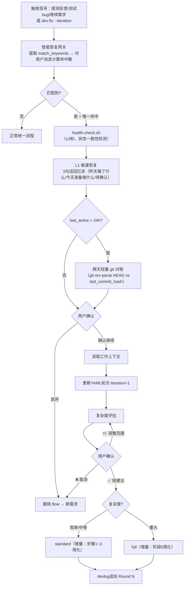
```mermaid
flowchart TD
TRIG["触发信号：提测反馈/测试bug/继续需求<br/>或 dev:fix --iteration"]
TRIG --> MATCH["智能恢复网关<br/>提取 match_keywords → 对用户消息计算命中数"]
MATCH --> MR{"匹配到?"}
MR -->|"否"| NORMAL["正常统一流程"]
MR -->|"是 + 唯一命中"| HEALTH["health-check.sh<br/>（≤3秒，状态一致性检测）"]
HEALTH --> RECOVER["L1 极速恢复<br/>3句话回忆杀（昨天做了什么/今天准备做什么/待确认）"]
RECOVER --> GIT24{"last_active > 24h?"}
GIT24 -->|"是"| GITCHK["跨天轻量 git 对账<br/>（git rev-parse HEAD vs last_commit_hash）"]
GIT24 -->|"否"| RC
GITCHK --> RC{"用户确认"}
RC -->|"确认继续"| READ["读取工作上下文"]
RC -->|"放弃"| CANCEL["删除.flow → 新需求"]
READ --> ITER["更新YAML轮次 iteration+1"]
ITER --> EVAL["复杂度评估"]
EVAL --> UC{"用户确认"}
UC -->|"✅ 按建议"| MODE{"复杂度?"}
UC -->|"✏️ 调整范围"| EVAL
UC -->|"❌ 取消"| CANCEL
MODE -->|"简单/中等"| STD["standard（增量：步骤1~3简化）"]
MODE -->|"重大"| FULL["full（增量：阶段0简化）"]
STD --> DEVLOG["devlog追加 Round N"]
FULL --> DEVLOG
```

> **v4 热启动增强**：恢复前先跑 `health-check.sh`（≤3 秒），输出 `exit 1`（阻断级警告）或 `exit 2`（非阻断警告）时追加提示。
> **24h+ 跨天对账**：`last_active > 24h` 时一行命令检查 HEAD 是否变化（`git rev-parse --short HEAD`），不一致时追加 ⚠️ 提示。

### 分批执行流程

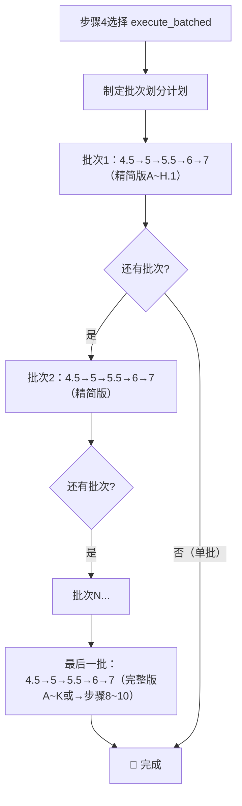
```mermaid
flowchart TD
S4DEC["步骤4选择 execute_batched"] --> BATCH_PLAN["制定批次划分计划"]
BATCH_PLAN --> B1["批次1：4.5→5→5.5→6→7（精简版A~H.1）"]
B1 --> B1DONE{"还有批次?"}
B1DONE -->|"是"| B2["批次2：4.5→5→5.5→6→7（精简版）"]
B2 --> B2DONE{"还有批次?"}
B2DONE -->|"是"| B3["批次N..."]
B3 --> LAST["最后一批：4.5→5→5.5→6→7（完整版A~K或→步骤8~10）"]
LAST --> DONE["🏁 完成"]
B1DONE -->|"否（单批）"| DONE
```

### 跨项目协作

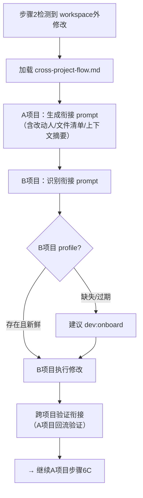
```mermaid
flowchart TD
S2CROSS["步骤2检测到 workspace外修改"] --> TRIG["加载 cross-project-flow.md"]
TRIG --> HANDOFF["A项目：生成衔接 prompt<br/>（含改动人/文件清单/上下文摘要）"]
HANDOFF --> BENTER["B项目：识别衔接 prompt"]
BENTER --> BPROF{"B项目 profile?"}
BPROF -->|"缺失/过期"| ONBOARD["建议 dev:onboard"]
BPROF -->|"存在且新鲜"| BEXEC["B项目执行修改"]
ONBOARD --> BEXEC
BEXEC --> VERIFY["跨项目验证衔接<br/>（A项目回流验证）"]
VERIFY --> DONE["→ 继续A项目步骤6C"]
```

### 需求漂移子流程

> **v4 新增**：`dev:fix --drift` 显式命令入口，跳过关键词匹配直接执行三步固定动作。

```mermaid
flowchart TD
DRIFT["触发信号<br/>① 产品说/需求变了/刚和XX对齐（关键词）<br/>② dev:fix --drift（显式命令，跳过匹配）"]
DRIFT --> CLASS["需求变更分类<br/>（沟通回流/方案否定/澄清调整）"]
CLASS --> STEP3_5["三步固定动作<br/>①归档旧方案 ②CR登记 ③更新上下文"]
STEP3_5 --> SYNC_DRIFT["自动调用 dev:sync<br/>同步下游文档 + 门控校验"]
SYNC_DRIFT --> RESUME["回到当前步骤继续<br/>或回退必要步骤"]
```

> **显式命令 `dev:fix --drift`**：直接触发需求漂移，跳过 doc-sync-rules §路由分流的 B/C/D 关键词匹配。完成后自动调用 `dev:sync` 刷新下游文档。

### 6→7 回归修复规则（v4 新增）

```mermaid
flowchart TD
TRIG67["步骤6通过后用户追加修复<br/>修复发生时机：6A失败/6B不通过/7加载前追加"]
TRIG67 --> FIX["执行代码修复"]
FIX --> R55["重走步骤5.5<br/>（read_file + L1审查 + 文档同步 + ESLint）"]
R55 --> R55VAL["输出5.5完成标记JSON + validate-output.sh"]
R55VAL --> R6["重走步骤6<br/>（read_file + 6A自动化验证）"]
R6 --> R6VAL["输出6完成标记JSON + validate-output.sh"]
R6VAL --> R7["重走步骤7<br/>（read_file + 完整closeout-flow）"]
R7 --> R7VAL["输出7完成标记JSON + validate-output.sh<br/>🔐 .step-7.validated 是流程结束唯一合法标志"]
```

> **不可豁免**：精简交互模式不豁免本规则。即使 `--fast`，步骤 7 的完整执行（A~J 环节）仍然强制。
> **禁止跳过**：禁止以"修复已验证通过"为由跳过步骤 7 的任何环节。禁止不调用 `validate-output.sh`。

### 物理检查点与门控系统

```mermaid
flowchart TD
STEP["步骤N完成"] --> JSON["输出结构化完成标记 JSON<br/>含 interactive_progression_shown"]
JSON --> VALIDATE["调用 validate-output.sh<br/>（Schema校验 + 物理检查点创建）"]
VALIDATE --> RESULT{"返回码?"}
RESULT -->|"0 通过"| CREATED["🔐 .step-N.validated 已创建"]
RESULT -->|"1 JSON格式错误"| FIX1["补齐JSON → 重试"]
RESULT -->|"2 Schema失败"| FIX2["补齐outputs → 重试"]
RESULT -->|"3 工具缺失降级"| FALLBACK["降级到 jq-only → 仍写.validated"]
CREATED --> LOAD_NEXT{"加载步骤N+1前"}
LOAD_NEXT --> LS["ls .step-N.validated"]
LS -->|"存在"| LOAD["✅ read_file steps/step-N+1-xxx.md"]
LS -->|"不存在"| RED14["🔴 红牌R5：回退步骤N重新调用"]
FIX1 --> VALIDATE
FIX2 --> VALIDATE
FALLBACK --> LOAD_NEXT
```

> **v4 交互式选项硬化**：完成标记 JSON 必须含 `interactive_progression_shown: true`（精简模式豁免流转除外），由 `post-step.sh` 机械校验。缺失时等价于红牌 #13。

### 工具门禁（红牌 R7）

```mermaid
flowchart TD
PHASE{"当前步骤?"}
PHASE -->|"阶段0"| P0["允许：interact + mcp_read + read_only<br/>（仅用户提及文件）<br/>禁止：write_code + execute + mcp_write"]
PHASE -->|"步骤1~3"| P1["允许：read_only + interact + mcp_read<br/>+ execute（仅只读命令）<br/>禁止：write_code + mcp_write"]
PHASE -->|"步骤4"| P4["允许：interact + read_only + execute + mcp_read<br/>禁止：write_code + mcp_write"]
PHASE -->|"步骤5+"| P5["🔓 全部解锁"]
P0 --> VIOLATE{"违规?"} -->|"是"| RED15["🔴 红牌R7：立即停止+回当前步骤"]
P1 --> VIOLATE
P4 --> VIOLATE
```

---

## 11. 文档同步体系（dev:sync）

> `dev:sync` 是流程内文档同步入口，任意步骤可召唤，完成后回原步骤。复用 `closeout-flow.md §H.0~H.3+` 的文档同步子集。
> **v4 增强**：热启动恢复时自动跑 `health-check.sh` 检测状态一致性。

### dev:sync — 流程内同步（caller=in-flow-sync）

```mermaid
flowchart TD
SYNC_TRIG["用户输入 dev:sync<br/>或 AI 主动弹框（场景A/B）"]
SYNC_TRIG --> CHECK{"检查 .flow 文件"}
CHECK -->|"不存在"| HINT["提示先使用 dev-flow 进入流程"]
CHECK -->|"存在"| PAUSE["暂存状态<br/>sync_from_step←current_step<br/>status←paused_for_sync"]
PAUSE --> EXEC["加载 closeout-flow.md<br/>caller=in-flow-sync"]
EXEC --> H0["H.0 CR 同步 + H.2 devlog<br/>+ H.3 knowledge 漂移<br/>+ H.3+ 文档平台 对账"]
H0 --> RESTORE["恢复 .flow<br/>current_step + silent_55_count=0"]
RESTORE --> DONE["回到原步骤继续"]
```

### AI 主动弹框（2 个场景）

| 场景 | 条件 | 行为 |
| --- | --- | --- |
| A · 5.5 静默累计 ≥3 | post-step.sh 检测 silent_55_count ≥3 | ask_followup_question 必弹 |
| B · 完整模式真空期追加改动 | caller=full-7 完成后 git diff vs last_sync_diff_sha 非空 | ask_followup_question 必弹 |

> **防退化条款**：dev:sync ≠ 5.5b 替代品。5.5b 是日常必做（含 freshness-lint 物理硬阻断），dev:sync 是累计静默≥3的兜底。

---

## 12. 交互模式（精简交互 + 口语意图消歧）

> **v4 新增**：口语意图消歧规则——用户口语化指令（"精简一下"/"简单点"/"重头来"等）先查直接命中映射表，未命中则弹 `ask_followup_question` 多维度选项。

### 交互模式风险分级

```mermaid
flowchart TD
MODE{"交互模式?"}
MODE -->|"standard"| STD["所有交互点正常暂停<br/>4~7次交互"]
MODE -->|"streamlined（精简）"| SIM["按风险分级处理<br/>2~3次交互"]
SIM --> RED["🔴 关键决策点<br/>步骤4决策 / 步骤7 commit / 验证熔断<br/>→ 任何模式必须暂停"]
SIM --> YELLOW["🟡 质量决策点<br/>L1/L2审查🟡项 / 验收结果<br/>→ 智能默认，异常才打断"]
SIM --> GREEN["🟢 流程决策点<br/>研究结果 / 环境检查（正常）<br/>→ 一行摘要继续"]
```

### 口语意图消歧规则（v4 新增）

```mermaid
flowchart TD
USER["用户口语化指令"] --> MATCH{"命中直接映射表?"}
MATCH -->|"是"| EXEC["静默执行 + 简短反馈<br/>--fast → streamlined<br/>每步都问我 → standard<br/>--micro → 评估 micro-fix<br/>走完整流程 → execute_full<br/>走标准流程 → execute_standard<br/>分批做 → execute_batched"]
MATCH -->|"否（模糊口语）"| ASK["ask_followup_question<br/>多维度候选选项<br/>例：精简一下 → ①streamlined ②micro-fix ③standard<br/>详细一些 → ①撤回streamlined ②full<br/>重头来 → ①回退 ②换方案 ③取消"]
ASK --> RESULT{"用户选择"} --> EXEC2["写入对应字段<br/>interaction_mode / mode / execution_depth"]
```

> **映射表**（直接命中，不弹窗）：`--fast`/`少问我`/`你决定就好`/`别老问我` → `interaction_mode: streamlined`；`每步都问我`/`我要确认`/`多问我` → `interaction_mode: standard`。
> **模糊口语**（必须弹窗）："精简一下"/"简单点"/"快一点"/"详细一些"/"深入一点"/"重头来"/"回到上一步"。
> **反绕过**：不直接命中映射表 → 禁止凭推测"语义解码"；禁止把 streamlined 与 micro-fix 等同；修改 YAML 头部前必须先确认维度。

### 步骤流转推进规则

```mermaid
flowchart TD
DONE["步骤N完成标记JSON<br/>含 interactive_progression_shown"] --> STREAM{"interaction_mode?"}
STREAM -->|"standard"| POPUP["弹出推进选项<br/>A.继续 B.暂停 C.回退"]
STREAM -->|"streamlined"| EXEMPT{"豁免流转?"}
EXEMPT -->|"0.5→1 / 4.5→5 / 5→5.5 / 5.5→6"| SILENT["静默推进"]
EXEMPT -->|"其他流转 + 关键节点"| POPUP
POPUP --> AF{"用户选择"}
AF -->|"A"| NEXT["→ 步骤N+1"]
AF -->|"B"| PAUSE["⏸️ 暂停（.flow→idle）"]
AF -->|"C"| ROLLBACK["🔄 回退到步骤N"]
```

---

## 13. Prompt Chaining 架构 + 程序化执行层

> **v4 升级**：新增 `health-check.sh`（热启动健康检查）、`freshness-lint.sh`（5.5b 新鲜度兜底）。
> 完善 `post-step.sh` 的 `interactive_progression_shown` 机械校验。

```mermaid
flowchart TD
ENTRY["触发 dev-flow"] --> LOAD_L0["加载 flow.md（L0 路由层）"]
LOAD_L0 --> ROUTER["加载 step-router.md（步骤路由器）"]
ROUTER --> S0["阶段0：use_skill requirement-intake"]
S0 --> JSON0["输出完成标记 JSON"]
JSON0 --> HOOK0["post-step.sh<br/>Schema校验 + .step-0.validated"]
HOOK0 --> GATE0{"通过?"}
GATE0 -->|"是"| PRE_NEXT["pre-step.sh（物理检查点白名单）"]
GATE0 -->|"否"| FIX0["补齐 → 重试"]
PRE_NEXT --> STEP["read_file steps/step-N-xxx.md"]
STEP --> EXEC["按步骤规范执行<br/>（工具门禁约束 + 产出物真实性原则）"]
EXEC --> JSONN["输出完成标记 JSON<br/>含 interactive_progression_shown"]
JSONN --> HOOKN["post-step.sh<br/>Schema + lint+freshness+interactive_progression_shown"]
HOOKN --> GATEN{"通过?"}
GATEN -->|"是 + .step-N.validated已创建"| QUERY["state-machine.sh --query-next<br/>（数据驱动查询）"]
GATEN -->|"否"| FIXN["补齐 → 重试"]
QUERY --> NEXTSTEP{"还有下一步?"}
NEXTSTEP -->|"是"| PRE_NEXT
NEXTSTEP -->|"否"| DONE["🏁 流程完成<br/>删除.flow + 清理.validated*"]

classDef chain fill:#1e1b4b,stroke:#4338ca,color:#e0e7ff
classDef program fill:#064e3b,stroke:#10b981,color:#d1fae5
class ENTRY,LOAD_L0,ROUTER,STEP,EXEC chain
class HOOK0,PRE_NEXT,HOOKN,QUERY program
```

> **v4 程序化执行层新增组件**：
> - **health-check.sh**（热启动）：热启动恢复前 ≤3 秒状态一致性检测，退出码 1（阻断）/ 2（警告）/ 0 或 3（静默）
> - **freshness-lint.sh**（5.5b）：物理事实校验工作上下文新鲜度，过时 → 阻断推进
> - **post-step.sh 增强**：新增 `interactive_progression_shown` 机械校验 + freshness-lint 集成

---

## 14. 源文件索引

| 文件 | 说明 |
| --- | --- |
| `SKILL.md` | 主入口，触发规则+全局配置+命令速查+流程加载指令 |
| `flow.md` | 开发流程详细指引（L0 路由层，阶段0+0.5+步骤1~10+热启动+多活跃流程+口语消歧） |
| `steps/step-router.md` | 步骤路由器（执行协议+门控+物理检查点+红牌+交互规则+模式白名单+口语消歧） |
| `steps/README.md` | 步骤规范目录导航 |
| `steps/step-1-research.md` | 步骤1：研究与定位（含充分性校验） |
| `steps/step-2-scope.md` | 步骤2：确认范围 |
| `steps/step-3-plan.md` | 步骤3：制定方案（极简模式机校验准入） |
| `steps/step-4-decision.md` | 步骤4：方案汇报与用户决策（4环节+智能评估+文档平台+分支定稿） |
| `steps/step-4.5-env-check.md` | 步骤4.5：环境检查（主干分支拦截） |
| `steps/step-5-execute.md` | 步骤5：执行修改（编码前置硬卡点+TDD） |
| `steps/step-5.5-post-coding.md` | 步骤5.5：编码后置钩子（L1审查+文档同步+ESLint+freshness-lint） |
| `steps/step-6-verify.md` | 步骤6：质量验证（6A自动化+6B验收+6C联调+熔断+6→7回归规则） |
| `steps/step-7-commit.md` | 步骤7：清理+Commit（加载 closeout-flow.md） |
| `steps/step-8-10-full.md` | 步骤8~10：完整执行扩展（L3审查+反思+归档） |
| `references/closeout-flow.md` | 收尾子流程规范（A~K 11环节制，5种调用方共享） |
| `references/_index.md` | 参考文件加载索引 + 条件激活矩阵 |
| `references/mode-matrix.md` | 模式矩阵（5基础+1专项+1修饰层+切换决策树+文档平台×mode策略） |
| `references/gate-validator.md` | 门控校验规范（物理检查点+lint+hooks+交互式选项+freshness兜底） |
| `references/working-context.md` | 工作上下文规则（命名+创建+更新+项目缩写映射+跨项目预检） |
| `references/active-flows.md` | 活跃流程注册目录（.flow v3 schema+智能恢复网关+并发抢占+health-check） |
| `references/iteration-fix.md` | 迭代修复机制（场景分类+差异处理+快车道+文档平台继承+轮次管理） |
| `references/rollback.md` | 回退对照表（单一真相源） |
| `references/drift-handling.md` | 需求漂移处理子流程（三步固定动作+反模式+dev:fix --drift显式入口） |
| `references/cross-project-flow.md` | 跨项目联调主索引（触发检测+衔接+集成+分析+单.flow架构） |
| `references/micro-fix-light.md` | micro-fix 轻量保留版执行规范（5个环节执行边界+三道防线+5项safe defaults） |
| `references/figma-flow.md` | Figma 设计稿处理流程（两级策略） |
| `references/tech-proposal-flow.md` | 技术方案文档生成/更新流程 |
| `references/in-flow-sync.md` | 流程内文档同步（dev:sync 完整流程+health-check集成+弹框场景） |
| `references/code-safety-rules.md` | 代码安全规则（lint验证+自检清单） |
| `references/user-acceptance.md` | 用户验收流程（步骤6B） |
| `references/integration-flow.md` | 联调流程（步骤6C） |
| `references/interaction-mode.md` | 交互模式（standard/streamlined风险分级+豁免清单+口语消歧） |
| `references/token-management.md` | 对话窗口 Token 管理策略 |
| `references/conversation-quality.md` | 对话质量守卫（长对话预警+压缩+收尾） |
| `references/devlog-rules.md` | 开发日志生成规范 |
| `references/doc-sync-rules.md` | 文档同步规则（三模式通用+路由分流） |
| `references/metrics-rules.md` | 流程度量机制（数据模型+采集+报告+仪表盘） |
| `references/core-principles.md` | 核心原则详细说明（§1~§18） |
| `references/shared-rules.md` | 共享规则单一真相源（Commit/沉淀/并行/分支/Hook） |
| `references/remote-knowledge.md` | 知识库平台 节点信号触达（5信号+项目映射+Token策略+噪声过滤） |
| `references/onboard-flow.md` | dev:onboard 命令流程与 profile 生命周期 |
| `references/output-schemas.md` | 步骤完成标记 JSON 统一模板定义（含 interactive_progression_shown） |
| `references/schemas/all-steps.schema.json` | 所有步骤完成标记 JSON 的机器可校验 Schema |
| `references/env-tools.md` | 环境与工具信息（含 Git Worktrees） |
| `references/tdd-mode.md` | TDD 测试驱动开发模式 |
| `references/react.md` | React 开发专项规范 |
| `references/component-library.md` | 组件库使用规范 |
| `references/flow-graph.md` | 流程图定义（流转路径表） |
| `references/flow-retrospective.md` | 流程回顾报告（步骤9） |
| `references/skill-full.md` | SKILL.md 完整备份（P0 精简前的边界情况） |
| `references/no-dev-flow-mode.md` | 无 dev-flow 时的简化质量检查规范 |
| `config/gates.yaml` | 门控规则单一权威源（物理检查点+lint+hooks+状态机+工具门禁+freshness） |
| `config/hooks.json` | Hook 注册表 |
| `scripts/` | 程序化执行层（含 health-check.sh/freshness-lint.sh + 63+个脚本） |
