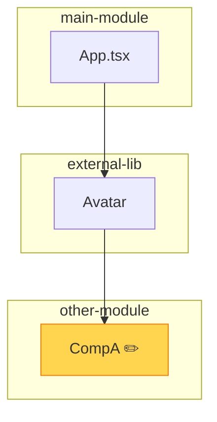
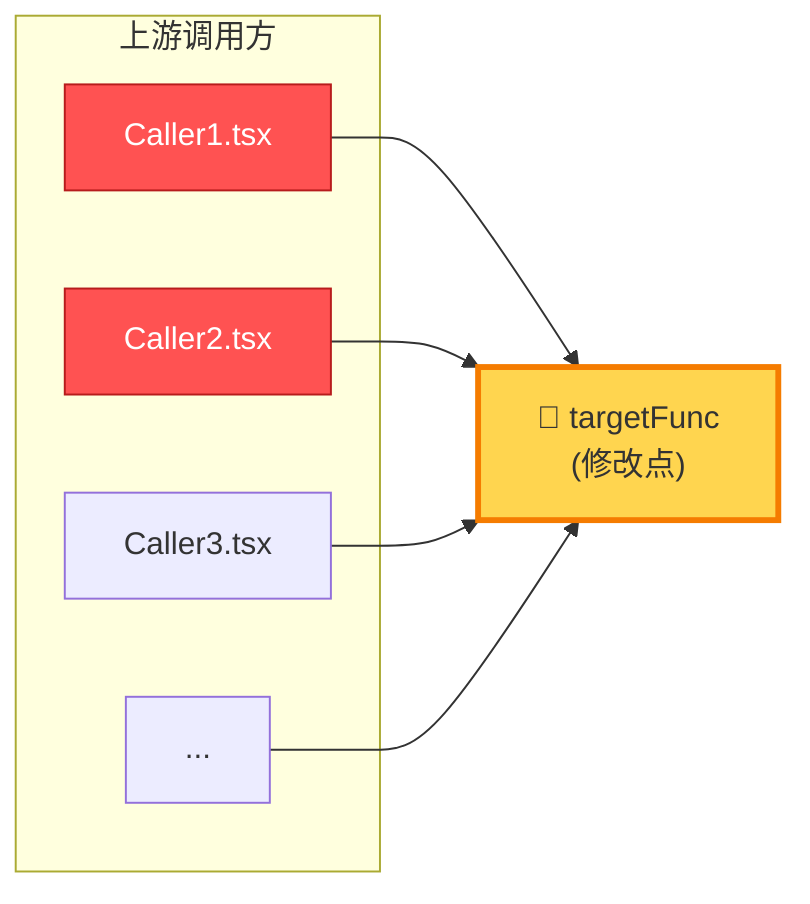

# 调用链路图规范（Call Graph Spec）

> 本文件是 dev-flow 中「代码调用/依赖关系可视化」的唯一权威来源。
> 多个步骤（step-1/2/3/6/7/iteration-fix）引用此规范，新增/修改须在此处统一维护。

## 定位与理念

- **目标**：把步骤 1~2 的「上下游依赖」、步骤 3 的「改动边界」、步骤 6 的「调用方分析」、步骤 7 的「改动链路」从**纯文字列表**升级为**可视化图**，让 AI 和人都能快速建立心智模型
- **与流程自身图区分**：`flow-graph.md` 描述 **dev-flow 流程节点**；本规范描述 **用户代码的调用关系**
- **产出物真实性**：不强制所有任务画图，仅在**能提升理解效率**时才画；简单任务（单文件、无上下游）不画
- **灵感来源**：Aider repo-map、Claude Code Repo Map、dependency-cruiser、madge、C4 Component diagram 等业界实践

## 触发矩阵（AI 自动判断）

| 场景 | 条件 | 格式 | 是否必画 |
| --- | --- | --- | :---: |
| 极简模式准入通过 | step-3 极简模式启用 | — | ❌ 不画 |
| 单文件无上下游 | `related_files_count ≤ 2` 且 `upstream_deps.length === 0` | — | ❌ 不画 |
| 小型改动 | `related_files_count ≤ 3` 且 `upstream_deps.length ≤ 1` | 文本树 | ✅ 画 |
| 中型改动 | `related_files_count > 3` 或 存在分支条件渲染 | 文本树 + Mermaid | ✅ 画 |
| 修改公共函数/组件 | step-6 V7 检测到调用方 > 5 | Mermaid 辐射图 | ✅ 强制 |
| 跨模块改动 | 涉及 ≥ 3 个独立模块 | Mermaid（含 subgraph 分组） | ✅ 画 |
| 迭代修复 | 已有工作上下文 + 新增改动 | 增量文本树（只画 Delta） | ✅ 画 |
| 步骤 7 / devlog | 最终交付 | 复用 step-1 的图（如有） | 🟡 推荐 |

## 格式 A：文本树（默认格式）

> **优势**：0 渲染依赖、Token 友好、任何 Markdown/终端都可见
> **适用**：≤ 10 节点的简单调用链路

### 模板

```text
{入口文件/组件} ({关键上下文，如所在模块})
└─ <{子组件} {关键 props}>      ← [操作类型] {备注}
└─ {孙组件/函数} ({关键条件})
├─ {分支 1}              ← [核心改]
└─ {分支 2}

```

### 操作类型标记（与 step-2 三级影响程度对齐）

| 标记 | 含义 | 对应 step-2 字段 |
| --- | --- | --- |
| `[核心改]` | 本次直接修改 | `impact_levels.core` |
| `[联动]` | 受影响需同步调整 | `impact_levels.linked` |
| `[仅验证]` | 不改但需验证不受影响 | `impact_levels.verify_only` |
| `[新增]` | 新建节点 | `files_to_create` |
| `[删除]` | 移除节点 | — |

### 完整示例

```text
main-module / App.tsx
└─ <Avatar someParam={someParam} />         ← [核心改] 新增 props
└─ Avatar.tsx (external-lib)            ← [联动] 第三方库，仅传参
└─ Section.tsx                       ← [联动]
└─ isCondA ?
├─ CompA                 ← [核心改] 支持新功能
└─ CompB               ← [仅验证]

```

## 格式 B：Mermaid（复杂场景）

> **优势**：多入口/分支/分组天然呈现；GitHub/GitLab/文档平台/主流 Markdown 均原生渲染
> **适用**：> 10 节点、跨模块、多分支、辐射式调用方分析

### 基础模板（graph TD）

```mermaid
graph TD
App["main-module App.tsx"] -->|someParam={someParam}| UA["Avatar<br/>(external-lib)"]
UA --> US["Section.tsx"]
US -->|isCondA| MV["CompA ✏️核心改"]
US -->|!isCondA| VD["CompB"]
classDef changed fill:#ffd54f,stroke:#f57c00,stroke-width:2px
classDef linked fill:#e1f5fe,stroke:#0288d1
class MV changed
class UA,US linked

```

### 跨模块分组模板（含 subgraph）



### 辐射图模板（step-6 V7 专用）

> 修改公共函数/组件时，展示**改动节点为圆心、调用方为外围**的风险拓扑



说明：调用方节点的样式标注受影响程度（🔴 签名变更导致破坏 / 🟡 行为变更需验证 / 🟢 仅内部实现变更）。

## 格式 C：增量调用图（迭代修复专用）

> **原则**：只画 **Delta**（本轮相对上轮的新增/删除节点），不重绘全量

```text
[增量] Round 3（提测反馈修复）

+ Section.tsx::handleChange   [新增方法]
± CompA.tsx (line 45-60)      [修改核心逻辑]

- deprecated-util.ts             [删除]

```

## 格式 D：改动边界标注（step-3 制定方案时使用）

> **原则**：不新画图，在 step-1 已有的调用图上**叠加边界标注**，清晰表达"本次改动改什么/联动什么/只验证什么"。

### 标注语义（三级影响度，与 `impact_levels` 完全对齐）

| 标注 | emoji | 语义 | 对应 `impact_levels` |
| --- | :---: | --- | --- |
| 核心改 | ✏️ | 本节点代码被直接修改 | `core` |
| 联动 | 🔗 | 本节点代码不改，但依赖/被依赖的节点改了，需联动验证 | `linked` |
| 仅验证 | 👁️ | 本节点无改动无依赖，仅作为回归验证范围 | `verify_only` |

### 文本树标注示例

```text
src/component/Search/
├── index.tsx          ✏️ 核心改（修复邮箱正则）
├── types.ts           🔗 联动（字段类型可能需要调整）
└── __tests__/
└── index.test.tsx 👁️ 仅验证（需补单测）

```

### Mermaid 标注示例

```text
graph TD
A[List.tsx]:::verify --> B[Search.tsx]:::core
B --> C[utils.ts]:::linked
classDef core fill:#ffeb3b,stroke:#f57c00,stroke-width:3px
classDef linked fill:#b3e5fc,stroke:#0277bd
classDef verify fill:#e0e0e0,stroke:#616161,stroke-dasharray:3 3

```

### ❌ 反模式（禁止）

- 禁止在 step-3 重绘调用图（应复用 step-1 输出）
- 禁止标注比 `impact_levels` 字段多或少（二者必须一一对应）
- 禁止省略 emoji 前缀（影响可读性）

## 绘制指引（AI 必读）

### 数据来源

| 信息 | 来源 |
| --- | --- |
| 节点（文件/组件/函数名） | step-1 `related_files` 表格、`codebase_search` 结果 |
| 边（调用关系） | `grep_search` import/调用点、AST 符号引用 |
| 关键 props / 传参 | 步骤 1 阅读组件 JSX 时记录 |
| 条件分支 | 步骤 1 阅读条件渲染代码时记录 |
| 操作类型 | step-2 `impact_levels` 字段 |

### 节点信息密度（重要）

每个节点应至少包含**文件名**；有价值时附加：

- 所在模块/包（如 `external-lib`）
- 关键 props/参数（如 `someParam={someParam}`）
- 关键条件（如 `isCondA`）
- 改动位置（如 `:L45-60`）

### 禁止事项

- ❌ **禁止编造不存在的调用关系**——每条边必须对应真实 import / 调用
- ❌ **禁止为了好看扩充节点**——只画与本次改动有关的链路
- ❌ **禁止省略关键分支**——条件渲染的两个分支如都受影响，必须都画出
- ❌ **禁止在极简模式下画图**——遵循触发矩阵，避免给简单任务增加 Token 负担
- ❌ **禁止替换事实性上下游列表**——调用图是**补充**，`upstream_deps`/`downstream_deps` 数组仍须输出

## 引用与复用链路

```text
step-1  ──画图──▶ [调用链路图]
│
├─▶ step-2（上下游依赖节引用）
├─▶ step-3（复杂度 ≥ 中时标注改动边界）
├─▶ step-6 V7（调用方>5 时升级为辐射图）
├─▶ iteration-fix（增量图，只画 Delta）
└─▶ step-7/devlog（作为交付物标配）

```

**复用原则**：step-1 画的图是**唯一真相源**；后续步骤基于它**标注/增强/增量**，禁止重画。

## 与知识库的联动（未来迭代，P3）

长期规划：每次 dev-flow 画的调用图自动归档到 `~/.codebuddy/knowledge/{project}/call-graphs/{模块}.md`；
下次命中同模块时，step-1 直接读取已有图作为冷启动基线，只画增量变化。
当前版本先不落地，保留扩展点。

## 版本

| 版本 | 日期 | 变更 |
| --- | --- | --- |
| v1.0 | 2026-04-23 | 初版：文本树 + Mermaid 双格式 + 触发矩阵 + 引用链路 |
