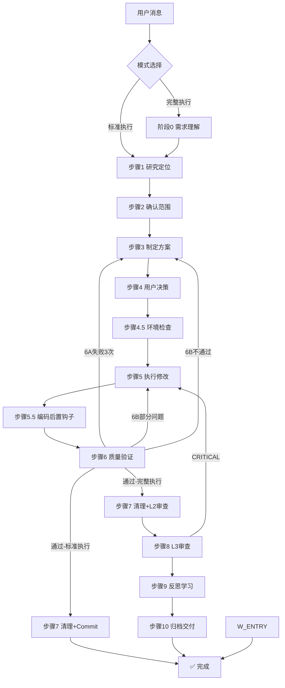

# dev-flow 流程图定义（统一流转路径）

> 本文件是 dev-flow 所有流转路径的唯一权威来源。
> 新人理解流程只需看本文件；维护时修改流转路径在此统一入口。

## 三模式入口

## 流转路径表（所有可能的路径）

### 正向路径

| 从 | 到 | 条件 | 模式 |
| --- | --- | --- | --- |
| 触发 | 阶段0 | 完整执行信号 | 完整 |
| 触发 | 步骤1 | 标准执行信号 | 快速 |
| 阶段0 | 步骤1 | 需求确认通过 | 完整 |
| 步骤1 | 步骤2 | 研究完成 | 快速/完整 |
| 步骤2 | 步骤3 | 用户确认范围 | 快速/完整 |
| 步骤3 | 步骤4 | 方案制定完成 | 快速/完整 |
| 步骤4 | 步骤4.5 | 用户选择"执行" | 快速/完整 |
| 步骤4.5 | 步骤5 | 环境就绪 | 快速/完整 |
| 步骤5 | 步骤5.5 | 编码完成 | 快速/完整 |
| 步骤5.5 | 步骤6 | L1审查+自检通过 | 快速/完整 |
| 步骤6 | 步骤7 | 验证通过 | 快速/完整 |
| 步骤7 | 完成 | commit确认 | 快速/收尾 |
| 步骤7 | 步骤8 | L2审查通过 | 完整 |
| 步骤8 | 步骤9 | L3审查通过 | 完整 |
| 步骤9 | 步骤10 | 反思完成 | 完整 |
| 步骤10 | 完成 | 归档交付完成 | 完整 |

### 回退路径

| 从 | 回退到 | 触发条件 | 说明 |
| --- | --- | --- | --- |
| 阶段0 | 阶段0 | 需求信息不足 | 请求补充信息 |
| 步骤1 | 阶段0 | 需求理解有误 | 重新确认需求 |
| 步骤6A | 步骤3 | 同一问题修复3轮未解决 | 方案可能有误，重新制定 |
| 步骤6B | 步骤5 | 部分问题需修复 | 清理调试代码后回到执行 |
| 步骤6B | 步骤3 | 验收不通过 | 方案需调整 |
| 步骤8 | 步骤5 | 发现CRITICAL问题 | 修复后重新验证 |

### 迭代修复路径

| 触发条件 | 入口 | 说明 |
| --- | --- | --- |
| 匹配已有上下文 + 上轮已完成 + 简单/中等 | 标准执行步骤1（增量） | 步骤1~3简化执行 |
| 匹配已有上下文 + 上轮已完成 + 重大 | 完整执行阶段0（增量） | 阶段0简化执行 |
