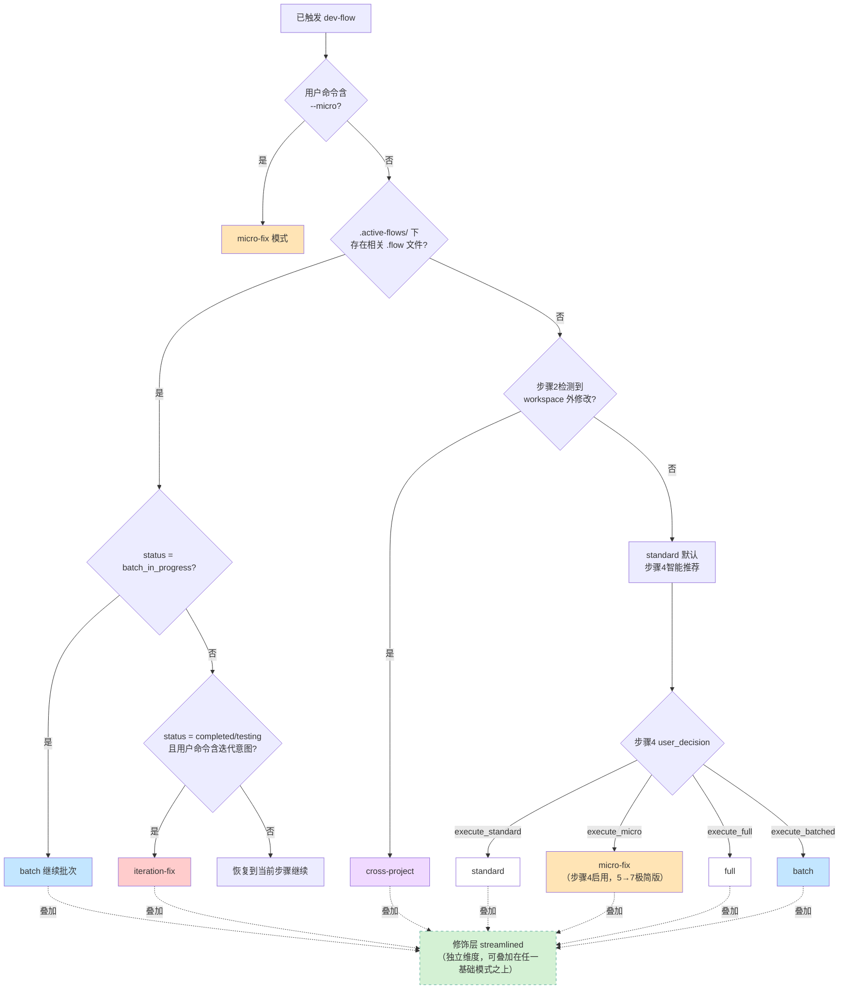

# 模式矩阵图（Mode Matrix）

> 本文件是 dev-flow **所有执行模式**的单一真相源。一张图说清 6 种基础模式的步骤覆盖、触发信号、加载差异，并定义独立的「修饰层」机制。
> 当 AI 不确定当前处于哪种模式、或用户询问模式切换规则时，加载本文件。

## 模式分类（重要前提）

> dev-flow 的「模式」分为两个**独立维度**：

| 维度 | 说明 | 取值 |
| --- | --- | --- |
| **基础模式**（mode） | 描述流程的步骤覆盖与编排策略，**互斥单选** | `standard` / `full` / `iteration-fix` / `batch` / `cross-project` / `micro-fix` |
| **修饰层**（interaction_mode） | 仅调节交互频率，**可与任意基础模式正交组合** | `standard`（标准）/ `streamlined`（精简） |

> ⚠️ `streamlined` **不是基础模式**，而是「交互修饰层」。它**从不替代** `standard/full/iteration-fix/...`，而是**叠加**在它们之上。详见 §九「修饰层（streamlined）」。

## 一、基础模式全景矩阵

> 列说明：✅ 执行 / ❌ 跳过 / 🔹 按需触发 / 🟢 可跳过 / 循环 = 批次循环执行 / 裁剪 = 步骤 7 仅执行环节 A~G
> **2026-06-01 改版**：所有模式均需先经显式命令（`dev-flow` / `dev:` / `--micro` 等）或活跃流程恢复触发 dev-flow 后，才能进入。下表「触发信号」列描述的是 **dev-flow 已触发后**，AI 如何选择具体的基础模式。

| 模式 | 触发条件（dev-flow 已激活） | 阶段0 | 0.5 | 1 | 2 | 3 | 4 | 4.5 | 5 | 5.5 | 6 | 7 | 8-10 |
| --- | --- | :---: | :---: | :---: | :---: | :---: | :---: | :---: | :---: | :---: | :---: | :---: | :---: |
| **standard** | 默认 + 步骤4选 `execute_standard` | ✅ | 🔹 | ✅ | ✅ | ✅ | ✅ | ✅ | ✅ | ✅ | ✅ | ✅**结束** | — |
| **full** | 默认 + 步骤4选 `execute_full` | ✅ | 🔹 | ✅ | ✅ | ✅ | ✅ | ✅ | ✅ | ✅ | ✅ | ✅裁剪 | ✅ |
| **micro-fix** | `--micro` 显式命令 + 满足阈值，**或**步骤4选 `execute_micro` | ✅精简 | ❌ | ❌ | ❌ | ❌ | ❌ | 🔹仅主干分支检测 | ✅ | 🔹L1极简 | ✅ read_lints | ⚡ A/H.2/H.3/J 极简版+commit | — |
| **iteration-fix** | 活跃 .flow 存在 + 用户命令含迭代意图（与 .flow 相关）+ 匹配到已有 working-context | 🔹简化 | ❌ | 🔹增量 | 🔹增量 | 🔹增量 | — | ✅ | ✅ | ✅ | ✅ | ✅ | — |
| **batch** | 步骤4选 `execute_batched` | ✅ | 🔹 | ✅ | ✅ | ✅ | ✅ | ✅循环 | ✅循环 | ✅循环 | ✅循环 | ✅循环 | 最后批 |
| **cross-project** | 步骤2检测到 workspace 外修改 | ✅ | 🔹 | ✅ | ✅跨 | ✅跨 | ✅ | ✅ | ✅ | ✅ | ✅跨 | ✅跨 | — |

## 二、模式切换决策树

> **2026-06-01 改版前提**：dev-flow 仅由显式命令触发或活跃流程相关恢复触发（详见 `SKILL.md` §「触发规则」）。下图描述的是**已触发 dev-flow 之后**，AI 如何根据用户命令、`.flow` 状态、步骤决策选择基础模式。



## 三、各模式加载差异表

> 列出每种基础模式**额外加载**或**跳过**的 reference 文件。加载顺序遵循 `references/_index.md` 的「条件激活矩阵」。修饰层 `streamlined` 的加载差异详见 §九。

| 模式 | 额外加载 | 跳过（与 standard 相比） |
| --- | --- | --- |
| standard | — | — |
| full | `flow-retrospective.md`（步骤9）、`metrics-rules.md`（步骤9 代替步骤7） | — |
| micro-fix | `micro-fix-light.md`（5 个轻量保留环节执行规范） | 步骤 1/2/3/4、5.5b 文档同步、`figma-flow.md`、`tech-proposal-flow.md`、`metrics-rules.md`、`flow-retrospective.md`（仅进入阶段0极简确认 + 步骤 5/5.5a极简/6/7极简） |
| iteration-fix | `iteration-fix.md` | `figma-flow.md` / `tech-proposal-flow.md` / 阶段 0.5 画像预注入 |
| batch | — | 非最后一批跳过：`metrics-rules.md`、`devlog-rules.md`（knowledge 沉淀） |
| cross-project | `cross-project-flow.md` | — |

## 三bis、micro-fix 模式专项说明

> micro-fix 是为「≤3 文件 + ≤ 10 行/文件 + 已知如何修改」场景设计的快速通道，避免为简单修复走完整的 7~10 步。

### 触发条件（多重判定，必须全部满足）

```yaml
trigger_micro_fix:
必要条件:

- 显式命令: "--micro"                  # 2026-06-01 改版：必须由 --micro 命令触发
- user_provided_fix_location: true     # 用户提供了精确位置
- estimated_lines_changed: ≤ 10        # 每文件 ≤ 10 行
- files_affected: ≤ 3                  # v2: 从 1 放宽到 3
- symmetric_change_required: true      # 多文件时必须是对称/重复修改（同一逻辑在多个入口做相同修复）
辅助描述信号（仅在用户已用 --micro 命令后，作为位置/意图描述参考；不能单独触发）:

- "改个错别字" / "错别字"
- "这里少个分号" / "少个逗号" / "少个括号"
- "把 X 改成 Y" / "把 X 换成 Y"
- "{文件}:{行号} 这行有问题" / "{文件} L{行号}"
- "这一行改一下" / "改个变量名" / "改个拼写"
- "加个 try/catch" / "加个兜底" / "加个判空"  # v2 新增：明确修复指令
排除条件（任一命中则降级到 standard）:

- 涉及业务逻辑变更（非简单容错/兜底）
- 用户描述模糊（"这块不太对"/"看看为什么不行"）
- 涉及主干分支或保护文件
- 需要调用 LLM 进行决策性思考（而非执行性修改）
- 多文件修改不对称（各文件改动逻辑不同）
symmetric_change 判定规则:

- 多个文件做相同结构的修改（如 mobile.tsx + desktop.tsx 加相同 try/catch）
- 改动模板一致，仅文件名/变量名等局部差异
- 反例：A 文件加功能 + B 文件改样式 → 不对称，降级到 standard

```

> ⚠️ **2026-06-01 改版重要前提**：上述「辅助描述信号」**不能单独触发 dev-flow 或 micro-fix**。用户必须先用 `--micro` 显式命令（如 `--micro 改个错别字`），命令触发 dev-flow 后这些自然语言才作为位置/意图描述发挥作用。普通对话中说"改个错别字"**不会触发任何行为**。

### 步骤裁剪详情

> v2 改造（2026-05-10）：从「极致裁剪」转向「轻量保留」，5 个环节由 ❌ 跳过升级为 ⚡ 极简版执行。详细执行规范见 `references/micro-fix-light.md`。

| 步骤 | micro-fix 表现 | 裁剪/保留理由 |
| --- | --- | --- |
| 阶段 0 | ✅ 仅保留 ≤3 行极简确认（文件+行号+要改什么） | 保留 - 避免误改 |
| 1 研究 | ❌ 跳过 | 用户已提供精确位置 |
| 2 范围 | ❌ 跳过 | ≤3 文件 + ≤10 行/文件，范围已明确 |
| 3 方案 | ❌ 跳过 | 已知修改内容，无方案分歧 |
| 4 决策 | ❌ 跳过 | 无方案选择，直接执行 |
| 4.5 环境 | 🔹 仅检测主干分支兜底（命中则中断） | 控制变更必须，不跳主干分支检测 |
| 5 编码 | ✅ 执行 | 实际动作 |
| 5.5a L1 审查 | ⚡ **极简版**：仅扫改动行 + 红线 §5/6/7/9 共 4 项 | 防止延续老代码缺陷（红线#7 兜底） |
| 5.5b 文档同步 | ❌ 跳过 | 改动极小，无文档同步需求 |
| 6 验证 | ✅ 最小验证（`read_lints` + 视觉确认，跳过构建/类型检查/测试/用户验收补充表达） | 防止低级错误 |
| 7-A Diff 分析 | ⚡ **极简版**：`git diff HEAD --stat` + 文件类型识别 | 检测 lock/配置文件等高风险变更 |
| 7-B 清理调试代码 | ⚡ 限改动行（全文扫描跳过） | 改动极小 |
| 7-C 可选链 | ❌ 跳过 | L1 极简版的红线 §7 已覆盖 |
| 7-D 即时验证 | ✅ 同 5.5c | 防止低级错误 |
| 7-E TODO 检查 | ❌ 跳过 | 字面修复无 TODO |
| 7-F 改动汇总 | ✅ 执行（展示用户确认） | 来源：环节 A 的 diff --stat，非步骤 1 |
| 7-G L2 审查 | ❌ 跳过 | L1 极简版 + 阶段 0 锁边界已覆盖 |
| 7-H.1 commit | ✅ 主干分支兜底 + smart-commit + 用户确认 | commit 不可逆，必须确认 |
| 7-H.2 devlog | ⚡ **极简版**：当前 Round 末尾追加 1 行（无活跃需求时落到 `_micro-fixes/{YYYY-MM}.md` 月度合集） | 防止开发记录断链 |
| 7-H.3 knowledge 漂移检测 | ⚡ **极简版**：grep 反查 + 命中模块变更历史追加 | **防止 micro-fix 局部修复污染 knowledge 全局认知**（最关键环节） |
| 7-H.3+ 文档平台 | ❌ 跳过 | 不达阈值 |
| 7-H.4 任务平台 提醒 | ❌ 跳过 | 字面修复无关联 |
| 7-I 数据驱动反思 | ❌ 跳过 | 不采集 metrics，反思缺数据基础 |
| 7-J 经验快检 | ⚡ **简版**：仅 Q1（用户纠正）+ Q2（踩坑递增），跳 Q3 | 零成本沉淀纠正/踩坑 Pattern |
| 7-K dev-logs 完整性自检 | ❌ 跳过 | micro-fix 不创建/修改 dev-logs，无沉淀价值（详见 references/gate-validator.md §「dev-logs 物理事实兜底（P0/P1 闭环）」） |
| 8–10 | ❌ 不适用 | 超出场景 |

### 安全兜底（**不可豁免**，红线优先于所有精简）

1. **主干分支检测**：4.5 仍需检测 main/master；命中 → 中断并要求用户确认，禁止隐式推进
2. **commit 确认**：仍须调用 `use_skill('smart-commit')`、用户选择「确认并提交」后才能提交，禁止自动 `git commit`
3. **`read_lints` 必走**：编码后必须运行，存在 lint 错误 → 修复后重试。连续 3 次失败 → 上报用户
4. **L1 极简审查必走**（v2 新增）：5.5a 必须调用 `code-review` skill 执行 **L1 基础审查**，并由 AI 在 prompt 中明示「仅扫改动行 + 仅检查红线 §5/6/7/9」；发现 ≥3 个 🔴 自动降级
5. **knowledge 漂移检测必走**（v2 新增）：7-H.3 必须执行 `grep -rl` 反查命中文件；命中则追加变更历史，防止认知漂移
6. **自动降级机制**：实际改动命中以下任一条件 → **自动降级到 standard 模式**，重新走 阶段0 → 步骤 1 → ...：

- 实际改动 > 15 行（单文件）
- 涉及 > 3 个文件（超出触发条件的 ≤3 限制）
- 多文件修改不对称（各文件改动逻辑不同）
- 涉及主干分支或保护文件
- L1 极简审查发现 ≥3 个 🔴 / 需要决策性思考的 🔴（如架构选择 / 业务语义重定义）
- 7-A Diff 极简分析检测到 lock 文件 / 配置文件 / 非声明文件且用户拒绝确认

1. **降级后不可逆**：一旦降级，后续不能中途接回 micro-fix，必须走完整 standard 流程

> 📌 **5 个轻量保留环节的完整执行规范**：详见 `references/micro-fix-light.md`（含执行边界、成本上限、自动降级触发条件、三道防线）

### 使用示例

```text
用户：把 src/utils/format.ts L42 的 `coun` 改成 `count`
AI 判定：命中 micro-fix（精确位置 + 单文件 + 1 行）
执行路径：阶段0极简确认 → 4.5 主干分支检测 → 5 编码 → 5.5a L1 极简审查 → 6 read_lints → 7-A Diff stat → 7-B 清理改动行 → 7-H.1 smart-commit 提交 → 7-H.2 devlog 追加 1 行 → 7-H.3 knowledge 漂移检测 → 7-J 经验快检（Q1+Q2，3 问全否则零开销）
预计交互：2~3 次（阶段0确认 + commit 确认 + 可选 7-A 高风险文件确认）
预计 Token：约为 standard 的 47~57%（v2 轻量保留版，相比 v1 的 30~40% 略升，但补足了 knowledge 漂移与回归预防）

```

## 四、各模式步骤完成标记差异

不同模式下步骤 7 的 `outputs` 字段有显著差异，详见 `output-schemas.md`：

| 字段 | standard | full | batch(非末批) | batch(末批) |
| --- | :---: | :---: | :---: | :---: |
| `commit_message` | ✅ | ❌推迟 | ✅ | ✅ |
| `devlog_generated` | `true` | ❌推迟 | `"batch_partial"` | `true` |
| `knowledge_updated` | `true` | ❌推迟 | `false` | `true` |
| `reflection` | ✅ | ❌推迟 | ❌ | ✅ |
| `metrics_report_generated` | ✅ | ❌步骤9做 | ❌ | ✅ |
| `flow_report_generated` | ✅ | ❌步骤9做 | ❌ | ✅ |
| `flow_report_file` | ✅ `flow-reports/{ID}.html` | ❌步骤9做 | ❌ | ✅ |
| `flow_report_opened` | `true / false` | ❌步骤9做 | ❌ | `true / false` |
| `batch_info` | — | — | `batch N/M` | `batch M/M` |
| `next_step` | `"done"` | `8` | `"batch_next"` | `"done"` |

> 📌 micro-fix 模式不在本表（不采集度量），完成标记中 `flow_report_generated` 必须为 `false`。详见 `references/micro-fix-light.md`。

## 五、优先级规则（冲突时的选择）

当多个**基础模式**信号同时触发时，按以下优先级选择（高优先 → 低优先）：

```text

1. 用户显式指定 > 所有
2. batch 继续 > iteration-fix（status 区分：batch_in_progress vs completed）
3. cross-project 衔接 prompt > iteration-fix
4. iteration-fix > 普通开发流程（匹配到活跃 working-context 时）
5. 活跃 .flow 恢复 > 新开流程

```

> 修饰层 `streamlined` **不参与基础模式的优先级竞争**——它独立判定（`--fast`/`少问我`/`你决定就好`/`你自己判断就行`/`别老问我` 命中即叠加），与最终选中的基础模式正交组合。

## 六、模式不可切换规则

> 一旦进入某个模式，中途**不可无缝切换**到另一个模式。切换必须经过显式声明或用户确认。

| 不可自动切换 | 必须经过 |
| --- | --- |
| standard → full | 步骤 4 用户选择覆盖（或步骤 7 后的柔性升级通道） |
| standard → batch | 步骤 4 用户选择 `execute_batched` |
| micro-fix → standard（自动降级） | 实际改动超过阈值（>15 行/文件 或 >3 文件 或 不对称修改 或 进入主干）时 自动降级并通知用户 |
| batch → iteration-fix | 当前批次完成 + 显式触发 |
| iteration-fix → full | 用户明确要求升级 |
| cross-project → 单项目 | 当前项目工作上下文已归档 |

## 七、快速判定速查表

AI 判断当前模式时的决策顺序（基础模式 + 修饰层**两轴并行**判定）。
**前提**：dev-flow 已由显式命令或活跃流程相关恢复触发。

```text

# 轴 1：基础模式判定
Step 1: 读取 .active-flows/{name}.flow

- 存在 + 含 mode 字段 → 直接使用该 mode
- 不存在 → 走 Step 2

Step 2: 检查显式命令修饰

- 用户命令含 --micro + 满足阈值 → micro-fix
- 活跃 .flow 存在 + 用户命令含迭代意图（如"继续这个需求") → 检查 working-context 匹配 → iteration-fix
- 活跃 .flow 存在 + status=batch_in_progress + 用户命令含批次推进意图 → batch

Step 3: 若进入 dev-flow 主流程

- 先跑阶段 0~4
- 步骤 2 检测 workspace 外修改 → cross-project
- 步骤 4 用户决策 → standard / full / batched

# 轴 2：修饰层判定（与基础模式正交执行，不互斥）
Step M: 扫描用户命令

- 命令含 --fast → interaction_mode = streamlined
- 用户在已有 .flow 流程中显式说"每步都问我" / "我要确认" → interaction_mode = standard
- 既无信号 → 沿用工作上下文已有 interaction_mode（默认 standard）

```

## 八、与其他 reference 的关系

- `_index.md` 的「条件激活矩阵」→ 告诉 AI **加载什么**
- `mode-matrix.md`（本文件）→ 告诉 AI **当前处于什么模式**
- `gate-validator.md` → 告诉 AI **如何校验完成标记**
- `output-schemas.md` → 告诉 AI **完成标记 JSON 结构**
- `iteration-fix.md` / `cross-project-flow.md` / `closeout-flow.md` → 模式专属详细规范
  （`closeout-flow.md` 现为步骤 7 commit/devlog/knowledge 收尾子流程的实现规范，
  被 standard-7 / full-7 / batch-7 共用）

## 九、修饰层（streamlined）

> 修饰层是与基础模式**正交**的独立维度，仅调节「交互频率」，不改变基础模式的步骤覆盖、reference 加载或输出 schema。

### 9.1 触发信号

> ⚠️ **2026-06-01 改版前提**：以下信号**仅在 dev-flow 已激活时**生效。普通对话中说「少问我」「你决定就好」等**不会触发任何行为**，也不会自动启动 dev-flow（详见 `SKILL.md` §「触发规则」）。

| 信号类型 | 关键词 | 生效场景 | 写入位置 |
| --- | --- | --- | --- |
| 启动时显式开启 | `dev: --fast` / `dev-flow --fast`（与命令组合） | dev-flow 启动时 | 工作上下文 YAML `interaction_mode: streamlined` |
| 流程内显式开启 | `--fast` / `少问我` / `你决定就好` / `你自己判断就行` / `别老问我` | **仅 dev-flow 已激活流程内** | 工作上下文 YAML `interaction_mode: streamlined` |
| 流程内显式关闭 | `每步都问我` / `我要确认` / `多问我` | **仅 dev-flow 已激活流程内** | 工作上下文 YAML `interaction_mode: standard` |
| 默认值 | （无信号） | — | `interaction_mode: standard` |

### 9.2 与基础模式的组合表

> ✅ 表示该组合合法且有定义的精简效果。

| 修饰层 \ 基础模式 | standard | full | iteration-fix | batch | cross-project |
| --- | :---: | :---: | :---: | :---: | :---: |
| **streamlined** | ✅ | ✅ | ✅ | ✅ | ✅ |

### 9.3 加载差异

- **额外加载**：`interaction-mode.md`（决定🟢/🟡/🔴决策点的精简策略）
- **不跳过任何基础模式的 reference**——只调节交互频率

### 9.4 精简范围（红线）

- 🟢 流程决策点（步骤流转推进）→ 静默自动推进（豁免范围见 `steps/step-router.md` §「步骤流转交互规则」）
- 🟡 质量决策点 → 智能默认
- 🔴 关键决策点（commit 确认、主干分支、文档决策、L1/L2/L3 审查弹窗）→ **仍必须暂停弹出**

详细规则见 `references/interaction-mode.md`。

## 模式 × 技术方案文档处理策略

> 步骤 4 · 文档决策（环节 3/4） 为硬性决策环节，以下矩阵描述不同基础模式下 文档平台 处理的差异。修饰层 `streamlined` **不影响** 文档决策（属于🔴关键决策点，不在精简范围内）。

| 模式 | 步骤 4 · 文档决策（环节 3/4） | 步骤 7 H.3+ | 步骤 10.3.5 |
| --- | --- | --- | --- |
| `standard` | ✅ 硬性必走 | docid 非空即触发¹ | — |
| `full` | ✅ 硬性必走 | ↩️ 推迟至 §10.3.5 | ✅ docid 非空即触发¹（action ∉ {skip, auto_inherited_skip} 时） |
| `iteration-fix`（提测） | 仅首轮走；后续轮次按 `action_history` 继承 | 命中阈值时触发 | 按首轮决策派生 |
| `iteration-fix`（上线后 bugfix） | 仅首轮走；后续按 `action_history` 继承 | ✅ 必走 | 按首轮决策派生 |
| `batch` | 仅 Batch 1 走；Batch 2+ 自动继承 Batch 1 决策 | 仅最后一批执行 | 仅最后一批（若 full） |
| `cross-project` | A 项目侧按其 mode 走；B 项目不触发 | 同左 | 同左 |

> ¹ **docid 非空即触发** = 工作上下文 `doc_platform_tech_proposal.docid` 非空就执行兜底对账
> （基于 git diff master..HEAD + 工作上下文 + 文档平台 原文三方对账）。
> 不再区分「上线后 bugfix / 提测后迭代修复 / status=outdated」等场景。
> 详见 `references/closeout-flow.md §H.3+`、`steps/step-8-10-full.md §10.3.5`、
> `tech-doc/modules/doc-platform-doc.md §兜底对账子流程`（三方共用同一套实现）。
> ² **完整模式步骤 7 推迟到步骤 10.3.5**：`caller=full-7` 在步骤 7 跳过 H.3+，由 step-8-10-full §10.3.5（`caller=full-10`）兜底处理，与 commit/devlog/knowledge 推迟节奏一致。

### 跨模式继承规则核心

1. **`action_history` 是权威历史证据链**——跨会话/跨模式/跨迭代都必须读取该字段
2. **首轮 skip 具有"吸附性"**——后续迭代自动继承 skip，除非用户显式覆盖
3. **首轮已发布具有"提醒性"**——后续迭代必然弹出决策，但默认项按场景智能调整
4. **用户逃生通道永远有效**——用户显式说"生成 技术方案文档"可覆盖任何继承规则

## 维护规则

修改本矩阵时，必须同步更新：

1. `SKILL.md`（触发规则章节）
2. `flow.md`（流程加载指令章节）
3. `steps/step-router.md`（批次切换章节）
4. `references/_index.md`（新增 mode-matrix.md 条目）
