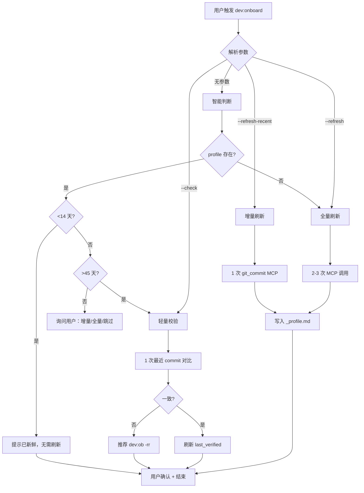

# dev:onboard 流程与 profile 生命周期

> 按需加载：`dev:onboard` 命令触发 / 阶段 0.5 检测到项目首次接触 / profile 新鲜度校验失败时。
> 本文件是 L0 profile（本地缓存层）的**单一真相源**，包括生成流程、新鲜度机制、刷新策略、遗漏场景兜底。

## 一、定位与价值

`dev:onboard` 是一个**一次性预构建**命令：对当前项目的 知识库平台 知识库做一次"全景扫描"，
生成 `~/.codebuddy/knowledge/{project}/_profile.md`（本地 profile 缓存文件），
供后续所有 dev-flow 运行时**零 MCP 调用**地读取项目全景。

- **不是**：复杂需求的全量知识沉淀（那是 `knowledge-loop` Skill 的职责）
- **就是**：轻量、可快速刷新的项目"快捷索引 + 技术雷达"

详细层级定义见 `skills/dev-flow/references/remote-knowledge.md` §三。

## 二、命令形态

| 命令 | 快捷 | 作用 |
| --- | --- | --- |
| `dev:onboard` | `dev:ob` | 为当前项目生成/刷新 profile（默认：智能判断） |
| `dev:onboard --refresh` | `dev:ob -r` | 强制全量刷新（即使 profile 新鲜） |
| `dev:onboard --refresh-recent` | `dev:ob -rr` | 仅刷新"最近变更"部分，保留架构部分 |
| `dev:onboard --check` | `dev:ob -c` | 只校验不刷新，输出健康度报告 |
| `dev:onboard --project=<name>` | — | 显式指定项目名（解决多 workspace 歧义） |

## 三、生成流程（首次 onboard）

### 步骤 1：项目识别

优先级：

1. `--project=<name>` 显式参数 > 工作上下文 `## 需求 > 项目` 字段 > `pwd` 推断
2. 从 `skills/dev-flow/references/remote-knowledge.md` §二 项目映射表取 `knowledge_uuid` + `search_domain`
3. 未命中 → 提示用户"项目未接入 知识库平台，跳过 onboard"

### 步骤 2：MCP 调用（总预算 ≤6k token）

按顺序发起 **2~3 次 MCP 调用**（总预算 ≤6k token）：

```text
调用 1（必做）：架构 wiki 索引
data_type:     git_doc_platform
search_domain: {项目 git_doc_platform 域}
query:         "项目整体架构 核心模块 入口"
keyword:       "架构;模块;入口;组件;README"
top_k:         3

调用 2（必做）：最近变更
data_type:     git_commit
search_domain: {项目 git_commit 域}
filter:        { $sort: [{ created_at: -1 }] }
page_size:     10
（仅取最近 10 条 commit 的 title + date + author）

调用 3（可选）：核心源码入口
data_type:     git
search_domain: {项目 git 域}
query:         "entry point package.json tsconfig next.config"
keyword:       "package.json;next.config;tsconfig;index;main"
top_k:         3

```

### 步骤 3：写入 `_profile.md`

目录约定：`~/.codebuddy/knowledge/{project}/_profile.md`（与 knowledge-loop 共用目录，避免冗余）。

### 步骤 4：用户确认

展示生成摘要（技术栈、模块数、最近 commit 数），让用户 ✅ 确认 / ✏️ 补充 / ⏭️ 跳过。

## 四、profile 文件模板

````markdown
---
type: remote-kb-profile                     # 区别于 knowledge-loop 的主题文件
schema: onboard-profile/v1
project: my-project
knowledge_uuid: your-knowledge-base-uuid
search_domain: MyOrg@my-project-master

# 时间戳三要素（新鲜度核心）
generated_at: "2026-04-28T14:58:05+08:00"
last_verified: "2026-04-28T14:58:05+08:00"
last_remote_kb_commit_seen: "abc1234"       # 生成时看到的最新 commit short_id

# 环境快照（防跨环境误用）
git_branch_at_generate: "master"
workspace_hint: "my-project"              # 按项目名而非路径识别（应对多副本）
package_name: "@your-org/your-package"
package_version: "3.12.5"
source_server: "remote_kb"                      # 生成时使用的 MCP server

# 置信度（复用 knowledge-loop confidence 体系）
confidence: verified
stability:
drift_count: 0
refresh_count: 0
total_mcp_calls: 3

# 用于后续轻量校验的"指纹查询"
source_queries:

- { data_type: git_doc_platform, keyword: "架构;模块;入口" }
- { data_type: git_commit, keyword: "feat;fix;refactor" }
---

# my-project 项目画像

## 技术栈
- Next.js 14 + React 18 + TypeScript 5
- 状态：Zustand
- 样式：项目 CSS 变量系统
- i18n：i18next（zh-CN / zh-TW / en）
- 监控：web-monitor-sdk

## 核心模块地图
| 模块 | 路径 | 职责 |
| --- | --- | --- |
| FeatureX Controller | `src/modules/feature-controller/` | 列表管理核心 |
| 详情页 | `src/pages/detail/` | 详情页入口 |
| 用户邀请 | `src/components/invite/` | 成员邀请组件 |
| ...（≤10 行） |

## 入口锚点
- package.json → `package.json`
- 路由入口 → `src/pages/_app.tsx`
- Next 配置 → `next.config.js`

## 最近 10 个 commit（仅作"最近变更雷达"）
| 时间 | commit | 标题 |
| --- | --- | --- |
| 2026-04-27 | abc1234 | feat: 新增 VIP 徽章显示 |
| 2026-04-25 | def5678 | fix: 修复日期显示时区问题 |
| ...（保持 ≤10 条） |

## 常用查询模板（AI 快速起调）

```
{
"data_type": "git_doc_platform",
"search_domain": "MyOrg@my-project-master-git_doc_platform",
"query": "{业务语义}",
"keyword": "{核心名词};{英文变体}"
}

```

## 检索健康度

- git: ✅ 可用
- git_doc_platform: ✅ 可用（wiki 页面 ≥10）
- git_commit: ✅ 可用（最近 1 周活跃）
- git_merge_request: ✅ 可用

````

## 五、profile 新鲜度机制（核心）

### 三重时间戳

| 字段 | 含义 | 更新时机 |
| --- | --- | --- |
| `generated_at` | 首次生成时间 | 全量刷新时重置 |
| `last_verified` | 最后一次验证通过时间 | 每次轻量校验/增量刷新/全量刷新时更新 |
| `last_remote_kb_commit_seen` | 生成时看到的最新 commit | 每次刷新时更新 |

### 多级过期策略

```text
每次 dev-flow 阶段 0.5 启动 → 检测 profile：

┌── profile 不存在
│   └─ 跳过 L0，进入 L1；dev-flow 结束后提示「是否 dev:onboard」
│
├── profile 存在，last_verified < 14 天（软 TTL）
│   └─ ✅ 直接使用，0 MCP 调用
│
├── profile 存在，14~45 天
│   └─ 🟡 使用 + 末尾弱提醒「profile 已 X 天未验证，建议 dev:ob -r」
│
├── profile 存在，> 45 天（硬 TTL）
│   └─ 🟠 强提醒 + 自动触发轻量校验（1 次 MCP，≤500 token）
│         校验通过 → 刷新 last_verified，继续用
│         校验不一致 → 推荐 dev:ob -rr 增量刷新
│
└── 代码漂移检测命中（见下节）
└─ 🔴 自动触发增量刷新（1 次 MCP，≤2k token）

```

### 漂移检测（每次 dev-flow 启动时执行）

```text
步骤 1：git log -1 --format=%h 获取本地最新 commit short_id
步骤 2：对比 profile.last_remote_kb_commit_seen
步骤 3：若本地领先 profile >5 个 commit → 标记潜在漂移
步骤 4：潜在漂移 → 触发增量刷新（只重跑 git_commit 调用）

```

只做 commit-hash 对比，不做全文 diff，控制性能。

### 三档刷新粒度

| 档次 | MCP 调用 | Token | 触发时机 |
| --- | --- | --- | --- |
| **全量刷新**（dev:ob -r） | 2~3 次 | ~6k | 首次生成 / >45 天强过期不一致 / 用户显式 |
| **增量刷新**（dev:ob -rr） | 1 次（git_commit） | ~2k | 14~45 天区间用户主动触发 / 代码漂移命中 |
| **轻量校验**（dev:ob -c） | 1 次（取最近 1 条 commit 对比） | ~500 | >45 天强过期自动触发 / 用户主动 `--check` |

## 六、十个遗漏场景的兜底机制

### 场景族 A：数据源变化类

| # | 场景 | 检测 | 处理 |
| --- | --- | --- | --- |
| **A1** | 分支切换（master ↔ feature） | 对比 `git_branch_at_generate` 与当前 `git rev-parse --abbrev-ref HEAD` | 不一致时弱提醒：「profile 基于 {旧分支} 生成，当前 {新分支}，架构部分仍可用，最近变更部分可能不适用」 |
| **A2** | 知识库平台 索引滞后 | 本地 `git log --oneline -1` vs MCP 返回最新 commit | 相差 >5 commit → 警告「知识库平台 索引可能滞后，结果仅供参考」 |
| **A3** | 项目重构/重命名 | `package.json` 的 `name`/`version` vs profile 记录 | 不一致 → 自动标记 stale，触发全量刷新 |
| **A4** | MCP server 切换 | profile.source_server vs 当前环境可用 server | 不一致 → 兼容尝试；两次失败后提示手动 `dev:ob -r` |

### 场景族 B：多环境/多实例类

| # | 场景 | 检测 | 处理 |
| --- | --- | --- | --- |
| **B1** | 多 workspace 同时工作 | 工作上下文 `## 需求 > 项目` 字段存在时优先于 `pwd` | 解决 `pwd` 误判；同时在输出中明确标识「当前项目：{name}」 |
| **B2** | 同项目多副本（两个目录同名） | 按 `project` 名而非路径命中 profile（`workspace_hint` 字段） | 两副本共用 profile，last_remote_kb_commit_seen 作为公共观察点 |
| **B3** | 跨机器协作（profile 来自同事） | 读取时检测 `generated_at` 所在机器（可选：记录 hostname） | 不硬校验；仅以 last_remote_kb_commit_seen 作漂移检测 |

### 场景族 C：使用行为类

| # | 场景 | 检测 | 处理 |
| --- | --- | --- | --- |
| **C1** | 首次进某项目未 onboard 就开发 | 阶段 0.5 发现 profile 不存在 | 不阻塞流程；dev-flow 收尾阶段主动提示「已积累本项目数据，建议 `dev:onboard` 建立 profile」 |
| **C2** | profile 被分支专属实验性代码污染 | 生成时强制只查 master 分支；commit 过滤 `feat-*/test-*` 开头 | 生成侧约束，不依赖运行时检查 |
| **C3** | 跨项目联调目标项目无 profile | step-2 标记 `cross_project=true` 时检查目标项目 profile 存在性 | 缺失时提示「联调目标 {project} 无 profile，是否一并 onboard？」 |

## 七、与 dev-flow 的集成点

```text
阶段 0.5（项目画像预注入）
└─ 读 profile.md（若存在且未过期）→ 注入需求上下文
漂移检测（一次本地 git log 对比）

步骤 1（研究与定位）
└─ 按节点信号触达规则启用 MCP 并行子任务
profile 提供的"最近变更"作为时间排序基准

步骤 7/10（收尾/归档）
└─ 若本轮 dev-flow 发现 profile 过期/漂移 → 提示刷新
若本轮是项目首次 dev-flow（无 profile）→ 提示 onboard

dev:onboard 命令（独立入口）
└─ 手动触发 profile 生成/刷新/校验

```

## 八、执行流程图（AI 行为）



## 九、输出规范

### onboard 完成后的用户输出

```markdown
✅ onboard 完成：{project}
━━━━━━━━━━━━━━━━━━━━━━━━━━━━━━
生成文件：`knowledge/{project}/_profile.md`
MCP 调用：{N} 次，Token 消耗：约 {X}k
技术栈：{tech_stack 摘要}
核心模块：{N} 个
最近 commit：{N} 条（最新 {commit} @ {date}）
━━━━━━━━━━━━━━━━━━━━━━━━━━━━━━
下次 dev-flow 阶段 0.5 将自动加载本 profile，零额外 MCP 调用。

```

### 健康度报告（--check 输出）

```markdown
📊 profile 健康度：{project}
━━━━━━━━━━━━━━━━━━━━━━━━━━━━━━
生成时间：{generated_at}（{N} 天前）
最近验证：{last_verified}（{N} 天前）
状态：✅ verified | 🟡 soft_expired | 🟠 hard_expired | 🔴 stale

漂移检测：

- 本地最新 commit：{local_hash}
- profile 记录的：{profile_hash}
- 差距：{N} commits（阈值：5）

推荐动作：

- ✅ 无需刷新
- 🟡 建议 dev:ob -rr（增量刷新，~2k token）
- 🟠 建议 dev:ob -r（全量刷新，~6k token）
━━━━━━━━━━━━━━━━━━━━━━━━━━━━━━

```

## 十、与 knowledge-loop 的职责边界（重要）

| 维度 | dev:onboard（本文件） | knowledge-loop Skill |
| --- | --- | --- |
| 目的 | 项目全景快速索引（L0 缓存） | 需求驱动的深度知识沉淀 |
| 触发 | `dev:onboard` 命令 / 阶段 0.5 加载 | dev-flow 步骤 5/7/10、`dev:kb` 命令 |
| 内容粒度 | 项目级（1 个文件 `_profile.md`） | 模块级（多文件 `ui/api/data-model/logic/pitfalls.md`） |
| 更新频率 | 按 TTL（14/45 天）+ 漂移检测 | 按每次开发沉淀 + 用户手动 verify |
| 置信度体系 | **复用** knowledge-loop 的 confidence 5 级 | 自身主导 |
| 存储位置 | `~/.codebuddy/knowledge/{project}/_profile.md` | `~/.codebuddy/knowledge/{project}/{module}/*.md` |

**复用而非重造**：profile 的 confidence / stability / drift 检测完全复用
`skills/knowledge-loop/references/confidence.md` 和 `skills/knowledge-loop/references/lifecycle.md` 的既有体系。

## 十一、首次接触本命令的用户提示

当用户首次在某项目触发 dev-flow，且未有 profile 时，收尾阶段主动提示：

```markdown
💡 检测到本项目首次 dev-flow，暂无 知识库平台 profile。

建立 profile 可让后续开发减少 ~80% 的 MCP Token 消耗（见 `skills/dev-flow/references/remote-knowledge.md` §六）。

| # | 选项 | 说明 |
| --- | --- | --- |
| A | ✅ 立即执行 `dev:onboard` | 建立 profile（~6k token，一次性） |
| B | ⏭️ 下次再说 | 继续使用 L1 本地检索 |
| C | 🚫 本项目不用 | 加入跳过清单，不再提醒 |
```

## 相关文档

- 节点信号触达 + Token 策略 + 项目映射 → `skills/dev-flow/references/remote-knowledge.md`（单一权威源）
- 置信度体系 → `skills/knowledge-loop/references/confidence.md`
- 生命周期 → `skills/knowledge-loop/references/lifecycle.md`
