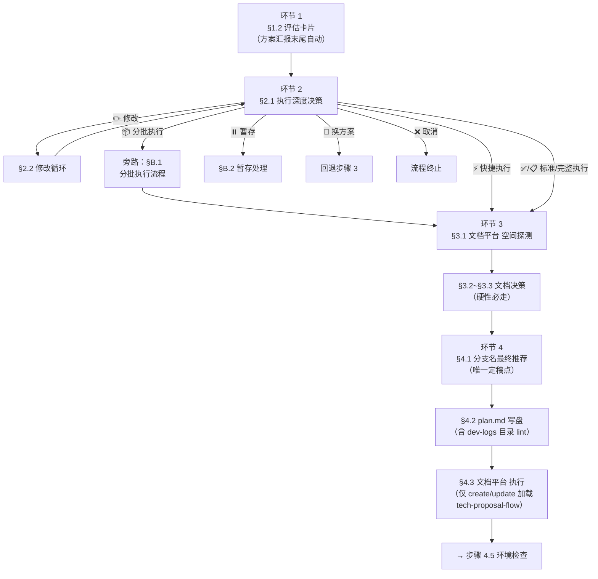

# 步骤 4：方案汇报与用户决策（门控）

> 本文件仅在执行步骤 4 时加载。**必须等待用户明确决策后才能进入步骤 5**。
> 📌 **结构 v3 重构于 2026-05-29 14:38**：按"阶段=执行时机"重排，告别旧版 §2.5/§5.5/§6 编号错位。原文件备份于 `.backup/20260529/step-4-decision.md`。
> 📌 **v3 patch 于 2026-05-29 15:14 / 15:55**：
> §4.1.3~§4.1.5/§4.1.7 下沉到 `references/branch-recommendation.md`，§4.1 子节从 7 个 → 4 个；
> 阶段 5 重命名为「旁路分支（非主路径）」消除时序错觉；
> §B.3 移除「修改」（修改实属 §2.2 循环，非终态）；
> 环节 4 加容灾排序说明、§3.1 加 Layer 速查表、§4.2 错误示例下沉到 `references/devlog-rules.md`；
> 流程图旁路节点 ID `S5_x` → `BYPASS_xxx`（消除最后的"5_"语义残留）。
> 本次备份于 `.backup/20260529-v3patch/`。
> 📌 **命名优化于 2026-06-01**：
> 步骤内部子环节统一由「阶段 N」改为「环节 N · 语义名」，消除与顶层「阶段 0/0.5」的术语撞车；
> 旁路分支章节编号 §5.x → §B.x。
> AI 面向用户输出须用「步骤 4 · 语义名（环节 N/4）」格式（如「步骤 4 · 文档决策（环节 3/4）」）。
> 本次备份于 `.backup/20260601-naming/`。

## 目标

向用户汇报方案和执行计划，**基于步骤 1~3 的研究成果进行智能评估**，推荐执行深度，等待用户明确决策。这是编码前的最后一道门控。

## 章节速查表（AI 加载即看见全局）

| 环节 | 章节 | 执行时机 | 是否必走 | 交互方式 |
| --- | --- | --- | --- | --- |
| **环节 1** 评估输出 | §1.1 评估维度 / §1.2 评估卡片 | 决策前·汇报方案末尾自动 | ✅ 必走 | 输出展示，无弹窗 |
| **环节 2** 执行深度决策 | §2.1 决策选项 / §2.2 修改循环 / §2.3 流转规则 | 决策中·第 1 次弹窗 | ✅ 必走 | `ask_followup_question` |
| **环节 3** 文档决策 | §3.1 空间探测 / §3.2~§3.3 决策选项 / §3.4 硬性规则 / §3.5 迭代默认项 | 决策中·第 2 次弹窗（仅执行类选项进入） | ✅ 硬性必走 | `ask_followup_question` |
| **环节 4** 决策落地 | §4.1 分支名定稿 / §4.2 plan.md 写盘 / §4.3 文档平台 执行 | 决策后·串行三步 | ✅ 必走 | 仅 §4.1 弹窗（特定场景） |
| **旁路分支** | §B.1 分批执行 / §B.2 暂存 / §B.3 终态（换方案/取消） | 由环节 2 §2.1 选项触发（非主路径） | 按需 | 视分支而定 |

> ⚠️ **决策后顺序锚点**（避免歧义）：环节 4 严格按 §4.1 → §4.2 → §4.3 串行执行。
> 依据：§4.1「触发时机」明示发生在「§4.2 即将把 plan.md 写入磁盘前」；`tech-proposal-flow.md` 明示 §4.3 完成后「直接进入步骤 4.5」。

## 流程图



> 📌 **流程图节点 ID 命名约定**：主路径节点用 `S{环节}_{子节}` 形式（如 `S3_1`、`S4_2`）；旁路节点用 `BYPASS_{用途}` 前缀（如 `BYPASS_BATCH`、`BYPASS_PAUSE`），明确区分主路径与非主路径。

---

## 环节 1：评估输出（决策前·自动）

### §1.1 评估维度

在汇报方案的同时，基于步骤 1~3 已收集的信息，**自动执行任务评估**：

| 维度 | 评估方式 | 权重 |
| --- | --- | --- |
| **改动范围** | 步骤 2 确认的文件数、预估改动行数 | 高 |
| **复杂度** | 是否涉及状态管理/异步/多模块联动 | 高 |
| **风险等级** | 是否涉及公共组件/核心逻辑/数据流 | 中 |
| **需求明确度** | 阶段 0 的需求理解是否有歧义 | 中 |
| **外部依赖** | 是否需要 任务平台/Figma/设计稿等外部信息 | 低 |

### §1.2 评估卡片（融入方案汇报末尾）

方案汇报完毕后，**必须输出评估卡片**：

```text
📊 任务评估与执行深度推荐
━━━━━━━━━━━━━━━━━━━━━━━━━━━━━━━━━━━━

📏 改动范围：{N} 个文件，~{M} 行改动
🧩 复杂度：{低/中/高}（{原因}）
⚠️ 风险等级：{低/中/高}（{原因}）
📁 devlog 目录：`{YYYYMMDD}_{类型}_{中文简述}`（{新增/复用已有目录}，用户确认前可要求调整）

🎯 推荐执行深度：{标准执行 或 完整执行 或 快捷执行}
理由：{一句话}

━━━━━━━━━━━━━━━━━━━━━━━━━━━━━━━━━━━━
```

> **📁 目录名显式展示（强制）**：
> 评估卡片中的「devlog 目录」字段**必须**输出——让用户在决策执行前自然看见目录名，
> 若命名不妥（如机械翻译、语义不准）可直接在「✏️ 修改」选项中要求调整。
> 此字段与「`dev-logs/` 目录规则」（§4.2）的 name_lint 四项自检互为补充：
> lint 保证结构合规，用户肉眼审核保证语义合理。
> 2026-07-06 新增：若为已有需求的后续轮次（任务平台 ID / working-context iteration 匹配），应显示「复用已有目录」而非「新增」，并在方案中明确标注将复用的目录名。步骤详见 §4.2「创建目录前复用检测」。

> 🏷️ 环节 1 完成后输出锚点：`[STEP-4-1-COMPLETE] 任务评估完成 | 评估卡片已输出`

> **`micro_suggested` 判定规则**：
> 推荐「快捷执行」需同时满足以下三项（与 `--micro` 准入条件一致，权威源 → `references/mode-matrix.md` §三bis）：
> - `files_count ≤ 3`
> - `lines_estimate ≤ 10`（每文件）
> - 用户在阶段 0 或步骤 1 已指明精确修改位置
>
> 满足时，评估卡片推荐深度显示为「快捷执行」，理由注明"改动极小、位置明确、适合快捷流程"。

---

## 环节 2：执行深度决策（决策中·第 1 次弹窗）

> 评估卡片输出后，**必须**通过 `ask_followup_question` 弹出本环节决策。

### §2.1 决策选项

```text
方案与执行计划汇报完毕，请选择执行深度：
```

| 选项 | 说明 | 默认 |
| --- | --- | --- |
| ✅ 标准执行 | 按当前计划执行步骤 5→6→7（编码→验证→L2审查+收尾） | ⭐ 改动小/低风险时默认 |
| ⚡ 快捷执行 | 仅编码 → 极简审查 → ESLint，跳过完整 L1/L2 审查、devlog 和 文档平台（步骤 1~3 已确认的 1 行级修复适用） | ⭐ `micro_suggested=true` 时默认 |
| 📋 完整执行 | 按当前计划执行步骤 5→10（含 L3 深度审查+反思+归档） | ⭐ 改动大/高风险时默认 |
| 📦 分批执行 | 按批次规划分批执行（始终展示；当 `batch_suggested: false` 时标灰显示并附说明「⚠️ 当前任务规模较小，不推荐分批；如确需分批，AI 会先回退到步骤 3 重新规划批次」） | — |
| ✏️ 修改 | 调整方案或计划的细节（可追加修改说明） | — |
| 🔄 换方案 | 推翻当前方案，回到步骤 3 重新制定 | — |
| ⏸️ 暂存 | 方案确认并锁定计划，但暂不执行 | — |
| ❌ 取消 | 终止本次任务 |

> **执行深度说明**：
>
> - **标准执行**（步骤 5→7）：编码 → 验证 → L2审查+commit+devlog+knowledge。适合大多数任务。
> - **快捷执行**（步骤 5→7 极简版）：仅编码 → 极简审查 → ESLint → 极简 commit。跳过完整 L1/L2 审查、devlog、knowledge、文档平台。适合步骤 1~3 已确认的 1 行级修复（≤3 文件 + ≤10 行/文件 + 位置明确）。
> - **完整执行**（步骤 5→10）：编码 → 验证 → 清理 → L3深度审查 → 反思 → 归档。适合核心逻辑改动、需求驱动开发。
> - 基于步骤 1~3 的研究成果（改动范围、风险、模块数）智能评估推荐执行深度。
> - 改动范围极小、位置明确 → 推荐快捷执行；改动范围小、风险低 → 推荐标准执行；改动范围大、多模块联动 → 推荐完整执行。
> - **分批执行**（步骤 5→7 × N 批）：按批次规划分批执行，每批次独立走 4.5→5→5.5→6→7 循环。适合大需求（>8步/10文件/3模块/500行）。详细流程见 §B.1。
> - `📦 分批执行` 选项**始终展示**，便于用户始终感知能力边界：
>   - `batch_suggested: true`（步骤 3 已建议分批）→ 选项**正常可选**，附标准说明
>   - `batch_suggested: false`（步骤 3 未建议分批）→ 选项**标灰展示**
>     （在 `ask_followup_question` options 中保留同序号；文本表格行附「⚠️ 当前任务规模较小，不推荐分批」提示），
>     用户仍可强制选择，但选择后必须先回退到步骤 3 重新规划批次划分（避免分批粒度失衡）。
> - `⚡ 快捷执行` 选项**始终展示**，便于用户始终感知能力边界：
>   - `micro_suggested: true`（满足 §1.2 判定规则）→ 选项正常可选 + ⭐ 默认推荐
>   - `micro_suggested: false`（不满足条件）→ 选项**标灰展示**
>     （在 `ask_followup_question` options 中保留同序号；文本表格行附「⚠️ 当前任务不满足 micro-fix 准入条件（文件数/行数/位置明确度）」提示），
>     用户仍可强制选择，但 AI 需提醒跳过完整审查的风险
> - 用户可自由覆盖 AI 推荐，不受任何限制。
> **🔒 选项一致性强制要求**：
> 表格中行数与 `ask_followup_question` 的 options 数组长度必须**始终相等**（即均为 8 项，含分批执行和快捷执行）。
> `batch_suggested: false` / `micro_suggested: false` 时，对应选项**保留位置**但通过文本说明降级提示，
> **严禁直接从表格或选项数组中移除**
> （否则违反「交互式选项一致性规则」C1/C2，详见 `references/gate-validator.md` §「交互式选项一致性门控」）。
>
> **⭐ 推荐项标识传递规范**（2026-07-29 新增）：
>
> `ask_followup_question` 的 option 对象仅有 `label`/`description` 两字段，无原生"推荐"标记，
> 因此推荐项的 `label` **必须**以 `⭐ [推荐] ` 开头。传递规则如下：
>
> - **推荐项判定权威源**：`outputs.assessment.recommended_depth` 字段值
>   - `recommended_depth: "standard"` → 表格中"✅ 标准执行"为推荐项
>   - `recommended_depth: "micro"` → 表格中"⚡ 快捷执行"为推荐项
>   - `recommended_depth: "full"` → 表格中"📋 完整执行"为推荐项
> - **文本表格**：「默认」列标注 `⭐ 改动小/低风险时默认` 或 `⭐ micro_suggested=true 时默认` 或 `⭐ 改动大/高风险时默认`
> - **`ask_followup_question` options**：推荐项 `label` = `"⭐ [推荐] ⚡ 快捷执行"`（`⭐ [推荐] ` 固定前缀 + 原 emoji + 选项名）
> - **非推荐项**：`label` 保持原格式（`"📋 完整执行"`），不加 ⭐
> - **`description` 中禁止重复出现"推荐"字样**（避免与 label 前缀重复）
> - **禁止遗漏**：若文本表格有 ⭐，而 `ask_followup_question` 对应 option 的 `label` 无 ⭐ → C8 违规
>
> 推荐项标识同时受 `references/gate-validator.md` §「交互式选项一致性门控」和 `scripts/lints/interactive-options-lint.sh` `check_c8()` 双门控校验。

#### 高级用法：附加步骤范围（部分执行）

用户选「标准执行」或「完整执行」时可追加步骤范围：

```text
> 标准执行 1-3      ← 只执行计划中第 1~3 步
> 标准执行 1,3,5    ← 只执行第 1、3、5 步
> 标准执行           ← 全部执行（默认）
```

部分执行时，计划仍整体锁定，未执行的步骤标记为 `待继续`，对应 `user_decision = execute_partial`。

### §2.2 修改循环

用户在 §2.1 选择「✏️ 修改」时：

1. 接收用户的修改意见
2. 更新执行计划中的对应内容
3. **按改动量决定输出方式**：

- 改动 ≤ 2 个步骤：输出差异对比（标注 `🔀 已调整`），末尾附完整计划折叠块
- 改动 > 2 个步骤或方案思路变化：重新输出完整计划

1. **必须使用 `ask_followup_question` 再次弹出与 §2.1 完全相同的执行深度选项**（禁止缩减选项数量）
2. **循环直到用户在 §2.1 选择终态选项**（快捷执行/标准执行/完整执行/分批执行/换方案/暂存/取消）
3. **进入环节 3 的时机**：仅当用户最终在 §2.1 选择**执行类选项**（快捷执行/标准执行/完整执行/分批执行）时，按 §2.3 流转规则进入环节 3；选择「换方案/暂存/取消」时不进入环节 3

> ⚠️ **注意**：修改循环只重弹 §2.1，不影响环节 3（文档决策）。若用户已完成环节 2+3 后又反悔想改方案，应直接回退到步骤 3（选「换方案」）重新制定，而非通过修改循环。
> 🔄 **分支推荐联动**：修改循环中若修改了方案性质（如 feature → bugfix、新增 → 重构）或改动范围（如文件数、功能描述关键词），最终进入 §4.1「分支名最终推荐」时**必须基于最终锁定方案重新评估前缀+功能简述**，不得沿用修改前的拟值。

### §2.3 流转规则

| 用户选择 | 流向 |
| --- | --- |
| 快捷执行 | **mode 切换为 `micro-fix`** → 必须立即进入环节 3（文档决策，用户可跳过），然后进入环节 4 §4.1（分支推荐）→ §4.2（plan.md 写盘，仅需记录改动文件和 1 行方案描述，无需完整计划）→ 步骤 5 起按 micro-fix 轻量流程（极简 L1 + read_lints + 极简 commit） |
| 标准执行 / 完整执行 / 分批执行 | **必须**立即进入环节 3（文档决策） |
| 修改 | 进入 §2.2 修改循环 |
| 换方案 | 回退步骤 3（不进入环节 3） |
| 暂存 | 跳至 §B.2 暂存处理（不进入环节 3） |
| 取消 | 流程终止 |

> 🔒 **分批执行的特殊路径**：用户选「分批执行」时，先进入 §B.1 分批执行流程展示批次规划，确认后**仍需进入环节 3**（Batch 1 完整走 文档决策）。

> 🏷️ 环节 2 完成后输出锚点：`[STEP-4-2-COMPLETE] 执行深度决策完成 | user_decision={decision}`

---

## 环节 3：技术方案文档决策（决策中·第 2 次弹窗·硬性必走）

> 进入本环节前，**必须**先检查是否已有技术方案文档（§3.1），基于检查结果设定智能默认项。
> ❌ **禁止跳过本环节**：AI 不得以"改动简单"/"纯文案调整"/"未找到已有文档"等任何理由省略此决策。是否生成/更新技术方案文档完全由用户决定，但**用户必须显式选择**一个选项（包括"本次不处理"也是显式决策）。

### §3.1 已有文档检查（决策选项前置必读）

进入决策选项前，检查是否已有技术方案文档：

**检查流程**：

1. **工作上下文检查**：读取工作上下文 `## 需求 → 参考` 字段，查看是否有文档链接/路径
2. **子类型判断**：根据需求性质确定子类型（`feat` 新功能 / `fix` 修复 / `opt` 优化 / `refactor` 重构），不确定时询问用户
3. **本地目录检查**：根据子类型扫描 `~/.codebuddy/tech-docs/{子类型}/` 下是否存在同名项目文档
4. **结果**：
   - 有匹配 → 记录已有文档信息，决策时提供「更新已有」和「新建」两个选项
   - 无匹配 → 仅提供「新建」和「跳过」选项
   - 无法确定 → 询问用户是否已有文档

> 检查结果写入工作上下文，供后续步骤使用。

### §3.2 决策选项（探测命中已有方案）

#### 迭代修复场景的前置判断

若工作上下文 YAML `doc_platform_tech_proposal.action_history` 非空（说明本需求在之前轮次已走过 文档决策），**先按 `references/iteration-fix.md` §「迭代修复的 文档决策继承规则」判断是否需要弹决策**：

- 首轮 `action=skipped` → **自动继承**跳过（不弹决策），追加 `action: skipped, user_choice: auto_inherited`
- 首轮已发布（`file_path` 或 `docid` 非空）→ 必弹决策，默认项按 §3.5 调整

#### 弹窗模板

```text
🔍 探测结果：在当前工作空间的文档目录中找到了匹配的技术方案：

- 标题：{候选.title}
- 路径：{候选.file_path}（在线模式：{候选.url}）
- 匹配度：{strong | medium | weak}
- 最后修改：{候选.last_modified}

请选择本轮 技术方案文档处理方式：

```

| 选项 | 说明 | 默认 |
| --- | --- | --- |
| 🔄 增量更新 | 基于本轮变更生成变更清单，用户确认后更新（模式 C） | ⭐ 强/中匹配时默认 |
| 🔗 关联该文档 | 将此文档写入工作上下文，本轮不执行更新（后续步骤按需处理） | 弱匹配时默认 |
| 🆕 重新创建 | 移除旧文档的记录，创建新技术方案（罕见） | — |
| ⏭️ 本次不处理 | 本轮跳过文档操作（例如小范围 bug、无方案变更） | — |
| 🔗 指定其他路径 | 匹配有误，手动提供正确的文档路径/链接 | — |

> **⭐ 推荐项标识传递规范**（2026-07-29 新增）：
> §3.2 表格的推荐项是**条件性推荐**（取决于匹配度 `match_level`），传递规则如下：
> - `match_level ∈ {strong, medium}` → 「默认」列标 `⭐ 默认`，对应 `ask_followup_question` option 的 `label` 以 `⭐ [推荐] ` 开头
> - `match_level = weak` → 「默认」列无 ⭐，所有 options label 均不加 `⭐ [推荐] `
> - 格式详见 `steps/step-router.md` §「推荐项标识传递规范」。

### §3.3 决策选项（探测未命中）

```text
🔍 未在你的 文档平台 空间（~yourname）找到匹配的技术方案。

请选择本轮 技术方案文档处理方式：

```

| 选项 | 说明 | 默认 |
| --- | --- | --- |
| 🆕 创建技术方案 | 按模板生成新文档，发布到 `技术方案/{feat &#124; fix &#124; opt &#124; refactor}/` 文件夹 | ⭐ 推荐 |
| 🔗 关联已有文档 | 手动提供已有技术方案的 文档平台 链接（探测漏检） | — |
| ⏭️ 本次不处理 | 本轮跳过 文档平台（例如小范围修复、探索性改动） | — |

> **⭐ 推荐项标识传递规范**（2026-07-29 新增）：
> §3.3 表格中「🆕 创建技术方案」为固定推荐项（「默认」列标注 `⭐ 推荐`），
> 对应 `ask_followup_question` option 的 `label` 固定为 `"⭐ [推荐] 🆕 创建技术方案"`。
> 格式详见 `steps/step-router.md` §「推荐项标识传递规范」。

### §3.4 硬性规则

> ❌ **禁止跳过**：AI 不得以"改动简单"/"纯文案调整"/"探测未命中"等任何理由省略此决策。是否处理 文档平台 完全由用户决定，但**用户必须显式选择**一个选项（包括"本次不处理"也是显式决策）。
> ⚠️ **"⏭️ 本次不处理"的副作用**：
> 选择后，`doc_platform_tech_proposal.status = "skipped"`，
> `action_history` 追加 `action: skipped, user_choice: explicit_skip` 条目。
> 本轮步骤 7 / 10 / H.3+ 均不触发 文档平台 同步。
> **后续迭代修复时会自动继承此决策**（见 `references/iteration-fix.md`）。
> ⚠️ **"🔗 关联" 类选项**：仅将文档路径/链接写入工作上下文，不触发 doc-platform-doc Skill 加载。

### §3.5 迭代修复场景的默认项覆盖

当 `action_history` 中存在 `action ∈ {created, updated, relinked}` 时（前面轮次已发布），§3.2 的默认项按场景调整：

| 场景 | 默认项 |
| --- | --- |
| 上线后 bugfix | 🔄 增量更新 |
| 提测后迭代修复 + 命中同步阈值（见 `references/iteration-fix.md`） | 🔄 增量更新 |
| 提测后迭代修复 + 未命中阈值 | ⏭️ 本次不处理 |

> 🏷️ 环节 3 完成后输出锚点：`[STEP-4-3-COMPLETE] 文档决策完成 | action={action} | decision_made=true`

---

## 环节 4：决策落地（决策后·串行三步）

> 🔒 **执行顺序锚点**：环节 3 完成后**严格按 §4.1 → §4.2 → §4.3 串行执行**，不可错乱。
> 依据：§4.1「触发时机」明示在「§4.2 即将把 plan.md 写入磁盘前」；`tech-proposal-flow.md` 明示 §4.3 完成后「直接进入步骤 4.5」。
> 📌 **为什么是这个顺序（容灾设计）**：§4.1（轻·写工作上下文 YAML）→ §4.2（中·写本地 plan.md）→ §4.3（重·远端写 文档平台，可能失败）。
> 失败时本地状态可作重试依据：§4.3 远端写入失败时，`doc-platform-lint.sh` 会拦截步骤 4 完成标记，下一轮自动重试 §4.3，§4.1/§4.2 的本地状态无需回滚。
> 反向（先 文档平台 后 plan.md）会破坏"本地优先、远端兜底"的容灾，禁止颠倒。

### §4.1 分支名最终推荐（唯一定稿点）

> 🎯 **触发时机**：用户在环节 2 §2.1 选择执行类选项（`execute_standard` / `execute_micro` / `execute_full` / `execute_partial` / `execute_batched`）后、§4.2 即将把 plan.md 写入磁盘前。
> 🎯 **唯一性**：dev-flow 全流程中分支名仅在此处推荐和定稿，前序步骤（阶段 0、步骤 1~3）不涉及分支推荐。
> 命名规范权威源 → `references/shared-rules.md` §6。

#### §4.1.1 前置判断（决定是否跳过本环节）

| 场景 | 判断条件 | 行为 |
| --- | --- | --- |
| 用户已显式告知分支名 | 工作上下文 `branch_status: "user_specified"`（阶段 0 收集到） | 跳过推荐，直接将用户值写入工作上下文 `branch` / `branch_workspace` 字段 |
| 迭代修复复用已有分支 | 工作上下文 `branch_status: "iteration_reuse"` 或 `iteration ≥ 2` 且已有 `branch` 值 | 跳过推荐，沿用已有分支名 |
| 默认场景 | 其他 | 执行下方 §4.1.2 推荐流程 |

#### §4.1.2 推荐流程

1. **基于已锁定的最终方案**评估前缀（`feature/` / `bugfix/` / `hotfix/` / `i18n/` / `private/` 等）
2. 提取功能简述（≤3 单词，短横线连接，全小写，禁止驼峰/下划线/缩写）
3. **若前缀为 `feature/`，同步生成孙分支推荐**：`feature_dev/<功能简述>/<开发者用户名>`（开发者用户名）
4. 输出推荐 + `ask_followup_question` 弹出选择交互

#### §4.1.3 输出与命名约束校验

> 📂 **细节下沉到 `references/branch-recommendation.md`**（单一权威源），本节仅保留骨架要点。

**输出模板**（按场景二选一，详见 `references/branch-recommendation.md` §A / §B）：

| 场景 | 模板内容 | 决策选项 |
| --- | --- | --- |
| feature/ 场景 | 父+孙分支配套推荐（不互斥） | ✅ 使用这套分支(默认) / ✏️ 修改 / 🔄 换前缀 |
| 非 feature/ 场景（bugfix/hotfix/i18n/private） | 单一分支推荐 | ✅ 使用 / ✏️ 修改 / 🔄 换前缀 |

**精简模式**：feature/ 默认采用配套分支（孙=开发，父=目标）静默推进；非 feature/ 直接采用推荐值。

**命名约束强制校验**（详见 `references/branch-recommendation.md` §C）：

```bash

# 强制：AI 推荐前必须跑脚本，exit 0 才能输出给用户
bash ~/.codebuddy/skills/dev-flow/scripts/lints/branch-name-lint.sh "<推荐的分支名>"

# user_specified 场景跳过校验：
bash ~/.codebuddy/skills/dev-flow/scripts/lints/branch-name-lint.sh --skip

```

> ⚠️ **双层校验**：第一层 AI 推荐时实时校验；第二层 `validate-output.sh step4` 提交时再次校验。即使 AI 第一层绕过填 `true`，第二层会用脚本重新计算，不匹配即拦截。

#### §4.1.4 写入工作上下文（用户确认后立即执行）

写入工作上下文 YAML Front Matter：

| 字段 | 取值 |
| --- | --- |
| `branch` | 父分支名（如 `feature/{≤3词}`；非 feature/ 场景与 `branch_workspace` 同值） |
| `branch_dev` | 孙分支名（仅 feature/ 场景时填，非 feature/ 场景与 `branch` 同值） |
| `branch_workspace` | 实际编码分支（= `branch_dev`，feature/ 场景固定为孙分支；非 feature/ 场景 = `branch`） |
| `branch_status` | `auto_recommended` / `user_modified` / `user_specified` / `iteration_reuse` |
| `has_dev_branch` | `true`（feature/ 场景且推荐了孙分支）/ `false` |

> ⚠️ **禁止**：AI 不得在用户确认前自动 `git checkout -b`；所有分支创建/切换由用户在步骤 4.5 之前手动执行。
> 🔗 **与步骤 4.5 的衔接**：步骤 4.5 读取 `branch` + `branch_dev` 时**父孙等价**（任一匹配即视为 🟢 通过），不会误报分支漂移。详见 `steps/step-4.5-env-check.md` §「智能分级处理（父孙兼容）」。

### §4.2 plan.md 写入磁盘（含 dev-logs 目录 lint）

> 🎯 **触发前提（2026-06-05 扩展）**：所有会导致代码提交/合入的决策均必须落盘 plan.md（含非标决策如 `ship_bug_a_only`、自定义 deal 等）。
> 仅 `cancel`（取消流程）、`change_plan`（回退步骤 3）、`pause`（暂存）、`modify`（修改循环，回退步骤 2）四种决策可跳过本节。

用户确认执行后：

- 将最终执行计划写入工作上下文 `## 执行计划` 区块
- 将执行计划保存为 `plan.md` 至 `~/.codebuddy/dev-logs/` 对应需求文件夹（见下方目录规则）
- 计划正式**锁定**
- **记录用户选择的执行深度**到工作上下文（标准执行/完整执行）

**`dev-logs/` 目录规则**：

- **目录位置**：`~/.codebuddy/dev-logs/{需求文件夹名}/plan.md`
- **需求文件夹命名格式**：`{YYYYMMDD}_{类型}_{需求简述}`（权威来源：`skills/tech-doc/modules/devlog.md` §一）
- **类型**：`feat`（需求）/ `fix`（Bug）/ `opt`（优化）/ `refactor`（重构）
- **需求简述**：**必须以中文为主**（允许嵌入英文专有名词/术语如 `FeatureX`/`i18n`/`App`/`Tag`/`API` 等），通常 4-15 个汉字
- ✅ 正确示例：`20260307_feat_列表批量导出`、`20260422_fix_移动端表单提交失败`
- ❌ 错误形态：纯英文简述 / 缺 `_类型_` 段 / 带项目缩写后缀（完整反例集 → `references/devlog-rules.md` §「dev-logs 目录命名反例」）

- ⚠️ **严禁混用 working-context 文件名格式**：

| 规范 | 格式 | 简述语言 | 示例 |
| --- | --- | --- | --- |
| **working-context 文件名** | `{YYYYMMDD}_{需求简述}_{项目缩写}.md` | **英文**短横线 | `20260422_form-submit-failed_myProject.md` |
| **dev-logs 目录名** | `{YYYYMMDD}_{类型}_{需求简述}` | **中文**为主 | `20260422_fix_移动端表单提交失败` |

两者**对应关系不是"去掉扩展名复制"**——命名段结构和语言都不同，**务必分别按各自规范生成，禁止机械替换**。

- ⚙️ **创建目录前复用检测（建议优先于 mkdir -p）**：

> 🟡 **建议性规则**：执行以下检测后判定为已有需求后续轮次 → **复用已有目录**（追加 plan.md / devlog.md，不创建新目录）。
> 2026-07-06 修复根因：之前每次新 session 都会以当天日期创建新目录，
> 导致同一需求产生 N 个按日期散列的目录，gen-dashboard.py 将其计为 N 个独立需求，覆盖率虚低。

复用检测两步法（按优先级依次执行）：

1. **任务平台 ID 匹配**：提取当前需求的 `task_id`（来自工作上下文 YAML 的 `task_id` 字段），在 `~/.codebuddy/dev-logs/` 下搜索已有目录的 `plan.md` 是否包含同一 任务平台 链接：

```bash

# 示例：搜索 任务平台 ID 1000000000123456790
grep -rl "1000000000123456790" ~/.codebuddy/dev-logs/*/plan.md 2>/dev/null

# 命中 → 返回包含该 任务平台 的已有目录 → 复用该目录
```

> 注意：`plan.md` 中的 任务平台 链接格式为 `任务平台：[ID](URL)` 或 Markdown 链接，用纯 ID 数字即可匹配。

1. **日期回溯**：若步骤 1 未命中，向前 1-30 天扫描 `dev-logs/` 下同项目、同分支的已有目录，人工判断是否为同需求：

- 同需求 → 复用
- 不同需求 → 走新建路径

- ⚙️ **创建目录前自检（强制，单一权威源 = `scripts/lints/devlog-dir-name-lint.sh`）**：
仅在判定为「非复用·新建」时执行此步骤。

```bash

# 推荐：直接调用脚本计算 4 项 boolean
eval "$(bash ~/.codebuddy/skills/dev-flow/scripts/lints/devlog-dir-name-lint.sh --shell "$DIR_NAME")"

# 注入：$name_lint_format_matched / $name_lint_type_valid /

#       $name_lint_brief_has_chinese / $name_lint_no_project_suffix
```

4 项校验完整规则见脚本和 `config/gates.yaml` §lints.devlog-dir-name-lint。任一失败 → **禁止 `mkdir -p`**，
先修正目录名再创建。创建后必须在步骤 4 完成 JSON 的 `plan_saved_to_disk.name_lint` 中如实填写四项结果。

- **目录不存在时**：通过上述自检后自动 `mkdir -p` 创建（此目录与 devlog 模块共用，devlog 也写入同一文件夹）
- **与 devlog 的关系**：`dev-logs/{需求文件夹名}/` 下同时存放 `plan.md`（执行计划）和 `devlog.md`（开发日志），两者共享同一需求文件夹

### §4.3 文档平台 执行（按 action 触发 tech-proposal-flow）

> 🔴 **强制执行规则（红牌级别，AI 不得绕过）**：
>
> 1. **`action ∈ {create, update}` → 必须在本步骤（步骤 4 环节 4）内立即完成 `tech-proposal-flow.md` 的加载与执行**（含实际文档写操作）
> 2. **不允许**把发布动作延后到步骤 5/7/10
> 3. step-7 H.3+ 与 step-10.3.5 的功能是**已发布文档的「兜底对账更新」**（前提 `doc_platform_tech_proposal.file_path` 或 `docid` 非空 = 已存在），**不是「首次创建」入口**
> 4. 跳过本节会被 lint 脚本「create_update_closure」物理拦截（文件路径/docid 为空 / status≠synced / trigger_step 非法 三项检查）

环节 3 的 文档决策结果直接驱动 doc-platform-doc 模块加载：

| 用户选择 | action | 后续行为 |
| --- | --- | --- |
| 🆕 创建技术方案 / 🆕 重新创建 | `create` | `read_file("references/tech-proposal-flow.md")` → doc-platform-doc 模式 A 新建流程 |
| 🔄 增量更新 | `update` | `read_file("references/tech-proposal-flow.md")` → doc-platform-doc 模式 A 更新子流程 |
| 🔗 关联该文档 / 🔗 关联已有文档 / 🔗 指定其他路径 | `relink` | 仅将文档信息写入工作上下文，不加载 doc-platform-doc |
| ⏭️ 本次不处理 | `skip` | **不加载 doc-platform-doc**，`doc_platform_tech_proposal.status = "skipped"` |

> ✅ **完成后**：`tech-proposal-flow.md` 明示「直接进入步骤 4.5」。

> 🏷️ 环节 4 完成后输出锚点：`[STEP-4-4-COMPLETE] 决策落地完成 | 分支已定稿 | plan.md 已写盘`

---

## 旁路分支（非主路径，由环节 2 §2.1 选项触发）

> 📌 **这不是"环节 5"——而是环节 2 决策弹窗的非主路径出口集合**。
> 主路径：环节 2 → 环节 3 → 环节 4。本节列出选「分批 / 暂存 / 换方案 / 取消」时的处理。
> 章节编号 `§B.x` 为历史延续，**不代表执行时序**（不要误以为发生在环节 4 之后）。

### §B.1 分批执行流程（用户在 §2.1 选择 📦 分批执行时）

> ⚠️ **不要误读**：选「分批」**不跳过环节 3 / 环节 4**。Batch 1 仍需完整走环节 3（文档决策）→ 环节 4 §4.1（分支推荐）→ §4.2（plan.md 写盘）→ §4.3（文档平台 执行），后续批次从步骤 4.5 开始循环。

1. 展示步骤 3 生成的批次规划，用户可调整批次划分
2. 确认批次规划后，选择 Batch 1 的执行深度（默认标准执行）
3. 锁定整体计划 + 批次规划，开始执行 Batch 1
4. 评估卡片切换为批次模式变体：

```text
📊 任务评估与执行深度推荐
━━━━━━━━━━━━━━━━━━━━━━━━━━━━━━━━━━━━

📏 总改动范围：{N} 个文件，~{M} 行改动
📦 批次规划：{K} 批，当前 Batch 1（{步骤范围}）
🧩 Batch 1 复杂度：{低/中/高}
⚠️ Batch 1 风险等级：{低/中/高}
📁 devlog 目录：`{YYYYMMDD}_{类型}_{中文简述}`（{新增/复用已有目录}，用户确认前可要求调整）

🎯 Batch 1 推荐执行深度：标准执行
理由：{一句话}

━━━━━━━━━━━━━━━━━━━━━━━━━━━━━━━━━━━━

```

1. 工作上下文 status 设为 `batch_in_progress`（而非 `completed`），确保不误触发迭代修复
2. 每批次完成后输出批次进度，询问是否继续下一批

**批次执行的 文档决策规则**：

- **Batch 1**：完整走环节 2 + 环节 3（含探测 + 用户决策）
- **Batch 2+**：**不重复弹出 文档决策**，自动继承 Batch 1 的 `doc_platform_tech_proposal.action`
- Batch 1 选 `create` 或 `update` → Batch 2+ 静默跳过 doc-platform-doc 加载（等待最后一批统一处理）
- Batch 1 选 `skip` → Batch 2+ 保持 skip
- **最后一批**（`current_batch == total_batches`）：按 Batch 1 决策执行一次 doc-platform-doc 模式 A/C（如果 action 不是 skip）

### §B.2 暂存处理（用户在 §2.1 选择 ⏸️ 暂存时）

- 锁定计划，写入工作上下文
- 进度标记为 `方案已确认，暂存待执行`
- 下次用户触发 dev-flow + 同一需求线索时，通过迭代修复机制自动恢复

### §B.3 终态：换方案 / 取消

> 📌 **「修改」不是终态**——选择「✏️ 修改」会进入 §2.2 修改循环（不在本节，请回看 §2.2）。本节仅承载真正的终态出口。

| 用户选择 | 处理 |
| --- | --- |
| 🔄 换方案 | 回退步骤 3 重新制定方案，`status: blocked, next_step: 3` |
| ❌ 取消 | 流程终止，`status: blocked` |

---

## ⛔ 退出自检清单（逐项口播确认后才能输出完成 JSON）

在输出完成标记 JSON 之前，逐项确认并口播：

- [ ] 环节 1 · 任务评估：评估卡片已输出（§1.2）？`micro_suggested` 判定是否正确？
- [ ] 环节 2 · 执行深度决策：`user_decision` 已由用户明确选择（非 AI 自动填充）？
- [ ] 环节 2 · 执行深度决策：`user_decision` ∈ 合法枚举值？
- [ ] 环节 3 · 文档决策：`decision_made` = true（执行类决策下硬性必走）？
- [ ] 环节 3 · 文档决策：`probe_executed` = true（除 auto_inherited_skip 外）？
- [ ] 环节 3 · 文档决策：doc-platform-lint 6 项全部通过？
- [ ] 环节 4 · 决策落地：§4.1 分支名推荐已定稿？分支命名 lint 通过？
- [ ] 环节 4 · 决策落地：§4.2 plan.md 已真实写盘且 ≥10 字节？
- [ ] 环节 4 · 决策落地：name_lint 4 项全部 true？
- [ ] 环节 4 · 决策落地：§4.3 文档平台 创建/更新已闭环（如适用）？
- [ ] `plan_locked` = true？
- [ ] `plan_saved_to_disk.status` = true（物理文件已验证存在）？
- [ ] 四个环节锚点标记 `[STEP-4-1/2/3/4-COMPLETE]` 均已输出？
- [ ] 上述全部完成 → 才可输出完成标记 JSON

---

## 必须输出

### 结构化完成标记（必须输出，缺字段视为未完成）

```json
{
"step": 4,
"name": "方案汇报与用户决策",
"status": "completed | blocked",
"outputs": {
"user_decision": "execute_standard | execute_micro | execute_full | execute_partial | execute_batched | modify | change_plan | pause | cancel",
"execution_depth": "standard | micro | full",
"execution_scope": "all | 部分步骤范围（如 1-3）",
"assessment": {
"files_count": "预估文件数",
"lines_estimate": "预估改动行数",
"complexity": "low | medium | high",
"risk_level": "low | medium | high",
"recommended_depth": "standard | micro | full",
"micro_suggested": "true | false"
},
"plan_locked": true,
"plan_saved_to_context": true,
"plan_saved_to_disk": {
"status": true,
"dir_name": "dev-logs 目录名（如 20260422_fix_移动端表单提交失败）",
"name_lint": {
"format_matched": "true | false",
"type_valid": "true | false",
"brief_has_chinese": "true | false",
"no_project_suffix": "true | false"
}
},
"doc_platform_tech_proposal": {
"decision_made": true,
"action": "create | update | relink | skip | auto_inherited_skip",
"probe_executed": "true | false",
"probe_layer": "layer_0 | layer_1 | layer_1_no_match | probe_failed | not_applicable",
"probe_mcp_calls": 0,
"matched_docid": "探测/关联到的 docid（create 时为空，skip 时视情况）",
"locked_title": "标题（update/relink 时从 metadata 获取；create 时按格式规范生成）",
"parent_docid": "create 时必填（在线模式为子文件夹 ID；本地模式通过 file_path 的目录体现分类）",
"trigger_step": "immediate | none"
},
"branch_recommendation": {
"branch": "父分支名（如 feature/ban-long-block）",
"branch_dev": "孙分支名（仅 feature/ 场景且选孙分支时不同于 branch；其他场景= branch）",
"branch_workspace": "用户选定的实际编码分支（= branch 或 branch_dev）",
"has_dev_branch": "true | false（feature/ 场景且推荐了孙分支时为 true）",
"branch_status": "auto_recommended | user_modified | user_specified | iteration_reuse",
"branch_name_lint_passed": "true | false | user_specified_skip_lint【命名约束校验：≤3词+全小写+短横线+完整单词】"
},
"batch_mode": "true | false（可选，仅分批执行时输出）",
"current_batch": "当前批次号（可选，仅分批执行时输出）",
"total_batches": "总批次数（可选，仅分批执行时输出）"
},
"working_context_updated": true,
"next_step": "4.5 | 3（换方案时）"
}

```

**完成标记校验规则**：

- `user_decision` 必须是上述枚举值之一
- `execution_depth` 必须为 `standard` 或 `micro` 或 `full`
- `plan_locked` 必须为 `true`（用户选择执行/暂存时）
- `plan_saved_to_disk.status` 必须为 `true`（用户选择执行时，plan.md 须实际写入 ~/.codebuddy/dev-logs/ 对应需求文件夹）
- `plan_saved_to_disk.name_lint` 四项
  （`format_matched`/`type_valid`/`brief_has_chinese`/`no_project_suffix`）
  必须**全部**为 `true`——任一为 false 即拒绝推进，
  需先重命名目录并同步更新 working-context/impact-index.md 的引用；
  详细规则见 `references/gate-validator.md` §「dev-logs 目录命名门控」
- **`doc_platform_tech_proposal.decision_made` 必须为 `true`（硬性要求）**
  ——当 `user_decision ∈ {execute_standard, execute_full, execute_partial, execute_batched}` 时，
  此字段必须为 `true`，AI 禁止以任何理由省略 文档决策环节
  ——当 `user_decision = execute_micro` 时，环节 3 仍必弹但用户选「本次不处理」无需额外警告
- `doc_platform_tech_proposal.action` 必须是 `create | update | relink | skip | auto_inherited_skip` 之一
- `action=update|relink` 时 `matched_docid` 和 `locked_title` 必须非空
- `action=create` 时 `parent_docid`（在线模式）或 `file_path`（本地模式）和 `locked_title` 必须非空
- `action=auto_inherited_skip` 仅在迭代修复场景下允许（首轮已明确 skip）
- `probe_executed=false` 仅允许在 `action=auto_inherited_skip` 场景下出现
- 用户选择「换方案」→ `status` 为 `blocked`，`next_step` 为 3
- 用户选择「取消」→ `status` 为 `blocked`，流程终止
- 用户选择「暂存」→ `status` 为 `completed`，流程暂停
- 只有 `user_decision` 为 `execute_standard`/`execute_micro`/`execute_full`/`execute_partial`/`execute_batched` 时才能进入步骤 4.5
- `execution_depth` 决定步骤 7 之后的流程：`standard` → 步骤 7 结束；`micro` → 步骤 7 极简结束（micro-fix-light）；`full` → 继续步骤 8~10
- 用户选择「分批执行」→ `user_decision` 为 `execute_batched`，`batch_mode` 为 `true`
- `execute_batched` 时 `batch_mode`/`current_batch`/`total_batches` 为必填字段
- 分批执行时工作上下文 status 设为 `batch_in_progress`（而非 `completed`）

**分支推荐校验规则**：

- `branch_recommendation.branch` 必须非空且符合正则 `^(feature|bugfix|hotfix|test|i18n|private|feature_dev|sub-master|dev)(/[a-z0-9][a-z0-9-]*){1,3}$`
- `branch_recommendation.branch_workspace` 必须非空且 = `branch` 或 `branch_dev`之一
- `has_dev_branch=true` 时：`branch_dev` 必须非空且以 `feature_dev/` 开头，末段为开发者用户名（开发者用户名）
- `has_dev_branch=false` 时：`branch_dev` 必须 = `branch`（保证下游 4.5 读取有值）
- `branch_name_lint_passed` 必须为 `true`——功能简述部分单词数 ≤3、全小写、短横线连接、禁止驼峰/下划线/缩写（详见 `references/shared-rules.md` §6）
- `branch_status: "user_specified"` 时 → `branch_name_lint_passed` 允许为 `user_specified_skip_lint`
- `branch_status: "iteration_reuse"` 时 → `branch` = 已有分支名，不重新评估前缀
- `user_decision ∈ {execute_standard, execute_micro, execute_full, execute_partial, execute_batched}` 时：
  `branch_recommendation` 为必填对象；
  `user_decision ∈ {modify, change_plan, pause, cancel}` 时可为空对象或缺省
