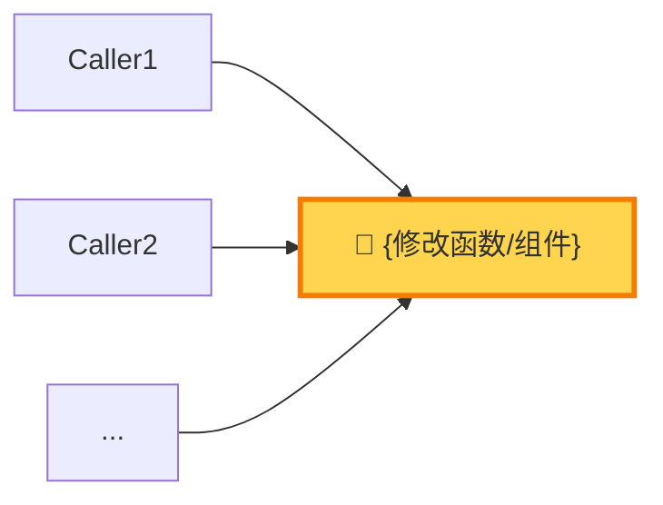

# 步骤 6：质量验证（6A + 6B + 6C）

> 本文件仅在执行步骤 6 时加载。包含三个子阶段，按顺序执行。

## 目标

通过自动化验证、用户验收和前后端联调，确保代码质量。

## 6A 自动化验证

### 🔀 可并行子任务

V1~V3 和 V6 之间无依赖，可并行执行：

| 并行组 | 包含阶段 | 说明 |
| --- | --- | --- |
| 编译检查组 | V1 Build + V2 TypeCheck | 编译和类型检查可同时进行 |
| 静态分析组 | V3 Lint + V6 Security + V8 i18n | Lint、安全和 i18n 可同时进行 |

> ⏳ 并行组全部通过后 → 串行执行 V4 Browser → V5 Test → V7 Diff Review
> ⚠️ V4/V5/V7 依赖前序阶段结果，必须串行

8 阶段验证（按 `shared-rules.md` §3 检测到的执行模式并行）：

| # | 阶段 | 验证内容 | 失败处理 |
| --- | --- | --- | --- |
| V1 | Build | 编译通过 | 直接修复 → 回 5.5a |
| V2 | Type Check | 无 TS 类型错误 | 直接修复 → 回 5.5a |
| V3 | Lint | 无新增警告（消费 5.5c `pending_lint_issues` 做最终裁决，不重复 lint 同文件） | 直接修复 → 回 5.5a |
| V4 | **Browser** | 浏览器 MCP 实时验证（条件触发） | 分析日志/截图 → 回步骤 5 修复 → 重走 5.5 → 6A |
| V5 | Test | 现有测试通过 | 分析原因 → 回步骤 3 重新制定方案 |
| V6 | Security | 用户输入/敏感数据 | 直接修复 → 回 5.5a |
| V7 | Diff Review + 回归风险评估 | 无预期外变更 + 回归风险可控 | 清理 / 补充验证建议 |
| V8 | i18n 兜底检测 | 确认 5.5d 结果 + 兜底遗漏（2026-07 新增） | 提醒 / 降级补执行 |

> 6A 中修复代码后必须遵循 `references/code-safety-rules.md`「代码修改后即时验证+审查规则」。

**3 次失败熔断**：同一阶段连续失败 3 次，停止试错，**必须使用 `ask_followup_question` 弹出交互式选项**：

| 选项 | 说明 |
| --- | --- |
| 🔄 回退重做 | 回到步骤 3 重新制定方案 |
| 🛠️ 我来修 | 暂停流程，由我手动修复后继续 |
| ⏭️ 跳过此阶段 | 忽略该验证阶段 |
| ❌ 终止 | 终止本次任务 |

### V4 Browser 触发条件

**触发**（满足任一）：涉及 DOM/CSS/样式/布局变更、接口调用变更、UI 交互流程变更、用户主动要求。
**不触发**（全部满足）：纯类型定义/纯配置/纯重构/纯文案修改。
执行：调用 `use_skill('verification-pipeline')` 查看 V4 详细规范。
> 工具选型：当 V4 涉及**性能分析 / 跨浏览器兼容 / 连接已登录真实 Chrome** 等进阶场景时，先调用 `use_skill('browser-toolkit')` 做智能路由，再回到 V4 标准流程。
> 📌 **可选脚本入口**（2026-05-15 新增）：V1~V3 + V6 + V7 可由 verification-pipeline 提供的程序化脚本承载——
>
> - 一次性执行：`bash skills/verification-pipeline/scripts/run-verify.sh --preset=core`
> - V6 单独：`bash skills/verification-pipeline/scripts/lints/secret-grep-lint.sh <files>`
> - V7 单独：`bash skills/verification-pipeline/scripts/lints/lock-file-lint.sh`
> - 3 次熔断物理计数：`bash skills/verification-pipeline/scripts/state/circuit-breaker.sh --inc <stage>`
> 输出 JSON 报告 schema：`skills/verification-pipeline/references/report.schema.json`

### V7 Diff Review 增强：回归风险评估（审核者分离）

V7 在原有的"预期外变更检查"基础上，**增加回归风险评估**。

> **设计原则**：调用方追踪由独立子 agent（1号，专精代码搜索与依赖链路）执行，避免主 agent 在编码阶段已"习惯"自己的改动而遗漏下游影响。

#### V7.1 调用方独立追踪（并行发起，审核者分离）

主 agent 在 V1-V3 并行执行期间，**同时**发起调用方分析：

```text
Task(1号): 回归风险调用方独立分析
prompt 内容包括：

1. 完整 git diff（功能分支 vs 主干，复用环节 A 的 REMOTE_DEFAULT）
2. 分析要点：
a. 对每个被修改的导出函数/组件/接口 → 搜索所有 import/调用位置
b. 判断是否属于破坏性变更：

- 签名变更（新增/删除/重排参数）
- 返回值类型变更
- 行为语义变更（同名函数逻辑改变）
c. 评估每个调用方的受影响程度：

- 🔴 破坏性：签名变更、删除导出
- 🟡 行为变更：返回值变化、行为语义变化
- 🟢 内部实现：仅内部重构不影响外部行为
d. 若调用方总数 > 5 → 标注 🔴 高风险

3. 输出格式：
- 调用方辐射图数据（节点 + 边 + 影响等级）
- 每个被修改导出的调用方表格
- 风险汇总（发现的高风险项数）

```

> ⚠️ 此 Task 与 V1-V3 并行执行，不增加串行等待时间。主 agent 在 V7 阶段直接消费其结果，无需自行重复搜索。

#### V7.2 评估维度（基于 1号 独立追踪结果）

| 检查项 | 检测方法 | 风险等级 |
| --- | --- | --- |
| 修改了公共函数/组件 | 消费 1号 的调用方追踪结果 | 调用方 >5 → 🔴 高 |
| 修改了接口参数/返回值 | 消费 1号 的破坏性变更分析 | 有变更 → 🟡 中 |
| 修改了 state/store 结构 | Diff 分析 interface/type 变更（主 agent 直接判断） | 有变更 → 🟡 中 |
| 修改了路由/权限配置 | Diff 分析路由/菜单配置文件（主 agent 直接判断） | 有变更 → 🔴 高 |
| 纯参数来源修正/样式调整 | Diff 分析逻辑不变 | 🟢 低 |

#### V7.3 输出格式（追加到 V7 结果中）

```text
V7 回归风险评估：

📡 调用方独立追踪（1号 agent）：

- 分析范围：N 个被修改导出
- 总调用方：M 个

| 导出 | 调用方数 | 最高影响 | 来源 |
| --- | :---: | :---: | --- |
| {函数/组件名} | {N} | 🔴破坏/🟡行为/🟢内部 | [1号] |

发现的高风险项：

- 修改函数：{函数名}
- 调用方：{调用方列表或数量}
- 影响范围：{描述}
- 回归风险：{🟢低/🟡中/🔴高}
- 建议：{无额外验证 / 建议手动验证 XX 页面 / 建议增加测试覆盖}

```

**调用方辐射图**（调用方数量 > 5 时强制输出，数据来源 = 1号 agent，规范见 `references/call-graph-spec.md`）：



> 调用方节点按受影响程度标注：🔴 签名破坏性变更 / 🟡 行为变更需验证 / 🟢 仅内部实现。辐射图可直接推导风险等级：扇出越大风险越高。

**风险处理**：

- 🟢 低：仅输出评估结果，不阻塞
- 🟡 中：输出评估结果 + 建议验证点，不阻塞
- 🔴 高：输出评估结果 + **主动建议用户进行 6B 验收**（即使快车道已跳过）

### V8 i18n 兜底检测（2026-07 新增）

> **定位**：兜底检测。基于 5.5d 的产出做二次确认，确保提交前 i18n 翻译词条无遗漏。
> **第一道拦截**：步骤 5.5d（详见 `step-5.5-post-coding.md` §5.5d）。

#### 触发条件

```text
✅ 5.5d 执行过（完成标记中 i18n_5_5d 字段存在）
✅ 改动文件中含 TSX/TS/JSX

```

**不触发**：5.5d 因无改动文件/无中文被跳过（`i18n_5_5d = no_issues`）、纯样式改动。

#### 三级行为（读 5.5d 完成标记，决定自身行为）

| 5.5d 结果 | V8 行为 | 交互 |
| --- | --- | :---: |
| `fixed_all` | 快速重扫 `find-untranslated-chinese.js` 确认无残留 → 静默通过 | 🔕 不弹 |
| `skipped` | 输出摘要："之前跳过的 {N} 项 i18n 问题仍存在" → 🟡 提醒 | 🟡 不弹选项，仅作为验证报告一部分 |
| `deferred` | 输出摘要："已记录 {N} 项 i18n 待办" → 标注状态 | 🟡 不弹选项 |
| `no_issues` | 静默通过 | 🔕 不弹 |

#### 异常降级：5.5d 未执行时

```text
i18n_5_5d = not_executed（如 micro-fix 模式跳过了 5.5d）
→ V8 降级为补执行完整扫描（= 5.5d 的 3 步流程）
→ 弹出交互式决策（与 5.5d 相同的 4 选项）
→ 确保无论什么路径，提交前一定过一遍 i18n 检查

```

#### 并行执行

V8 与 V3 Lint、V6 Security 同属**静态分析组**，三道检查并行执行，不额外增加串行耗时。

#### 3 次失败熔断

V8 降级补执行场景下适用标准熔断机制（同一阶段连续失败 3 次 → 弹出交互选项）。仅基于 5.5d 结果做二次确认时因无修复动作，不触发熔断。

> 🏷️ 6A 完成后输出锚点：`[STEP-6-A-COMPLETE] 自动化验证完成 | V1={status} V2={status} V3={status} V4={status} V5={status} V6={status} V7={status} V8={status}`

## 6B 用户验收（可选）

**快车道自动跳过**：当迭代修复快车道启用时（简单复杂度 + 代码已实施），6B 自动跳过，不弹出决策选项。

**触发时机**：6A 全部通过后，自动弹出决策选项（⏭️ 跳过验收 / 🔍 进行验收）。默认推荐跳过。

用户选择「进行验收」时 → `read_file("references/user-acceptance.md")` 加载完整验收流程。

**验收后清理**：不需要联调时，进入步骤 7 前必须清理所有 `// [ACCEPTANCE-TEST]` 标记的调试代码。
需要联调时，调试代码保留至联调完成后再清理。

**回退机制**：✅ 通过 → 6C | ⚠️ 部分问题 → 步骤 5 修复 | ❌ 不通过 → 步骤 3 重新制定方案。

> 🏷️ 6B 完成后输出锚点：`[STEP-6-B-COMPLETE] 用户验收 | 结果={passed\|skipped\|partial_issues\|failed}`

## 6C 前后端联调（条件触发）

**快车道自动跳过**：当迭代修复快车道启用时且不涉及新增接口调用时，6C 自动跳过，不弹出决策选项。

**触发条件**（满足任一）：新增/修改接口调用、前后端数据交互变更、用户主动要求、后端接口不可用、**工作上下文包含 `cross_project.enabled: true`**。
**不触发条件**（全部满足）：纯前端改动、不涉及接口调用变更、用户明确不需要联调、无跨项目标记。

**触发判断时机**：6B 完成后，AI 自动评估，**必须使用 `ask_followup_question` 弹出交互式选项**：

| 选项 | 说明 |
| --- | --- |
| 🔗 进行联调 | 等待后端就绪后进行联调验证 |
| 🔗 跨项目联调 | 在验证项目中安装新版本并验证（仅 `cross_project` 时显示） |
| ⏭️ 跳过联调 | 不需要联调，直接进入步骤 7 |
| 📝 生成 Commit 并暂存 | 后端未就绪，生成 Commit 保存进度，保留调试代码 |
| ⏸️ 直接暂存 | 后端未就绪，不生成 Commit，直接暂存 |

**各选项执行流程**：

- 「🔗 进行联调」→ `read_file("references/integration-flow.md")` 加载联调流程
- 「🔗 跨项目联调」→ `read_file("references/cross-project/integration.md")` 加载跨项目联调流程（step-6C 扩展章节）
- 「⏭️ 跳过联调」→ 直接进入步骤 7
- 「📝 生成 Commit 并暂存」→ 按 `references/shared-rules.md` §1「Commit Message 生成」流程 → 暂存
- 「⏸️ 直接暂存」→ `read_file("references/integration-flow.md")` 加载暂存状态

> 暂存场景下**不清理调试代码**，联调恢复后仍需要。清理统一在联调通过后的步骤 7 执行。

> 🏷️ 6C 完成后输出锚点：`[STEP-6-C-COMPLETE] 联调 | 结果={passed\|skipped\|not_triggered\|paused_waiting}`

## ⛔ 退出自检清单（逐项口播确认后才能输出完成 JSON）

在输出完成标记 JSON 之前，逐项确认并口播：

- [ ] 6A V1 Build: 已执行/跳过？结果已记录到 `6a_result.v1_build`？
- [ ] 6A V2 TypeCheck: 已执行/跳过？结果已记录到 `6a_result.v2_typecheck`？
- [ ] 6A V3 Lint: 已执行/跳过？结果已记录到 `6a_result.v3_lint`？
- [ ] 6A V4 Browser: 已执行/未触发？结果已记录到 `6a_result.v4_browser`？
- [ ] 6A V5 Test: 已执行/跳过？结果已记录到 `6a_result.v5_test`？
- [ ] 6A V6 Security: 已执行/跳过？结果已记录到 `6a_result.v6_security`？
- [ ] 6A V7 Diff Review: 已执行/跳过（含 V7.1 调用方独立追踪）？结果已记录？
- [ ] 6A V8 i18n: 已执行/未触发？结果已记录到 `6a_result.v8_i18n`？
- [ ] 6A 全部 8 阶段 `6a_result` 字段有值（不能为空）？
- [ ] 任何阶段失败 → 是否已触发 3 次熔断机制？
- [ ] 6B 用户验收：已决策（passed/skipped/partial_issues/failed）？
- [ ] 6C 联调：已决策（passed/skipped/not_triggered/paused_waiting）？
- [ ] 三个子阶段锚点标记 `[STEP-6-A/B/C-COMPLETE]` 均已输出？
- [ ] 上述全部完成 → 才可输出完成标记 JSON

---

## 必须输出

### 步骤推进选项（标准模式必须）

按 `steps/step-router.md` §「步骤流转交互规则」，完成标记 JSON 输出并状态同步后，**必须调用 `ask_followup_question` 弹出推进选项**（先文本表格展示，再调用工具）：

| 选项 | 说明 |
| --- | --- |
| ▶️ 继续步骤 7（清理+Commit） | 质量验证通过，进入收尾环节 |
| ⏸️ 暂停，我有补充/疑问 | 暂停等待用户输入 |
| 🔁 回退步骤 5 修复问题 | 验证发现问题需回到编码阶段 |

> **精简模式**：步骤 6→7 无专属豁免，标准模式必须弹出；6A 全部通过且无 6B/6C 交互时，精简模式下可合并为一次交互。

### 结构化完成标记（必须输出，缺字段视为未完成）

```json
{
"step": 6,
"name": "质量验证",
"status": "completed | blocked",
"outputs": {
"6a_result": {
"v1_build": "passed | fixed | skipped",
"v2_typecheck": "passed | fixed | skipped",
"v3_lint": "passed | fixed | skipped",
"v4_browser": "passed | fixed | skipped | not_triggered",
"v5_test": "passed | fixed | skipped",
"v6_security": "passed | fixed | skipped",
"v7_diff": "passed | fixed | skipped",
"v7_regression_risk": "low | medium | high | not_assessed",
"v8_i18n": "passed | reminded | escalated | not_triggered"
},
"6b_result": "passed | skipped | partial_issues | failed",
"6c_result": "passed | skipped | not_triggered | paused_waiting | cross_project_pending_validation"
},
"working_context_updated": true,
"next_step": 7
}

```

**完成标记校验规则**：

- `6a_result` 中所有阶段必须有值（不能为空）
- 如果 6C 选择暂存，`status` 为 `blocked`，流程暂停
- `status` 为 `completed` 时才能进入步骤 7
- 📌 **2026-07 新增**：`v8_i18n` 字段，值取自 `5.5d.i18n_5_5d` 的二次确认结果
